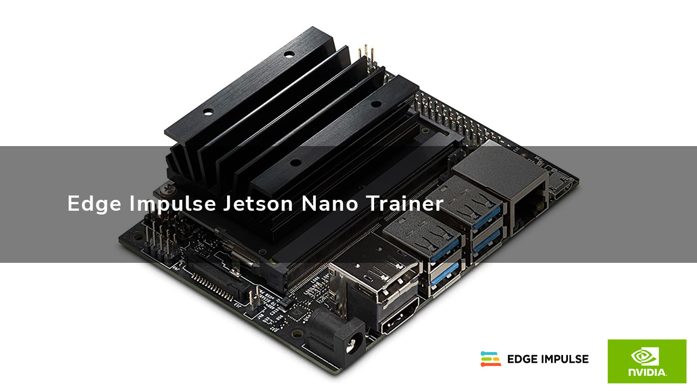
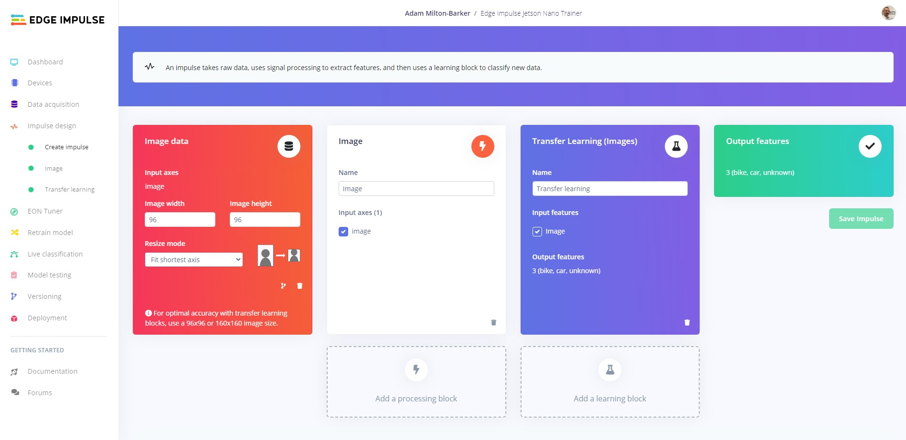
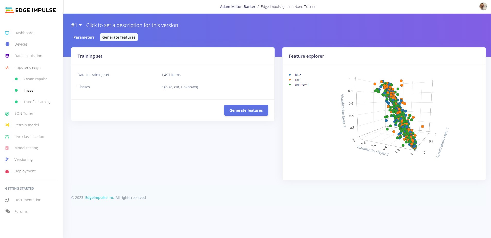
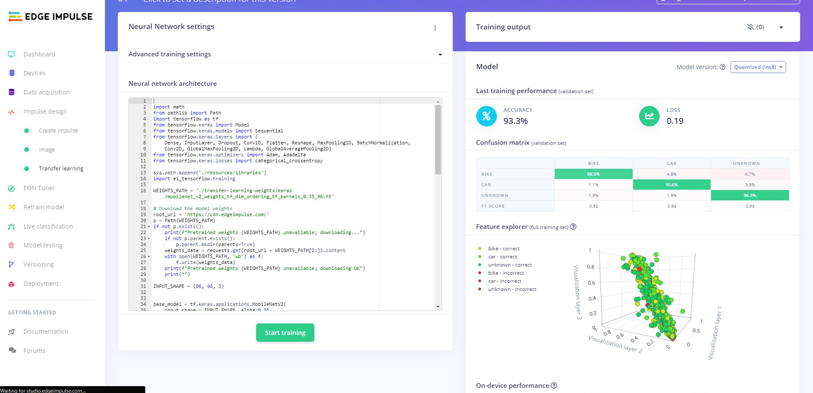
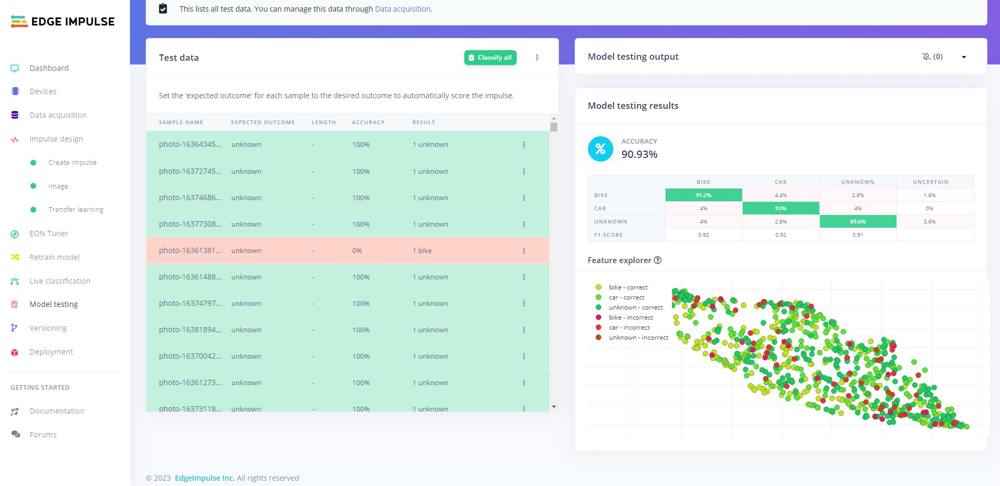
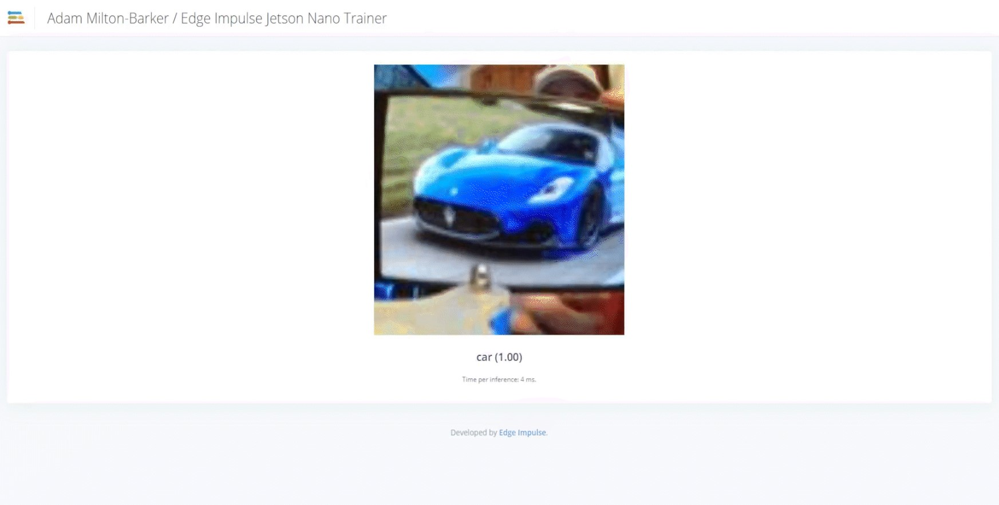
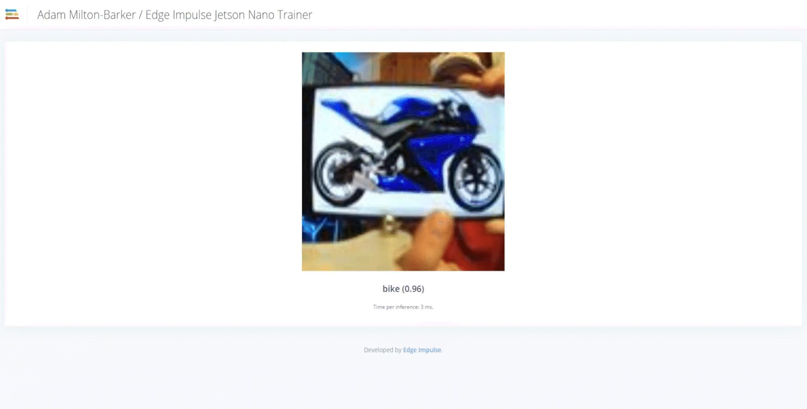
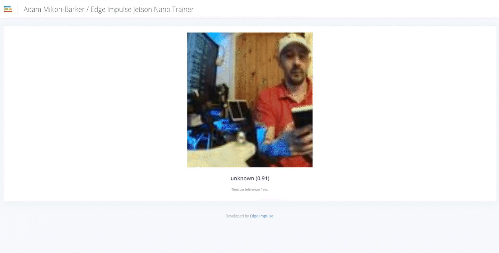

# Edge Impulse API Usage Sample Application - Jetson Nano Trainer

Created By: [Adam Milton-Barker](https://www.adammiltonbarker.com/)

## Project Repo

[https://github.com/AdamMiltonBarker/edge-impulse-jetson-nano-trainer](https://github.com/AdamMiltonBarker/edge-impulse-jetson-nano-trainer)

## Introduction



_A Python program that utilizes the Edge Impulse API to create, train and deploy a model on Jetson Nano._

## NVIDIA Jetson Nano

The NVIDIA Jetson Nano is a small yet powerful computer designed for use in embedded systems and edge computing applications. The Jetson Nano is particularly well-suited for use in applications that require machine learning or computer vision processing at the edge of a network.

Its small size and low power consumption also make it a cost-effective and efficient choice for edge computing applications in industries such as robotics, healthcare, and manufacturing.

As an NVIDIA Jetson AI Specialist and Jetson AI Ambassador, I love building projects for the Jetson Nano. I use the Jetson Nano for both my Leukaemia MedTech non-profit, my business, for projects I contribute to the Edge Impulse Experts platform, and for personal projects.

## Edge Impulse

Edge Impulse is an end-to-end platform for building and deploying machine learning models on edge devices. It simplifies the process of collecting, processing, and analyzing sensor data from various sources, such as microcontrollers, and turning it into high-quality machine learning models.

The platform offers a variety of tools and resources, including a web-based IDE, a comprehensive set of libraries and APIs, and a range of pre-built models that can be customized for specific use cases.

## The Problem

Whilst the Jetson Nano is a highly capable device for edge inference, it may not be the most suitable choice for AI model training, in fact NVIDIA recommend you should not train models on the Jetson Nano. However, Edge Impulse offers a compelling solution to this challenge by providing a platform for developing and deploying models on a range of edge devices, including the Jetson Nano.

That said, some researchers and developers may prefer a more hands-on approach to coding and developing solutions on the Jetson Nano, despite its limitations for AI training.

## The Solution

This is where the Edge Impulse API comes in. Edge impulse have a number of APIs, which together, provide the ability to hook into most of the platforms capabilities, including the Studio. In this project we will create a new Edge Impulse project, connect a device, upload training and test data, create an Impulse, train the model, and then deploy and run the model on your Jetson Nano.

## Installation

Before you can get started you need to clone the `edge-impulse-jetson-nano-trainer` repository to your Jetson Nano. On your Jetson Nano navigate to where you want to be and run the following command:

```
bash
git clone https://github.com/AdamMiltonBarker/edge-impulse-jetson-nano-trainer
```

Now cd into the directory:

```
bash
cd edge-impulse-jetson-nano-trainer
```

And run the following command to install the required software:

```
bash
sh install.sh
```

This will install the required software for your program.

## The Configuration

You can find the configuration in the `confs.json` file. This file has been set up to run this program as it is, but you are able to modify it and the code to act how you like. Think of this program as a boilerplate program and introduction to using the Edge Impulse APIs.

At certain points during the program, this file will be update, this ensures that if you stop the program you will always start off from where you left off.

## Edge Impulse Account

To use this program you will need an Edge Impulse account. If you do not have one, head over to the [Edge Impulse website](https://www.edgeimpulse.com/) and create one, then head back here.

## Data

You can use any dataset you like for this tutorial, I used the [Car vs Bike Classification Dataset](https://www.kaggle.com/datasets/utkarshsaxenadn/car-vs-bike-classification-dataset) from Kaggle, and the [Unsplash random images collection](https://www.kaggle.com/datasets/lprdosmil/unsplash-random-images-collection) for the unknown class.

These datasets include `.jpg`, `.jpeg`, and `.png` files, so we need to update the configuration file to look like the following:

```
json
"data": {
    "file_type": [
        ".jpg",
        ".jpeg",
        ".png"
    ],
    "test_data": false,
    "test_dir": "data/test",
    "train_data": false,
    "train_dir": "data/train",
    "type": "",
    "types": [
        "local",
        "remote"
    ]
},
```

You will notice the `test_dir` and `train_dir` paths, this is where your data should be placed. The directory names inside of those directories will be used as the labels for your dataset. In this case, you should create `car`, `bike`, and `unknown` directories in both the `train` and `test` dirs.

There is a limitation on the number of files you can upload through the API, through my testing I was able to comfortably upload around 500 training per class, and 250 testing images per class.

## The Program

The main bulk of the code lives in the `ei_jetson_trainer.py` file. Ensuring you have your Edge Impulse account set up, let's begin.

### Start The Program

Navigate to the project root directory and execute the following command:

```
bash
python3 ei_jetson_trainer.py
```

### Login To Edge Impulse

The first thing the program will ask you to do is login. Enter your Edge Impulse username or email, and then your password.

```
What is your username?

What is your password?
```

For security your username and password are not stored on the Jetson Nano. Each time you use the program you will have to enter them at the beginning of your session.

### Project Details

Next you will be asked for a name for your new project.

```
What is your new project name?
```

Enter a name for your new project and continue by pressing enter.

## Connect Your Device

The prompt will now ask you for your device ID:

```
What is your new device ID?
```

At this point you need to follow the instructions in the [Jetson Nano documentation](https://docs.edgeimpulse.com/docs/development-platforms/officially-supported-cpu-gpu-targets/nvidia-jetson-nano) on the Edge Impulse website. The program will provide you the link so you can just copy and paste it into your browser.

Once you have installed all of the required software, head over to a new terminal and run the following command:

```
bash
edge-impulse-linux
```

Follow the steps given to you and then head to the devices tab on your new project in the Edge Impulse Studio and copy the device ID. Once you have that, head back to the Jetson Nano trainer terminal and enter it into the program.

### Data

You should have followed the steps above and all of your training and testing data is in the relevant directories. The program will now loop through your data and send it to the Edge Impulse platform.

```
** Data ingestion type is local
** Make sure your data is in the data/train and data/test folders.
** Directory names in these folders will be used as the labels.
** 499 bike train data images
** 498 car train data images
** 500 unknown train data images
** 250 bike test data images
** 250 car test data images
** 250 unknown test data images
```


This may take some time. While you wait you can head over the Edge Impulse Studio and navigate to the `Data Aquisition` tab and you will be able to see your data being imported to the platform.



Next the program will create the Impulse for you, including all required blocks.

### Feature Generation



The next step the program will take is to generate the features for your dataset. This will start a job and the platform will send socket messages to the program to let it know the job has been completed and to continue. While this is happening you can navigate to `Impulse Design` -> `Image` -> `Generate Features` where you will see the features being generated.

Once the platform informs the program that the features have been created, training will begin.

### Training



The program will now start training. You can head over to `Impulse Design` -> `Image` -> `Transfer Learning` where you will be able to watch the model being trained. Once the training has finished the results will be displayed and the program will be notified via sockets.

### Testing



The program will now begin testing on the test data. You can watch this happening in real-time in the Edge Impulse Studio in the `Model Testing` tab.

### Deploy



Now that our model is trained and tested, it is time to run it on our device. Thanks to Edge Impulse, this step is easy. Make sure you have disconnected your device from the platform, and in terminal run:

```
bash
edge-impulse-linux-runner 
```



Your model will be installed on your Jetson Nano and immediately begin classifying. The Edge Impulse runner will give you a local URL you can view the real-time stream and classifications.


