# Automate the CI/CD Pipeline of your Models with Edge Impulse and GitHub Actions

Created By: Haziqa Sajid

## Introduction

As machine learning models evolve, one of the biggest challenges is keeping up with constant updates, retraining, and redeployment, especially when targeting edge devices. These environments are particularly vulnerable to **data drift**. This is when the incoming data gradually changes from the data the model was trained on. Data drift can lead to degraded model performance over time. Without frequent updates, models can become less reliable, and detecting these changes manually can be slow and error-prone. 

The need for an automated pipeline is clear. It should ensure that models are consistently updated, tested, and deployed without compromising time or quality. This article aims to use GitHub workflows as a CI/CD solution for efficiently building and deploying your Edge Impulse model.

## Understanding the ML Lifecycle

Like all software, a machine learning (ML) project has phases. The ML lifecycle involves six key phases:

1. **Data Collection:** Gathering raw data from various sources, ensuring quality and diversity.
2. **Data Preprocessing:** Cleaning, transforming, and scaling data to make it model-ready.
3. **Training:** Feeding data into ML algorithms to learn patterns involving optimization and tuning.
4. **Evaluation:** Using test datasets to assess model performance with metrics like accuracy and recall.
5. **Deployment:** Integrating validated models into production environments for real-world use.
6. **Monitoring:** Continuously tracking performance to detect drift or degradation, ensuring reliability.

Unlike traditional software development, ML projects often involve iterative processes. For example, adding more data, modifying data processing techniques, or training models for additional epochs. MLOps was introduced to streamline these complexities.

## Introduction to MLOps

MLOps (Machine Learning Operations) combines ML, DevOps, and Data Engineering principles to streamline and automate the ML lifecycle. It enhances each phase by:

* Automating data pipelines
* Accelerating training
* Validating models with CI/CD
* Simplifying deployment
* Enabling real-time monitoring

This fosters collaboration between teams and ensures smoother transitions from development to production. The processes can still struggle without continuous feedback. Dynamic environments require models to adapt to changing data and user needs. 

Continuous feedback loops detect data drift, incorporate new insights, and improve user experience through iterative updates. Automated retraining pipelines in MLOps frameworks efficiently manage these updates, minimizing manual effort.

## CI/CD in Machine Learning

Continuous Integration (CI) and Continuous Deployment (CD) are pivotal in modern machine learning (ML) workflows. They ensure efficiency and reliability across the ML lifecycle.

### Continuous Integration (CI)

CI involves automating the testing and validating changes in code, data pipelines, or models. Every update, whether to feature engineering scripts, model architectures, or training pipelines, is integrated into a shared repository and undergoes rigorous automated testing. This ensures that new changes do not break existing functionality and maintain consistency.

### Continuous Deployment (CD)

CD focuses on automating the process of deploying validated changes to production environments. This includes seamlessly transitioning models, data updates, or pipeline modifications while minimizing downtime. CD ensures models are always up-to-date and responsive to evolving real-world conditions. In the MLOps framework, CI/CD plays a crucial role in:

1. **Accelerating Iterations:** CI/CD enables rapid prototyping and iteration by automating repetitive tasks like testing and deployment.
2. **Ensuring Consistency:** Rigorous validation during CI prevents errors from propagating to production, while CD ensures smooth rollouts.
3. **Fostering Creativity:** Automating integrations allows teams to focus on innovation rather than manual processes.

CI/CD pipelines also address ML challenges like data drift, performance degradation, and reproducibility through automated retraining, metrics monitoring, and versioning. Rollback mechanisms ensure quick recovery from deployment issues. Integrating CI/CD into MLOps keeps ML systems adaptive, robust, and aligned with evolving business and data demands.

This article explains how to use GitHub Actions to build and deploy an **Edge Impulse** model, a cloud platform for AI/ML on embedded systems.

## Practical Guide on CI/CD with GitHub Actions & Edge Impulse

The following guide will walk you through the process of developing a practical audio classification system using Edge Impulse to detect when a baby is crying or sleeping. Let’s start with the setup.

### Setup

To begin, visit [Edge Impulse](https://edgeimpulse.com/) and log in to your account. If you don’t already have an account, create one for free. For this project, we’ll use the Enterprise Plan to access advanced features such as synthetic data generation. After logging in, create a new project and name it something meaningful, like *Baby Audio Classification*. 

### Data Collection

In this step, we create a dataset of synthetic audio clips representing two categories: baby crying and baby sleeping sounds. Using Edge Impulse’s synthetic data generation capabilities, we can simulate realistic audio samples tailored to our needs. These samples will serve as the foundation for training and testing our audio classification model. 

Leveraging parameters like prompt influence, sample length, and frequency ensures the dataset is diverse, balanced, and representative of real-world scenarios.

#### Steps to Generate Synthetic Data

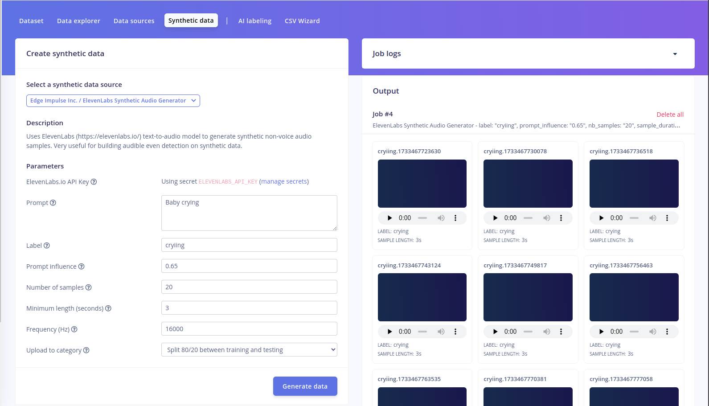

1. Navigate to the **Synthetic Data** tab in the *Data Acquisition* section of your project.
2. Select **Edge Impulse Inc. / ElevenLabs Synthetic Audio Generator** as the data source.
3. Input a descriptive **Prompt**, such as “Baby crying” or “Baby sleeping,” to guide the audio generation.
4. Assign a **Label** for the prompt, e.g., `crying` or `sleeping`, to categorize the generated audio samples.
5. Adjust the **Prompt Influence** parameter (e.g., 0.65) to balance between creativity and adherence to the prompt.
6. Set the **Number of Samples** to specify how many audio clips you want to generate.
7. Define the **Minimum Length (seconds)** to ensure all samples meet your required duration (e.g., 3 seconds).
8. Set the **Frequency (Hz)**, typically at 16000 Hz, for audio classification tasks.
9. Choose how the data is distributed between training and testing, such as an 80/20 split.
10. Click **Generate Data** to produce the synthetic audio samples.
11. Review the output to ensure the generated samples are accurate and appropriately labeled.

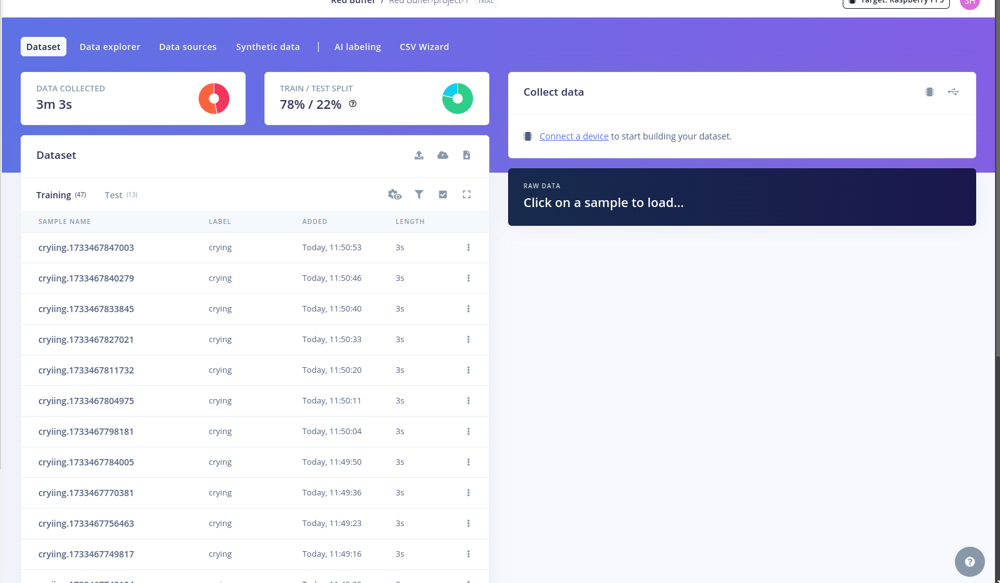

#### Design an Impulse using Edge Impulse

An impulse in Edge Impulse defines the end-to-end processing pipeline for your data—from raw input to classification. In this step, we design an impulse tailored for audio data to distinguish between baby crying and sleeping sounds. The impulse includes the configuration of audio data as time-series input, feature extraction using MFCC (Mel-Frequency Cepstral Coefficients), and classification using a machine learning block.

##### Steps to Create an Impulse:

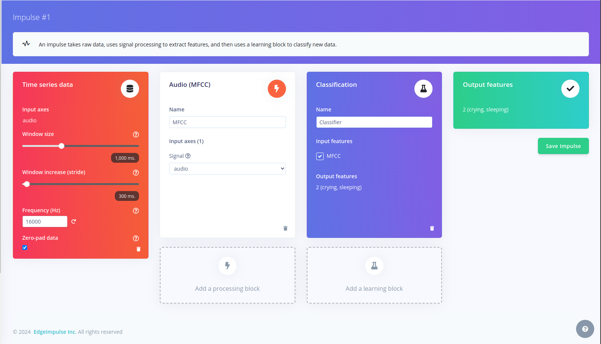

1. **Configure Input (Time-Series Data)**
   * Navigate to the **Impulse Design** tab in your project.
   * Select **Time Series Data** as the input block for audio signals.
   * Set the **Window Size** to `1000 ms` (1 second), which defines the duration of audio analyzed per segment.
   * Configure the **Window Increase (Stride)** to `300 ms` to determine the overlap between consecutive segments, ensuring sufficient coverage of the audio signal.
   * Specify the **Frequency** as `16000 Hz` to match the sampling rate of your audio data.
   * Enable **Zero-pad Data** to ensure all audio inputs meet the required window size.
       
2. **Add the MFCC Processing Block**
   * Select **MFCC** as the feature extraction block.
   * Name the block (e.g., `MFCC`) and link the **Input Axes** to `audio`.
   * MFCC transforms the raw audio into a spectrogram-like representation that captures key features for audio classification, making it effective for distinguishing sounds like crying and sleeping.

3. **Add the Classification Block**
   * Choose the **Classification** learning block to map the extracted MFCC features to output labels (`crying` and `sleeping`).
   * Name the block (e.g., `Classifier`).
   * Ensure that **MFCC** is selected as the input feature for this block.
   * Verify that the output features are correctly labeled as `crying` and `sleeping`.
       
4. **Save the Impulse**
   * Click on **Save Impulse** to finalize the configuration.

#### Configuring the MFCC Block

The Mel-Frequency Cepstral Coefficients (MFCC) block transforms audio into a visual representation known as a spectrogram, where:

* **Rows** represent frequency ranges.
* **Columns** represent time spans.
* **Cell values** indicate the amplitude for specific frequencies over time, with intensity shown as colors.

The spectrogram reveals sound patterns, such as the differences between a baby crying and sleeping. These patterns, though subtle, are enough for a neural network to recognize.

##### Steps to Configure the MFCC Block

1. **Preview Audio Data**
   * Open the **MFCC** tab in the left menu.

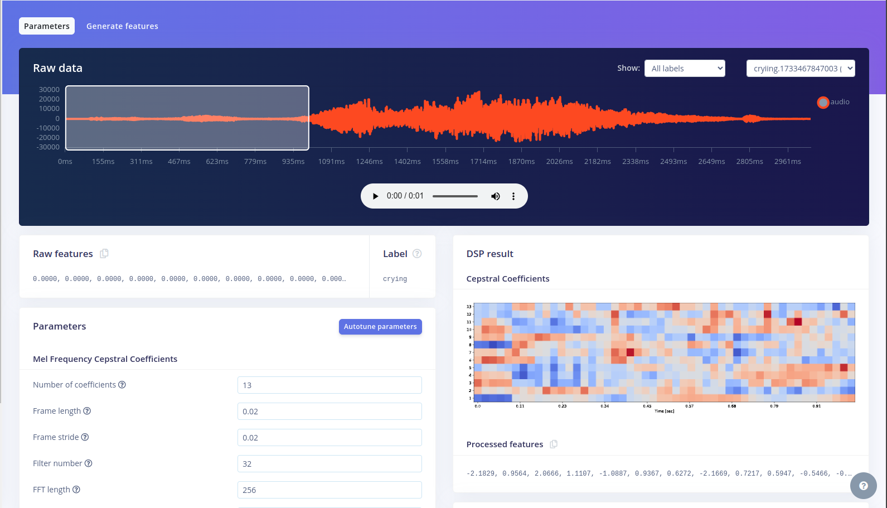

   * Use the sample dropdown to explore audio segments and their spectrograms.
    
2. **Adjust Parameters**
   * The **Parameters** box provides default settings, which work well for most cases.
       
3. **Generate Features**
   * Click **Generate Features** to process all audio windows into spectrograms.

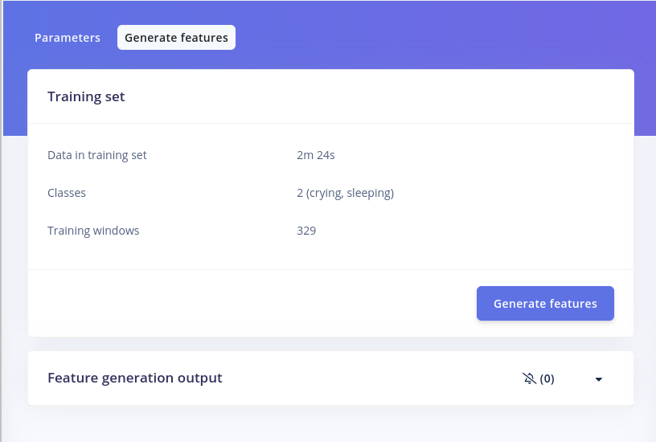

   * Wait for the process to complete (it may take time for large datasets).

4. **Visualize Features**
   * Use the **Feature Explorer** to visualize data clusters, identify class separations, and spot mislabeled data.

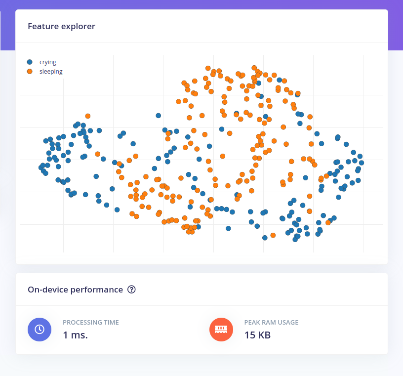

#### Create a Neural Network

With the data processed, you can now train a neural network to classify audio into two categories.

##### Steps to Train the Neural Network:

1. **Open the Classifier**
   * Click **Classifier** in the left menu to access the neural network setup.

2. **Neural Network Overview**
   * The network consists of layers of "neurons."
   * The MFCC features pass through layers, transforming into probabilities for **crying** or **sleeping** classification.

3. **Training the Network**
   * You can use Edge Impulse's default architecture or customize it (e.g., via TensorFlow/Keras). We have used the default architecture.
   * Our data was limited to only 3 minutes, so we incorporated data augmentation. Data augmentation involves applying various transformations to existing data, such as scaling, flipping, or adding noise, to artificially increase the diversity of the training set. In Edge Impulse, we just need to configure it:

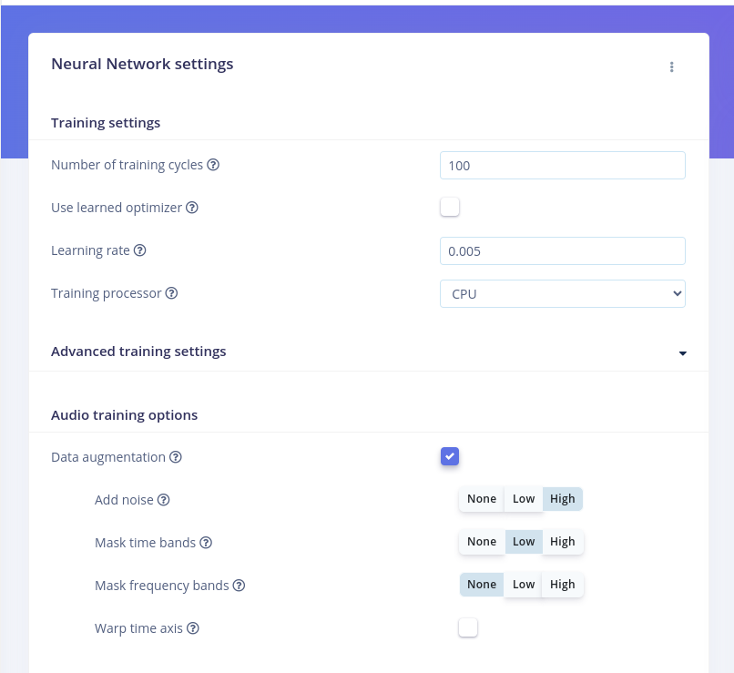

   * Click **Save & Train**. Training takes a few minutes, and results are displayed in the **Model panel**.
       
4. **Evaluate the Results**
   * **Accuracy**: Indicates the percentage of correctly classified audio windows.
   * **Confusion Matrix**: Shows how well the model classifies each class. Misclassifications reveal areas for improvement. The results are as follows:

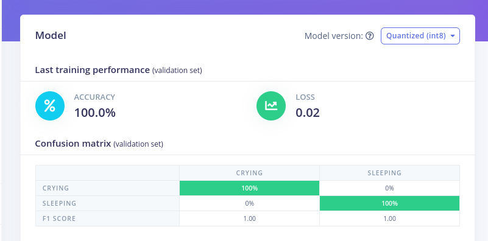

At this stage, our model is trained and performing well. However, since the results are exceptionally good, there is a risk of overfitting. To ensure its reliability, it's important to test the model thoroughly.

#### Model Testing

Model testing evaluates the trained neural network's performance on unseen data to ensure it generalizes well. In this step, we check how accurately the model classifies test data into its respective categories.

##### Steps for Model Testing

1. **Access the Testing Interface**
   * Navigate to **Model Testing** in the left-hand menu of Edge Impulse.
       
2. **Run Classification**
   * Click **Classify All** to run the model on all test samples. These test samples are derived from the 78/22 split we applied to the prepared dataset. The results, including predictions and classification accuracy, will be displayed for each sample.
       
3. **Analyze the Results**
   * **Accuracy**: Check the overall classification accuracy displayed in the **Model Testing Output** panel.
   * **Metrics**: Review metrics like precision, recall, and F1 score for a deeper performance evaluation.
   * **Confusion Matrix**: Understand how well the model differentiates between classes and identify misclassifications. 
Here are the results:

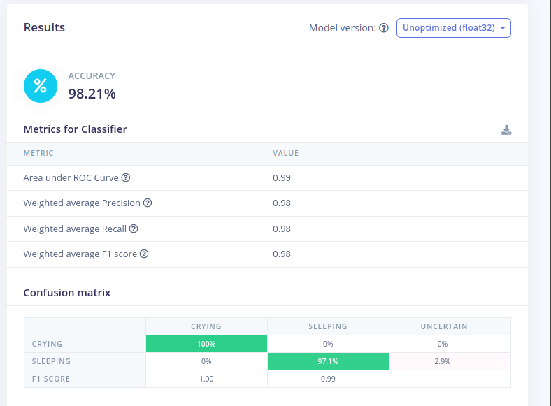

4. **Refine as Needed**
   * If accuracy is unsatisfactory, consider refining your model by improving the training dataset, adjusting the architecture, or re-tuning hyperparameters.

With the testing complete, the model is ready for deployment.

#### Deploy to Device using Edge Impulse

Once your Impulse is designed, trained, and verified, you can deploy it to your device for offline operation, reduced latency, and low power consumption. Edge Impulse allows you to package the entire Impulse into a C++ library for your embedded software.

To export, go to the Deployment menu, select your development board, and click **Build**. 

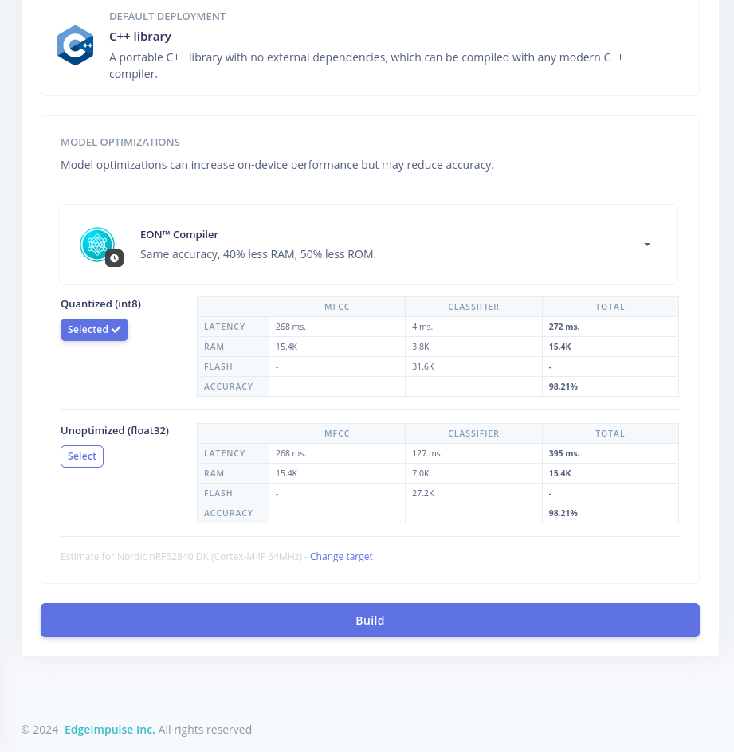

#### Adding GitHub Action to the Workflow

We can use GitHub Actions to automate the build and deployment of your Edge Impulse model. This process streamlines the workflow, ensuring that the model is automatically built and deployed whenever there is a push to the `main` branch. Below are the steps to set up the GitHub repository, configure the action, and define the necessary workflow to achieve this.

##### Steps

1. **Create a Workflow**

First, create a new repository in GitHub to store your project. Once created, clone the repository to your local machine to begin setting up the workflow. Create a `.github/workflows` directory in your repository. Inside this directory, create a YAML file for the workflow configuration.

```
.github/workflows/build\_deploy.yml
```

2. **Define the Trigger Event**

In the YAML file, specify that the workflow should run when there is a `push` event to the `main` branch.

```
 on:
  push:
    branches:
      - main
```

3. **Add the Build Job**

Define a job within the workflow to build and deploy the Edge Impulse model. This job will run on an `ubuntu-22.04` environment.

```
 jobs:
  build:
    name: Build & Deploy
    runs-on: ubuntu-22.04
```

4. **Build and Deploy the Edge Impulse Model**

Use the `edgeimpulse/build-deploy@v1` action to automate the build and deployment of your Edge Impulse model. Make sure to use your GitHub secrets for the `project_id` and `api_key`.

```
 - name: Build and deploy Edge Impulse Model
   uses: edgeimpulse/build-deploy@v1
   id: build-deploy
   with:
     project_id: ${{ secrets.PROJECT_ID }}
     api_key: ${{ secrets.API_KEY }}
```

The project ID can be found in the URL like this:

```
https://studio.edgeimpulse.com/studio/<Project-Id>
```

The API key is available under the "Keys" tab on the Dashboard page.

5. **Extract the Model and SDK**

After the deployment, unzip the generated deployment file and move the necessary files into the project directory. This includes the Edge Impulse SDK, model parameters, and the TFLite model.

```
 - name: Extract the Model and SDK
  run: |
    mkdir temp
    unzip -q "${{ steps.build-deploy.outputs.deployment_file_name }}" -d temp
    mv temp/edge-impulse-sdk/ .
    mv temp/model-parameters/ .
    mv temp/tflite-model/ .
    rm -rf "${{ steps.build-deploy.outputs.deployment_file_name }}"
    rm -rf temp/
```

Now, when someone pushes to main, this will be built automatically, and the action workflow will look like this:

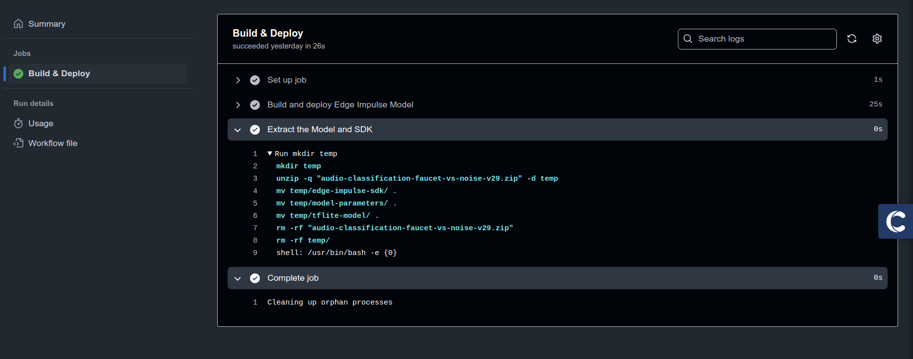

By adding this GitHub Action to your workflow, you automate the build and deployment of your Edge Impulse model.

## Conclusion

Automating your Edge Impulse model integration with GitHub Actions streamlines your workflow. This includes automated testing, which saves time and boosts efficiency. However, high-quality data remains crucial for any ML project. Edge Impulse Enterprise addresses this by enabling AI-powered synthetic data generation, whether it's images, audio, or text. Visit [Edge Impulse](https://studio.edgeimpulse.com/trial-signup) today to learn about Enterprise access or begin a free trial.

