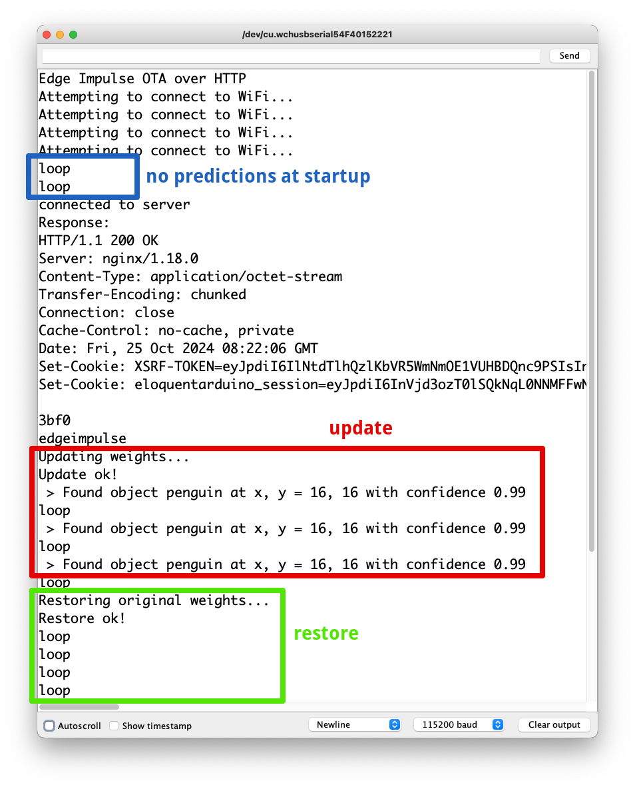

# DIY Model Weight Update for Continuous AI Deployments

Created By: Simone Salerno

Public Project Link: [https://studio.edgeimpulse.com/public/508852/latest](https://studio.edgeimpulse.com/public/508852/latest)

GitHub Repo:  [https://github.com/eloquentarduino/python-edgeimpulse-ota/blob/main/examples/ei_model_ota](https://github.com/eloquentarduino/python-edgeimpulse-ota/blob/main/examples/ei_model_ota)

## Introduction

Continuous deployment in the context of the software development lifecycle refers to the practice
of periodically updating your source code, and shipping the latest release to your users without service interruption.

In the context of machine learning, this same concept extends (and is more often put in practice) to the model and its weights. Your first iteration of a model is, actually, the best iteration *so far*, in the sense that it achieved the best metric (e.g. accuracy) on the data you had available at the time of training.

After this first deployment however, you should be monitoring your model's performance in the field, and keep track of how well it performs on new, unseen data. It is usually the case that model performance degrades over time (so called "model drift") and you need to update the model to remediate this degradation.

This article will show you how you can perform over-the-air (OTA) updates to an Edge Impulse model's weights deployed on a microcontroller in a vendor-agnostic way. You can swap the model weights by loading them from the internet, or from an SD card, or any other storage medium you prefer. The key concepts are that:

 1. you'll only update the model's weights, not the entire board firmware (as opposed to most vendor-specific OTA strategies)
 2. the process works with any board


**Disclaimer**

This is a DIY (Do It Yourself) technique, not officially supported by Edge Impulse. For this reason, we'll need to patch the generated Arduino library to include the OTA code. Future breaking changes in the Edge Impulse API could break this method. For this reason, source code is released publicly so that you can adjust to your specific needs, if required.


Here's the roadmap for the rest of the article that highlights the steps required to make the entire process work:

 1. Train a model on Edge Impulse as usual and export as "genuine" Arduino library
 2. Patch the library to include the OTA mechanism and deploy the patched version to your board
 3. Collect more data, fine tune parameters, improve labelling to generate a better model (not included in this article, specific for your project)
 4. Export the updated "genuine" model and convert it into an OTA binary payload
 5. Trigger the update process from the board (by periodically pinging a server for updates, by user interaction, etc.)

I created a Public Project available for you to follow along at [https://studio.edgeimpulse.com/public/508852/latest](https://studio.edgeimpulse.com/public/508852/latest). It is a FOMO classifier that recognizes a penguin toy from camera frames. The project has two versions: **"bad"** is a (deliberately) low accuracy model trained for 1 epoch which can't recognize anything. A second model named **"smart"** is trained for 50 epochs and has a pretty high accuracy. We will confirm that our OTA process is working by observing our _bad_ model failing on a frame containing a penguin, then being replaced by the smart one that correctly locates the object.

## Train First Iteration of a Model

This part is project-specific. I assume you already have a model in Edge Impulse that you want to deploy to your microcontroller. It can be of any type (audio, image, sensor), it makes no difference from the OTA perspective. If you want to clearly see the weights' swapping happening, I suggest you create a bad version of your model which achieves 0% accuracy (e.g. by training the model for just 1 epoch). Then go to the *Deployment* page and export the model as an Arduino library zip.

## Patch the Model with OTA Routines

As stated earlier, the genuine Edge Impulse generated library doesn't support model weight updates natively for microcontrollers. So we need to patch its source code. I created a Python package called `edgeimpulse_ota` that does the job for you, so this part is completely automated. You can refer to the [Colab Notebook](https://colab.research.google.com/drive/1jDJD6dJDVnILde7kEIJVhawrQEeQ0fln?usp=sharing) for the code.

The patched library is the one that needs to be deployed on your board. Here's an example sketch that runs the FOMO model on a static sample (containing a penguin). When running, you should only see the message "loop", indicating that no object has been detected.

The sketch is available on [GitHub](https://github.com/eloquentarduino/python-edgeimpulse-ota/blob/main/examples/ei_model_ota/ei_model_ota.ino).

```cpp
/**
 * Edge Impulse OTA updates.
 * Open the Serial Monitor and enter "ota"
 * to perform the update.
 * Enter "restore" to restore the original weights.
 * 
 * This project ships with a "dumb" model (default)
 * which can't predict anything. When you enter "ota",
 * a "smart" model is loaded and you will see it detects
 * the penguin in the input data.
 * 
 * When you enter "restore", the dumb model is loaded back
 * and the models makes no more predictions.
 */

#define WIFI_SSID "SSID"
#define WIFI_PASS "PASSWORD"
#define EI_API_KEY "ei_59e01e8cdef245c00a1e5f654f978f806ecebe5f2c58d68b"
#define EI_PROJECT_ID "508852"
#define OTA_SERVER "eloquentarduino.com"
#define OTA_PATH "/edgeimpulse-ota/serve/" EI_API_KEY "/" EI_PROJECT_ID ".bin"

#include <WiFi.h>
#include <fomo-dumb_inferencing.h>


signal_t input;
ei_impulse_result_t result;
WiFiClient http;

float penguin[] = {0x4c584d, 0x4c5750 ... 0x90f0d, 0x90f0d};


bool makeRequest();
void updateWeights(Stream& updateSource);
void restoreWeights();


void setup() {
  Serial.begin(115200);
  while (!Serial);
  delay(3000);
  Serial.println("Edge Impulse OTA over HTTP");

  // connect to WiFi
  WiFi.begin(WIFI_SSID, WIFI_PASS);
  
  while (WiFi.status() != WL_CONNECTED) {
    Serial.println("Attempting to connect to WiFi...");
    delay(2000);
  }
}


void loop() {  
  Serial.println("loop");
  String userInput = Serial.available() ? Serial.readStringUntil('\n') : "";


  // update / restore weights from user input
  if (userInput.startsWith("ota")) {
    if (makeRequest())
      updateWeights(http);
  }

  if (userInput.startsWith("restore")) {
    restoreWeights();
  }


  // run impulse
  if (numpy::signal_from_buffer(penguin, EI_CLASSIFIER_DSP_INPUT_FRAME_SIZE, &input) != 0) {
    Serial.println("numpy::signal_from_buffer failed");
    return;
  }

  if (run_classifier(&input, &result, false) != 0) {
    Serial.println("run_classifier failed");
    return;
  }


  // print results
  for (size_t ix = 0; ix < result.bounding_boxes_count; ix++) {
    auto bb = result.bounding_boxes[ix];

    if (bb.value > 0) {
        Serial.print(" > Found object ");
        Serial.print(bb.label);
        Serial.print(" at x, y = ");
        Serial.print(bb.x);
        Serial.print(", ");
        Serial.print(bb.y);
        Serial.print(" with confidence ");
        Serial.println(bb.value);
    }
  }

  delay(1000);
}


bool makeRequest() {
  // flush request, if necessary
  while (http.connected() && http.available())
    http.read();
    
  //http.stop();
  
  if (http.connect(OTA_SERVER, 80)) {
    Serial.println("connected to server");
    // Make a HTTP request:
    http.print("GET ");
    http.print(OTA_PATH);
    http.println(" HTTP/1.1");
    http.print("Host: ");
    http.println(OTA_SERVER);
    http.println("User-Agent: Arduino");
    http.println("Connection: close");
    http.println();
    delay(3000);

    size_t timeout = millis() + 10000L;
    String response("");

    while (millis() < timeout) {
      if (http.available()) {
        response += (char) http.read();

        // detect start of body
        if (response.endsWith("edgeimpulse")) {
          Serial.println("Response:");
          Serial.println(response);
          
          return true;
        }
      }
    }

    Serial.println("Got response, but cannot detect body");
    return false;
  }
  else {
    Serial.println("Can't connect to OTA server");
    return false;
  }
}


void updateWeights(Stream& updateSource) {
  Serial.println("Updating weights...");
  String updateError = ei_update_weights(updateSource);

  if (updateError != "") {
    Serial.print("Update error: ");
    Serial.println(updateError);
    restoreWeights();
  }
  else {
    Serial.println("Update ok!");
  }
}


void restoreWeights() {
  Serial.println("Restoring original weights...");

  String restoreError = ei_restore_weights();

  if (restoreError != "") {
    Serial.print("Restore error: ");
    Serial.println(restoreError);
  }
  else {
    Serial.println("Restore ok!");
  }
}
```

The example sketch triggers the model's update when you enter **`ota`** into the serial monitor. It is up to you to replace this part with your custom logic. The new model is fetched from the internet in this case, but you can load the binary data from any instance of Arduino's `stream` class.

The public endpoint at `eloquentarduino.com` prepends the string `edgeimpulse` to the OTA payload so that you can easily seek the request at the correct position. The `ei_update_weights` will start reading the stream from its current position, so be sure you seek it correctly in case you are going to adapt this sketch to your own needs!

## Train a New Model

In a real world scenario, after some time you may have collected more data, or improved the label quality, or trained the model for more epochs. No matter how, you have generated an improved version of your model.

What is mandatory here is that **the architecture of the model must stay the same!**. Let's take the case of a FOMO model, for instance. If your original model is trained on 96x96 pixel, grayscale images using MobileNetV2 0.1, the improved model cannot be trained on 128x128 pixel images, or in RGB mode, or with MobileNetV2 0.3. Since we're only updating the weights, we require that their type, number and layout exactly match the original ones.

If you need to make changes to the model's architecture, you'll need to go through your vendor-specific full-firmware OTA update process instead.

## Convert Model to OTA Binary Format

Now that we have a new model, we have to convert it into a format suitable for OTA update. Edge Impulse export options always include the full TensorFlow runtime + Edge Impulse SDK source code to make it self-contained for the target environment. In our case though, the SDK and any additional support code is already flashed on the board: we're only interested in the new weights. Again, we'll leverage the `edgeimpulse_ota` Python package to do the conversion for us. Refer to the [Colab Notebook here](https://colab.research.google.com/drive/1jDJD6dJDVnILde7kEIJVhawrQEeQ0fln?usp=sharing) for the code. You will produce a `.bin` file that can be read by the Arduino OTA code to update the model's weights on the fly. How you will serve this file is up to you. The 2 most common use cases are by hosting it on a web server accessible at, for example `http://your-domain.com/ei-ota.bin`, or saving it to an SD card accessible from the microcontroller.

As a convenience for you, I made a public API endpoint available for free that leverages the Edge Impulse API to serve the model's latest version binary data available at `https://eloquentarduino.com/edgeimpulse-ota/serve/&lt;api-key&gt;/&lt;project-id&gt;.bin`.

To generate an API key, head to the Project Dashboard in the Studio and navigate to the **Keys** tab at the top, then click _Add a new api key_ in the right corner. A read-only key will suffice for the purpose.

To get the Project ID, inspect the URL: it will look like `https://studio.edgeimpulse.com/studio/123456`: those digits are the ID you need.

Since the whole point of OTA updates is to not physically touch the device after deployment, the SD card approach has an interesting collateral use case that is *model swapping*. You can pre-load multiple models into your SD card and allow the user to choose which one they want. Working with a camera, for example, you can ask the user if they want to recognize dogs, or cats, or penguins... Working with audio, the user could choose their preferred wake word from many available, or swap between voice commands for home automation (e.g. light on, light off) vs media control (e.g. play, pause, next), which would be too many to predict accurately for a single model.



## Caveats

Edge Impulse model weights are declared as constant, by default. This means they can't be updated later, on the fly. To overcome this limitation, the `edgeimpulse_ota` library strips the `const` modifier and makes them editable. The downside of this process is that now those weights will be stored in the RAM instead of the FLASH memory, and RAM is usually more limited.

Then, there exists an `ei_restore_weights()` function that allows you to restore the original weights if something goes wrong during the update process (e.g. corrupted OTA payload, or broken internet connection). This is not called by default because it essentially doubles the memory needed to store a model. Given the update payload is read as a unidirectional stream and that the weights are updated inplace, there's no mechanism to selectively revert the weights. Hence, we need to store a full copy of the original weights that won't be altered.

## Conclusion

Now you have all the pieces required to perform model weights updates over-the-air for your project:

 - a method to patch a genuine Edge Impulse library that allows for weights' replacement
 - a method to convert an Edge Impulse model's weights into OTA format

How and when you will improve the model or trigger the update is up to you, and depends on your specific deployment environment. You may have an MLOps pipeline already created that captures data from the field, you can collect more data yourself, or you may even leverage [synthetic data](https://docs.edgeimpulse.com/docs/edge-impulse-studio/data-acquisition/synthetic-data-tab). No matter how, you can now have a feedback loop to continuously improve your model's performance.
