# Deploying Edge Impulse Models on ZEDEDA Cloud Devices

Created By: Attila Tokes

## Introduction

With increasing fleet sizes, managing edge devices and applications becomes increasingly harder. This introduces the necessity for device management platforms such as [ZEDEDA](https://zededa.com/), which allow orchestrating large number of edge devices and applications with ease. Applications also need to be packaged in a more structured way, allowing deploying and updating them in a more automated manner.

This project shows how we can package and deploy [Edge Impulse](https://edgeimpulse.com/) based Machine Learning (ML) applications on devices managed by the ZEDEDA Cloud platform.

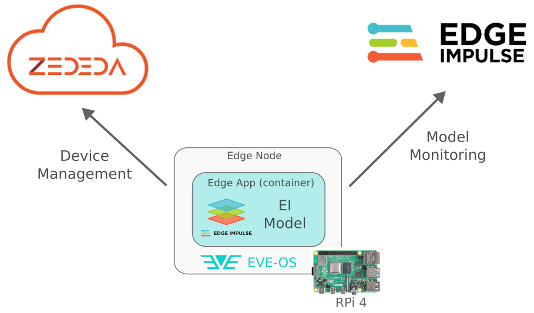

A Raspberry Pi 4 single-board computer will be used as our example Edge Device. On the Raspberry Pi 4 we will install EVE OS, then we will provision it into the ZEDEDA Cloud platform.

Our Edge Impulse model will be packaged as a containerized application based on the [EI Impulse Runner](https://docs.edgeimpulse.com/docs/tools/edge-impulse-cli/cli-run-impulse). The containerized application then will be imported into the ZEDEDA platform as an Edge App, from where and it will be deployed to the Edge Device.

Finally, we will show a quick preview on how the experimental Model Monitoring features can be used to monitor Edge Impulse models running on production devices.

## Edge Impulse

In this project we will focus on deploying Image / Video based Edge Impulse projects on ZEDEDA Cloud devices. We can use an existing Edge Impulse project, or create a new one.

For this demo, I created a simple object detection project. First, I collected a couple of images with a mug, a glass and a Raspberry Pi 4:

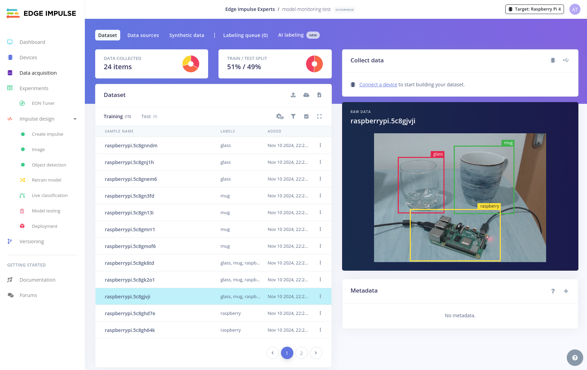

Then the target objects in the collected images were manually labeled in the _Data acquisition_ section in Edge Impulse Studio. The dataset was then split into train and test sets.

Then, I set up an Impulse implementing Object Detection for our target objects:

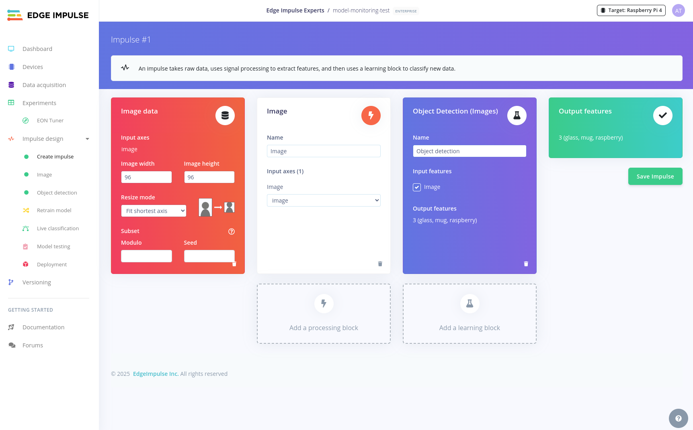

The Impulse I used is a simple one, and uses the standard Object Detection processing block with the default parameters. Different Impulse architectures can also be used, as it makes little difference on how we will package our EI application later in this project.

After we train our Impulse, we can can test its basic functionality with Live classification on a supported device. If everything is good, the Impulse should be ready to be used in an edge application.

In order to access the trained Impulse from ZEDEDA Cloud / EVE OS devices we will need an API Key from the Edge Impulse Studio. We can get this from the **Dashboard -> Keys** section:

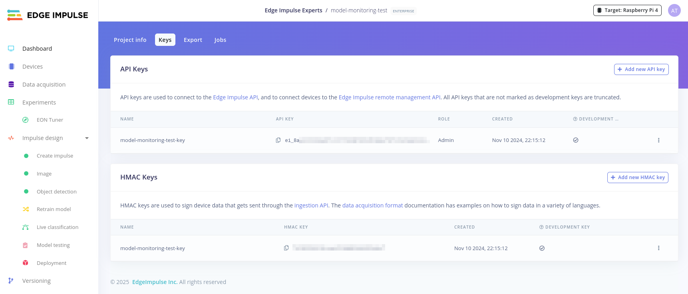

From here, copy the API Key's value with the `ei_...` format.

## ZEDEDA

The [ZEDEDA Cloud](https://zededa.com/) is a SaaS platform offering among others, orchestration and management services of edge device and applications directly from the Cloud. ZEDEDA works with fully managed Edge Devices, to which one or more Edge Applications can be seamlessly deployed.

In this project we will show how an Edge Impulse ML model can be deployed on a ZEDEDA managed edge devices.

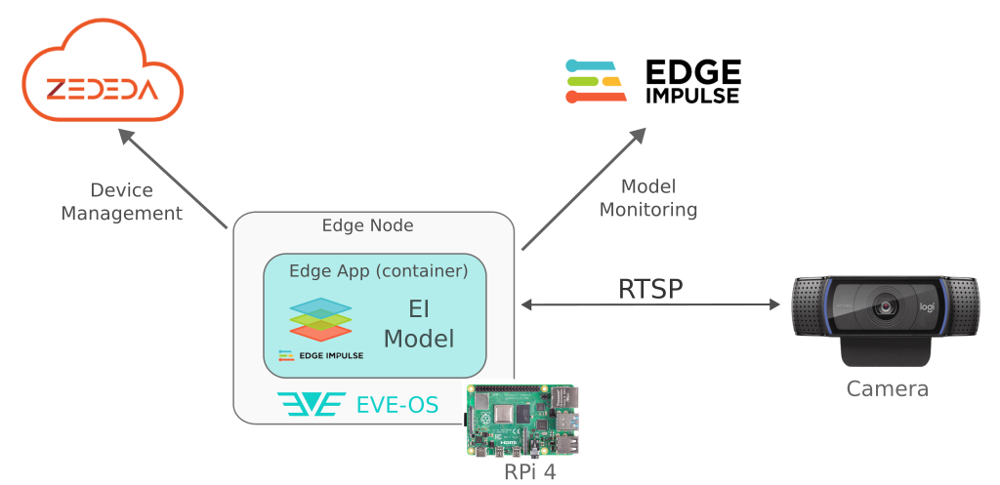

For the purpose of the demo we will use a Raspberry Pi 4 as our ZEDEDA Edge Node. The Edge Impulse ML model, also known as an Impulse, will be deployed to the platform as an Edge App. Additionally, the new experimental Model Monitoring features will be used to inspect the live running AI model directly from Edge Impulse Studio.

Hardware used:
- a Raspberry Pi 4 Model B, with at least 2GB of RAM
- a microSD card with at least 8GB capacity
- wired LAN connection with Internet access
- an IP camera or an USB webcam 
- (optional) an HDMI display and micro-HDMI to HDMI cable - these are only needed to view the debug output of EVE-OS

### Installing EVE-OS on a Raspberry Pi 4

Edge Nodes managed by the ZEDEDA cloud platform must run [EVE-OS](https://lfedge.org/projects/eve/), which is light-weight, open-source Linux distribution designed to run containerized or VM-based workloads. In this section we will show how to install EVE-OS on a Raspberry Pi 4.

To install EVE-OS we need to generate and flash an SD Card image. This can be done using the [lfedge/eve](https://hub.docker.com/r/lfedge/eve) tool which is packaged as a Docker container.

The default settings create an EVE-OS image intended for production use. In case we are using a demo / trial account with ZEDEDA Cloud, we need to prepare a small customization to point the EVE-OS installation to the ZEDEDA Demo server. This can be done as bellow:

```sh
$ mkdir "$HOME/eve-overrides-demo"
$ echo zedcloud.gmwtus.zededa.net > "$HOME/eve-overrides-demo/server"
```

With this we are ready to generate an EVE-OS image by running the following command:

```sh
$ docker run -v "$HOME/eve-overrides-demo:/in" --rm lfedge/eve:latest-arm64 live > ./live.img

...
b5171159-734b-4254-9930-2c35239d3858     # <-- this is an uniquely generated soft serial number
```

The command produces a `live.img` file with our EVE-OS image. Along with this, there is uniquely generated soft serial number printed as the last line of the output. Make sure to note this, as it will be needed later in the provisioning step.

The resulting `live.img` should be a regular disk image file, and can flashed to a microSD card using [Balena Etcher](https://etcher.balena.io/) or similar tools.

After the SD card is flashed we can insert it into the Raspberry Pi 4. EVE OS should boot automatically. In case we have a HDMI display connected we will see some message with EVE-OS trying to connect to ZEDEDA Cloud.

### Creating an ZEDEDA Cloud Project

With the Raspberry Pi 4 running EVE-OS, we can start setting up things in the ZEDEDA Cloud platform.

The first thing we need in ZEDEDA Cloud is a Project. To create it we go to [Administration -> Projects](https://zedcontrol.gmwtus.zededa.net/administration/projects/list) and click on _Add Project_:

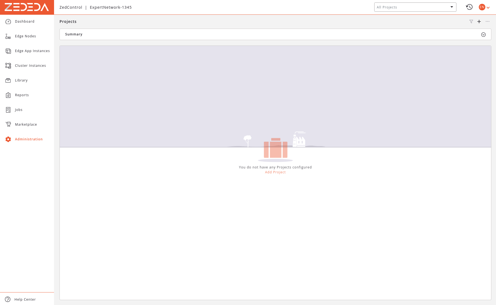

Next, give a name to the project and select the "Deployment" type:

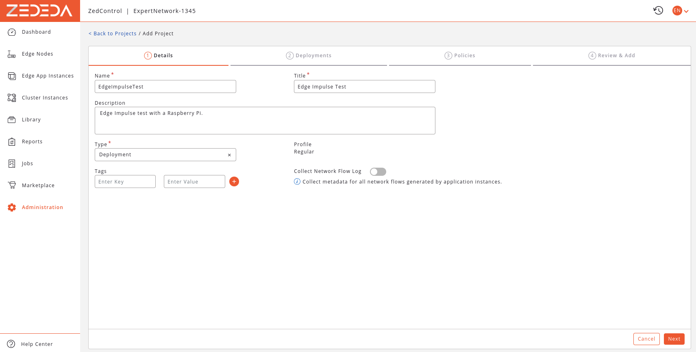

On the Deployments and Policies pages we can use the same name:

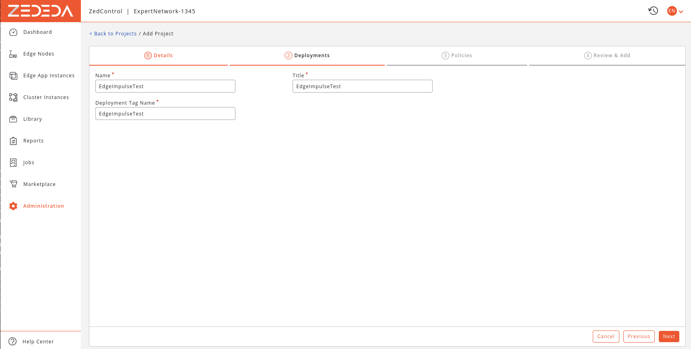

...While keeping the rest of the options as default:

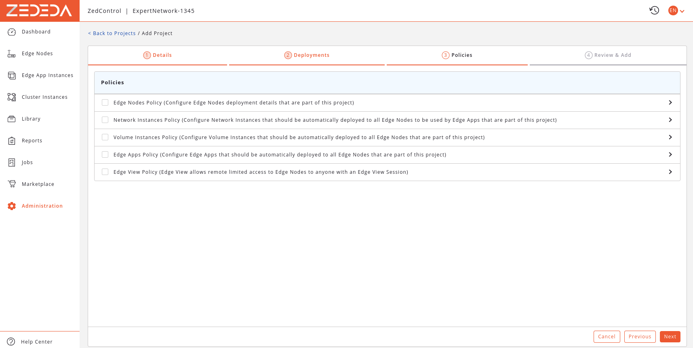

Lastly, we can review our inputs and hit _Next_ to create our project:

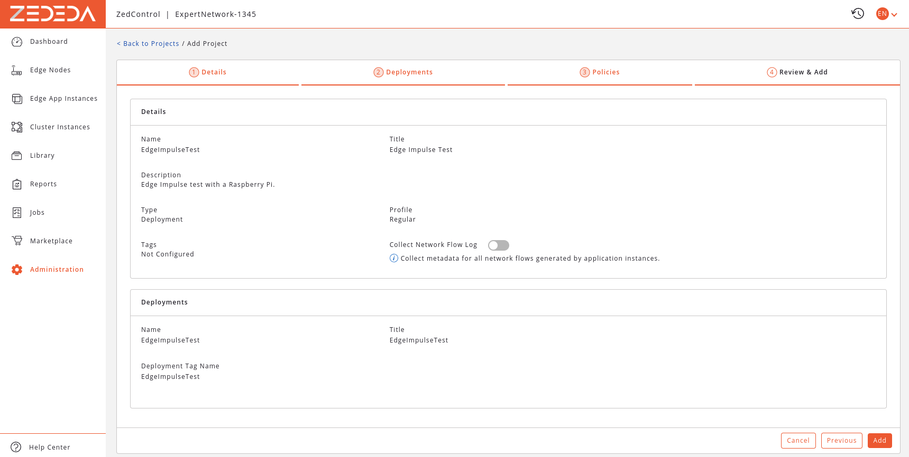

After the project is created, our Projects list should look something like this:

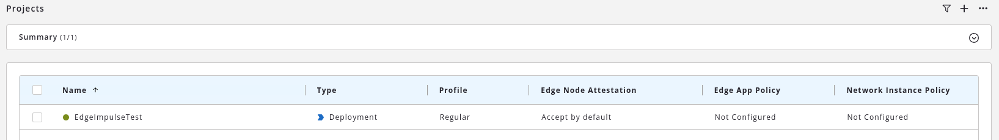

### Configuring a Network

Before being able to onboard the Raspberry Pi 4 we will need to configure a network for the Edge Nodes to use. For this go to [Library -> Networks](https://zedcontrol.gmwtus.zededa.net/library/networks/list) and click _Add Network_.

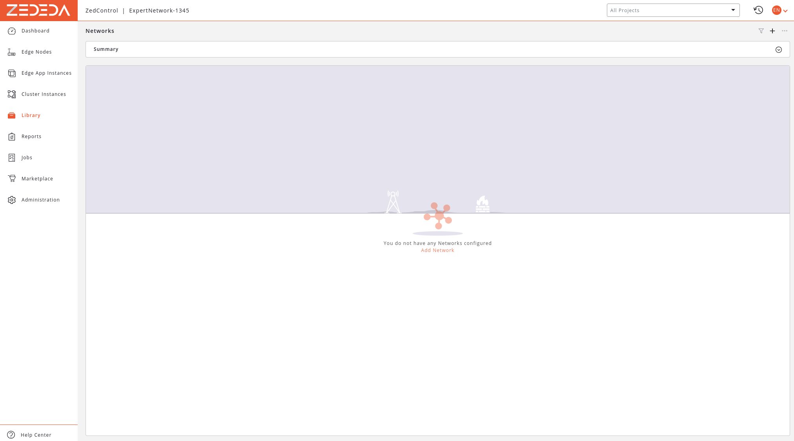

Here, add a new IPv4 network with an arbitrary name, DHCP client mode, and 1500 MTU:

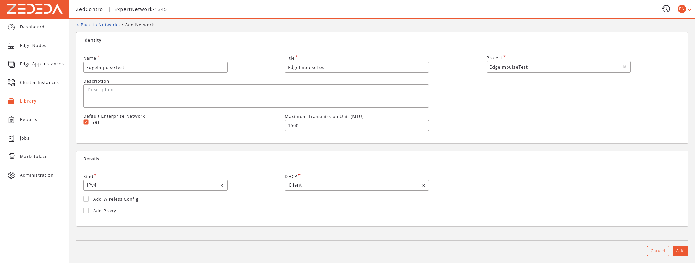

The newly added network should appear in the networks list:

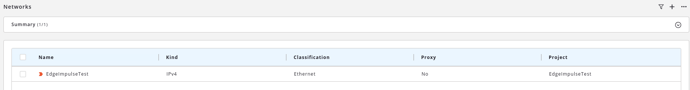

### Onboarding the Raspberry Pi 4 to ZEDEDA Cloud

At this point we should be ready to onboard our Raspberry Pi 4 into ZEDEDA Cloud.

If this is our first Edge Node we first need to import a supported hardware model from the ZEDEDA Marketplace. For this go to [MarketPlace -> Models](https://zedcontrol.gmwtus.zededa.net/marketplace/models/list), and in the Global Models section find a import the **RPi4-4G** model:

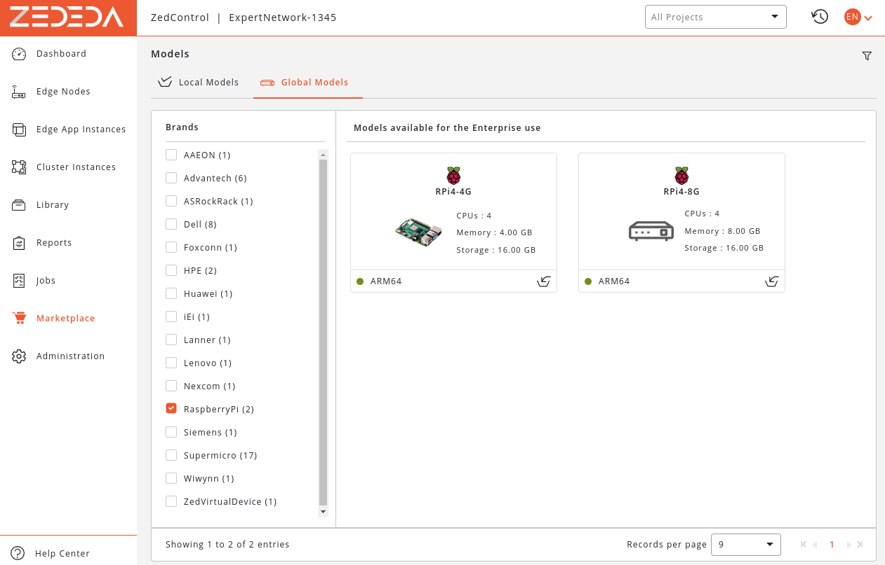

Next, go to the [Edge Nodes](https://zedcontrol.gmwtus.zededa.net/edge-nodes/list) page, and click _Add Edge Node_.

Here we should give a name to the new node, and select our previously created Project and Deployment Tag:

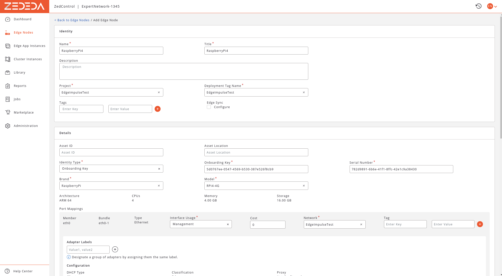

In the Details sections, select _Onboarding Key_ as the Identity Type. Set the Onboarding Key to `5d0767ee-0547-4569-b530-387e526f8cb9`, which is the default key for all projects. In the Serial Number field enter the unique serial number we got earlier at the generate EVE OS image step. For the Brand and Model select _RaspberryPi_ and _RPi-4G_.

In the Port Mapping section set `eth0` as a Management interface, with our previously created Network attached to it. The `wlan0` network can be left unused, while the USB port can be set as _App Direct_ (we will not use them).

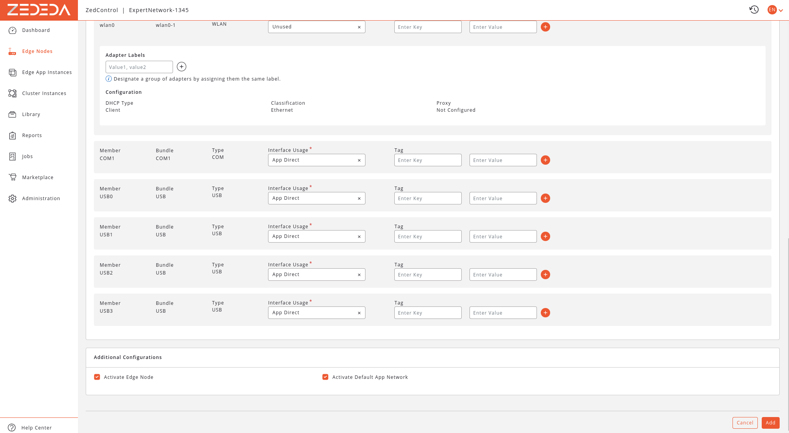

In the _Additional Configuration_ section we can check both activation options.

After we click Next, the onboarding of the Edge Node will start. During the onboarding, if we have an HDMI screen connected to the Raspberry Pi, we should see some console activity showing the device is trying to onboard to the ZEDEDA cloud platform.

The onboarding process can take a couple of minutes, after which we should find that our Edge Node comes online:

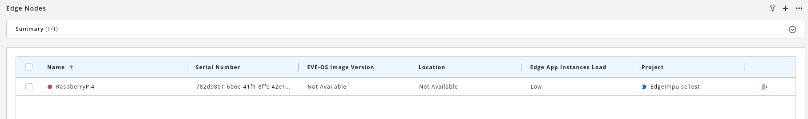

In the Edge Node's page we can find various details and metrics:

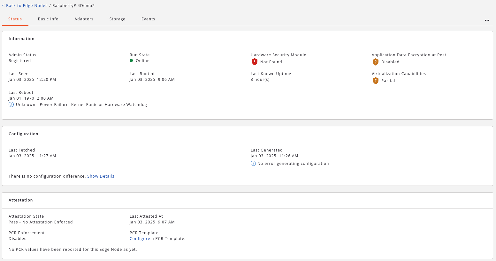

## Deploying the Edge Impulse Project to ZEDEDA

In this section we will show how we can deploy Edge Impulse models as an Edge App into the ZEDEDA platform.

EVE OS and the ZEDEDA platform supports running applications based either on Containers or Virtual Machines (VM). In this project we will build and deploy our Edge Impulse model as a Container-based Edge App.

### Preparing a Container Image

Edge Impulse already packages the EI Runner as a Docker container. We can use this as a base of our Container image, over which we can apply customizations.

Customizations can range from running EI Runner parameters to run in different modes (ex. API server vs. live inference), to adding startup scripts or implementing custom applications.

For this demo project, I added the following customizations to the base Docker image:
1. A set of GStreamer plugins was added to be able to use RTSP Camera as our video source.
   *(note: this was needed as ZEDEDA / EVE OS does not seems to support USB cameras with the Raspberry Pi)*
2. A entry point script was added, which can start the EI Impulse Runner with custom parameters

The final `Dockerfile` looks like this:

```docker
FROM aureleq/ei-inference-container

ARG DEBIAN_FRONTEND=noninteractive

RUN ln -snf /usr/share/zoneinfo/Europe/Bucharest /etc/localtime && echo Europe/Bucharest > /etc/timezone

RUN apt update -y && apt install -y gstreamer1.0-tools gstreamer1.0-plugins-good gstreamer1.0-plugins-base gstreamer1.0-plugins-base-apps gstreamer1.0-libav && apt dist-upgrade -y && apt autoremove -y && apt autoclean -y

ADD app.sh /app/app.sh
```

The `app.sh` is a script used as the container's entry point. It can start the Edge Impulse runner in two possible modes:
1. HTTP Server mode - starts an inference server on port `1337` - this exposes the EI model as an API to be used by other applications
2. RTSP Camera mode, with Model Monitoring - starts the EI Runner with a RTSP Camera as the video source, and the experimental Model Monitoring features enabled

The script also accepts an EI API Key, and a custom Device Name:

```sh
#!/bin/bash

MODE="$1"
EI_API_KEY="$2"
DEVICE_NAME="$3"

echo "Mode: $MODE"
echo "EI API Key: $EI_API_KEY"

if [[ "$MODE" == "http-server" ]]; then
    echo "Running EI runner in HTTP server mode..."
    node /app/linux/node/build/cli/linux/runner.js --api-key "${EI_API_KEY}" --run-http-server 1337 --impulse-id 1

elif [[ "$MODE" == "gst-model-monitoring" ]]; then
    echo "Running EI runner with GStreamer sources + Model monitoring..."
    while true; do
       echo "${DEVICE_NAME}" | node /app/linux/node/build/cli/linux/runner.js --clean --silent --monitor --api-key "${EI_API_KEY}" --verbose --enable-camera --gst-launch-args "rtspsrc location=rtsp://<RTSP-CAM-IP>:8554/stream ! rtph264depay ! avdec_h264 ! videoconvert ! jpegenc" || true; 
       echo "Runner stopped! Restarting it..."
    done
else
    echo "Unknown mode!"
    exit 1;
fi
```

To be able to use this container image in ZEDEDA Cloud, we need to make it available in a container repository. I used a private DockerHub repository for this purpose. The image was built and published as follows:

```sh
$ docker buildx build . --platform linux/arm64 --tag attitokes/zededa-test:edge-impulse-in-docker-0.1.0 --load
$ docker push attitokes/zededa-test:edge-impulse-in-docker-0.1.0
```

### Configuring the Container Registry and Adding the Container Image

As we will use a slightly modified container image, we will need a container registry that we can attach to ZEDEDA Cloud. To attach a container registry to ZEDEDA Cloud, go to [Library -> Data Stores](https://zedcontrol.gmwtus.zededa.net/library/data-stores/list), and hit `+` to create a new data store.

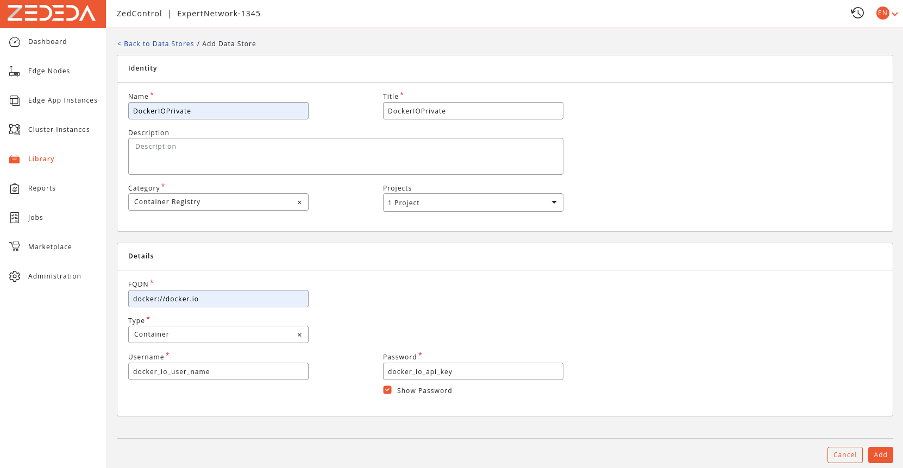

Give it a name, and select _Container Registry_ as the Category. I used Docker Hub, for which we should set `docker://docker.io` as the FQDN. Select the type of Container, and enter a Docker IO user name and API key.

After this we should be able to import our container image into ZEDEDA. For this go to [Library -> Edge App Images](https://zedcontrol.gmwtus.zededa.net/library/images/app/list), and click `+` to add a new image:

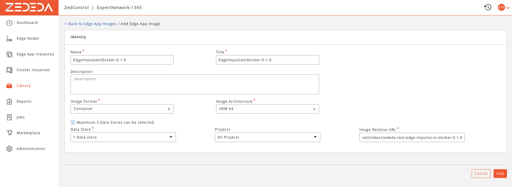

Here, select the newly added Data Store, specify the image URL using the `/<username>/<image>:<tag>` format.

### Creating and Edge App

With this we are ready to package our EI model as an ZEDEDA Edge App. For this go to [Marketplace -> Edge Apps](https://zedcontrol.gmwtus.zededa.net/marketplace/edge-apps/local/list), and create a new edge app. Select _Container_ as the application type.

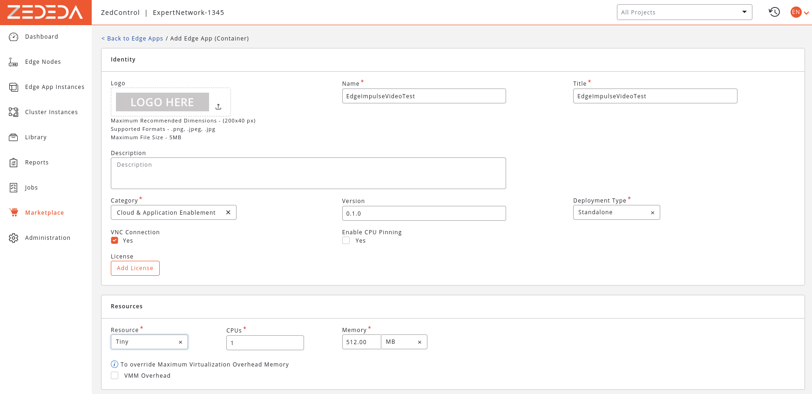

In the _Add Edge App_ page give the application a name, and select _Standalone_ as the Deployment Type. For _Resources_, Tiny or Small should be enough.


In the _Drives_ section, select the Edge App Image we created previously. 

Then, in the _Networking_ section we need to configure an Outbound rule that allows any traffic:

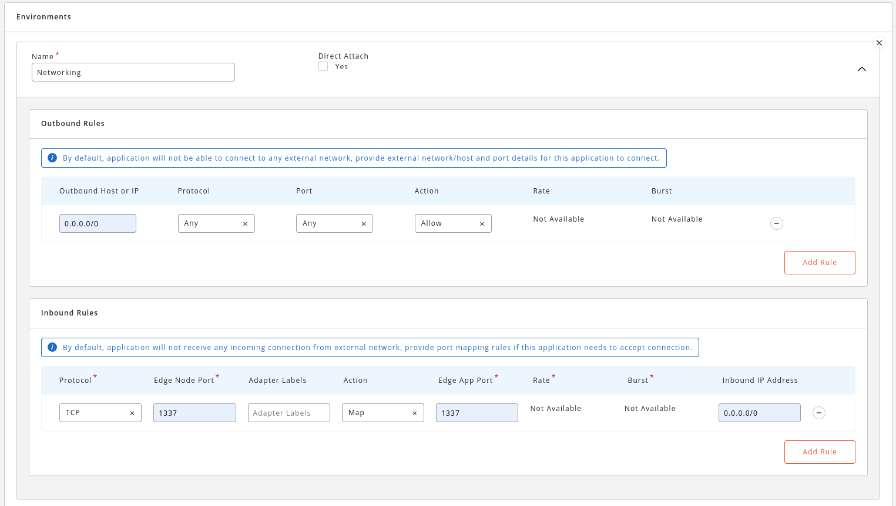

Additionally, if we want to use the HTTP server, we also need to expose the `1337` port to the outside world.

In the _Configurations_, enable the custom edge app configuration as follows:

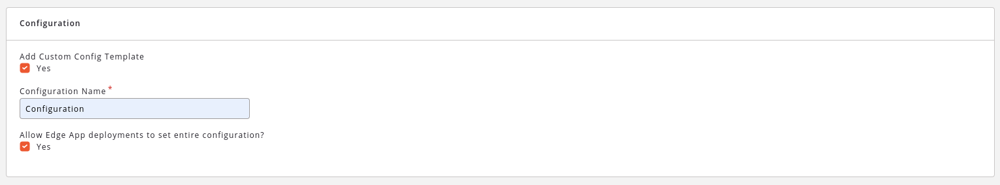

This will allow us to inject settings like the Device name and Edge Impulse API Key later when we deploy the Edge App to the Raspberry Pi 4.

On the Developer Info section, fill in the necessary details, and click _Add_ to create the Edge App.

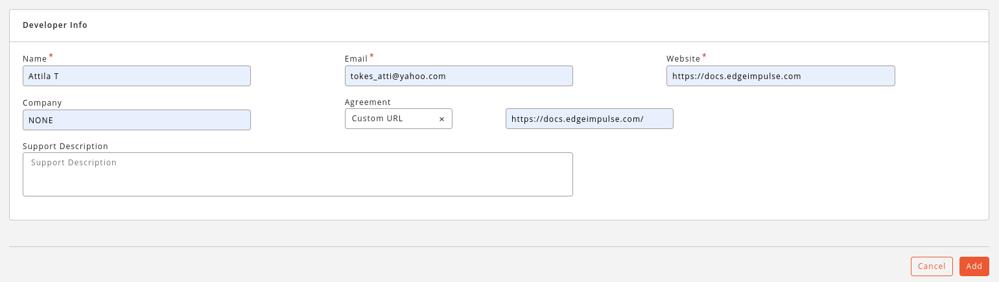

### Deploying the Edge App to the Raspberry Pi 4

With the Edge App created, we should be able deploy it to our Raspberry Pi 4 Edge Node. To do this go to the [Edge App Instances](https://zedcontrol.gmwtus.zededa.net/edge-app-instances/list) section, and use the `+` button to create a new deployment:

In the first page select the Raspberry Pi 4 Edge Node to deploy to:

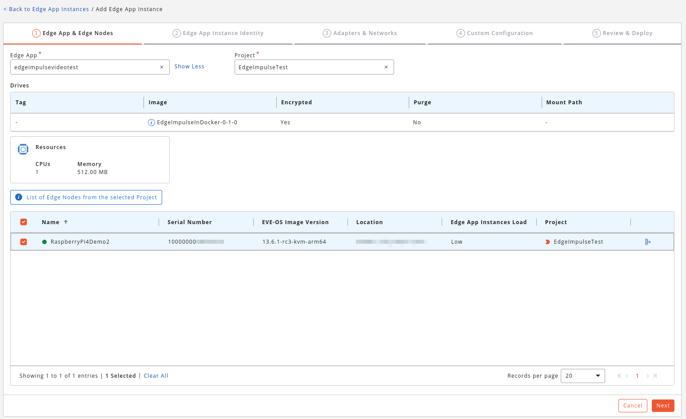

Then, in the next page, give the app instance a name:

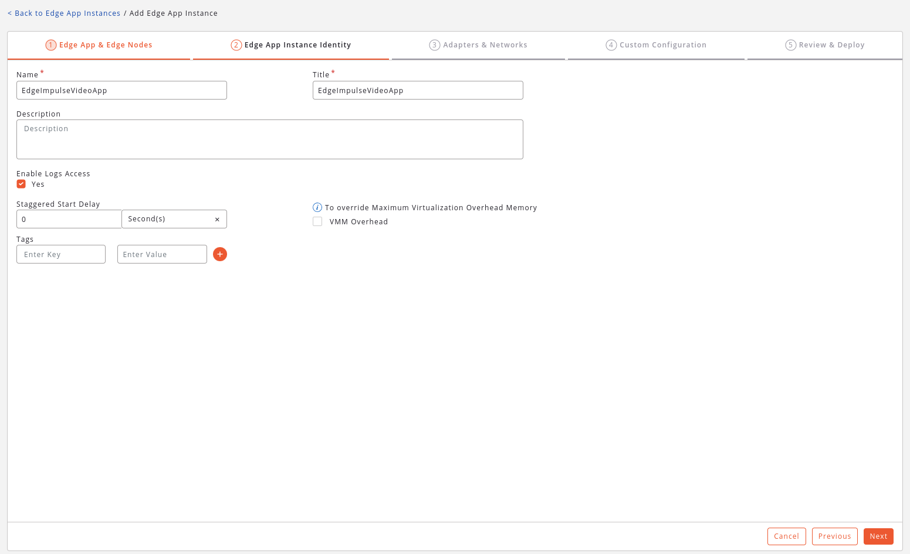

In the next page, the Networking settings should be already pre-populated with the correct adapter, so we can go the next page:

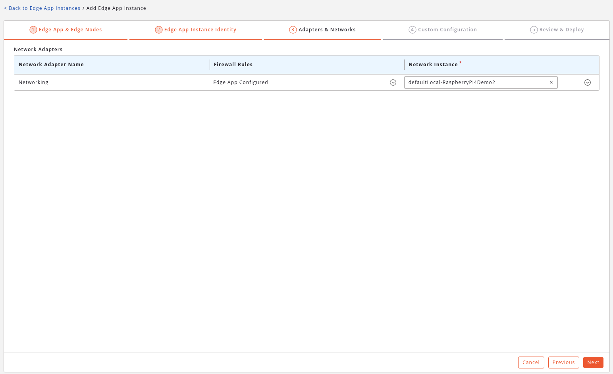

On the next page we need to configure the settings for our Edge App instance. Here we can specify a Device Name and our Edge Impulse API Key as follows:

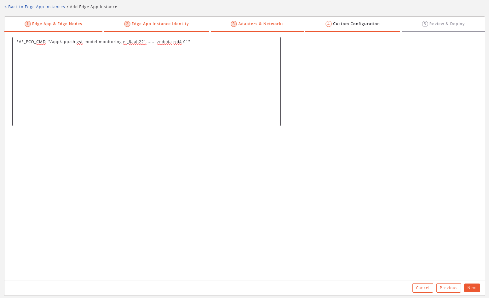

For this use the following configuration:

```
EVE_ECO_CMD="/app/app.sh gst-model-monitoring <EI_API KEY> <DEVICE_NAME>"
```

Finally, we can review and deploy the app:

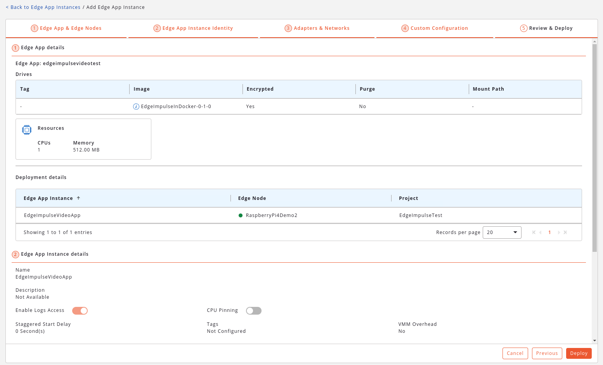

It takes a couple of minutes until the container image is fully downloaded, a volume is created and the app is booted. During this time the Edge App Instance will go through various states, and in the end it should come online:

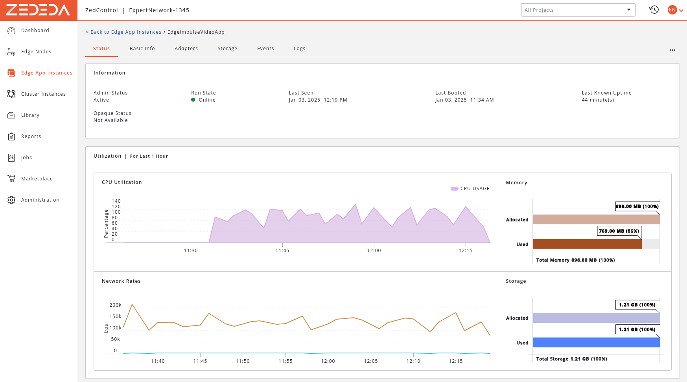

## Edge Impulse Model Monitoring

Managing large fleets of Edge Devices can get complex. The ZEDEDA Cloud solves this by offering a centralized platform that makes managing Edge Devices and Apps easy.

The ZEDEDA platform however does not have insights on what our Edge Apps are actually doing. With Edge ML applications it is particularly important to get insights about our model's performance in the real world.

Up until recently, in Edge Impulse implementing monitoring of production Edge ML apps was left to the users. 

Now, Edge Impulse is working on a new set of [Model Monitoring](https://edgeimpulse.com/industrial-new-features) features, meant to enable deployment and monitoring of EdgeML apps.

With Model Monitoring enabled on our ZEDEDA Edge App we can benefit from the following features:
1. New devices running the Edge App are automatically populated in the Devices tab in EI Studio.
2. Using Live Inference we can monitor / debug the AI models running on the Edge Device in real-time.
3. We can push a new model version to the Edge Devices, without the need to restart or redeploy the Edge App.

The Model Monitoring features are still experimental, but here is a quick demo on how Live Inference currently looks in the Edge Impulse Studio:

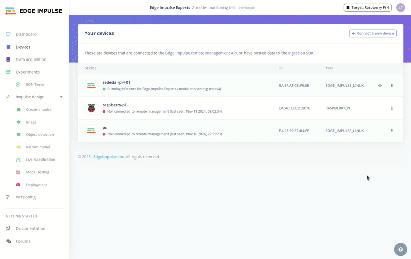

## Conclusions

The ZEDEDA platform allows managing and orchestrating large number of edge devices and applications from a centralized platform. It provides visibility and control over the edge devices deployed in the field directly from the cloud. Its zero-trust security model ensures device integrity, and allows secure communication of edge apps with the cloud.

Packaging Edge Impulse models into container-based edge apps allow deploying them to multiple devices with ease. Using the EI Impulse Runner in various modes allows launching models and integrating them with external applications and data sources in flexible ways. Additionally, the new set of model monitoring features will allow monitoring edge models deployed in the real world and collecting data from them in real-time.

These features make the combination of the ZEDEDA and Edge Impulse platforms a great solution for deploying edge ML applications to large fleets of edge devices.
