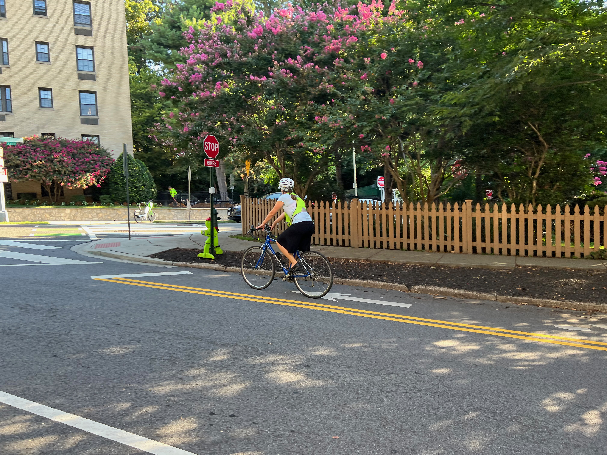
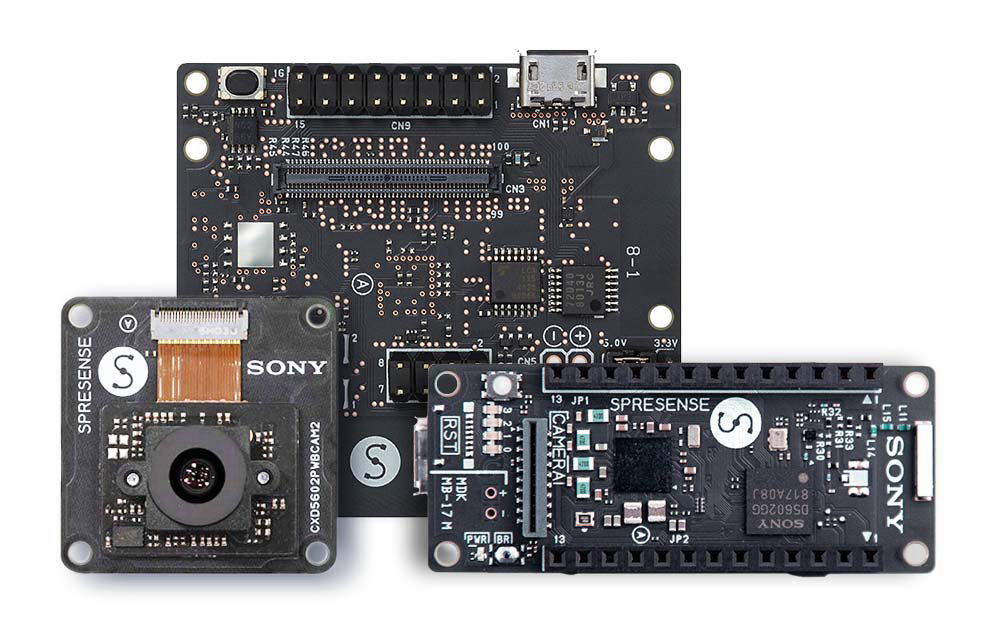
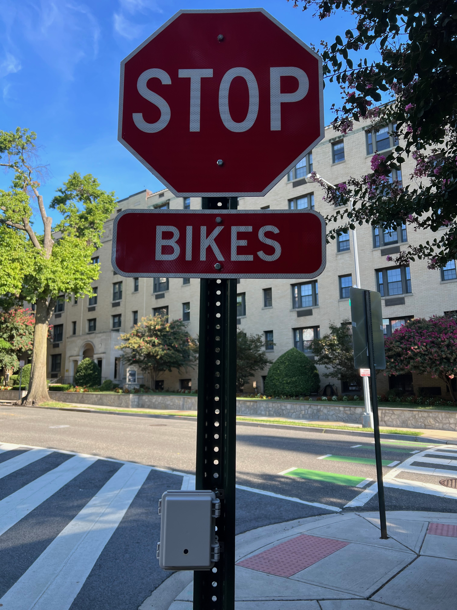
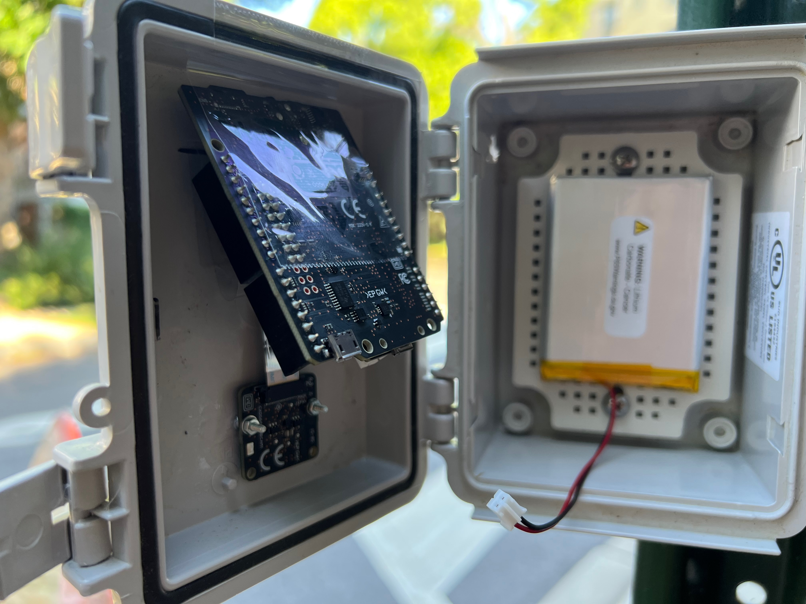
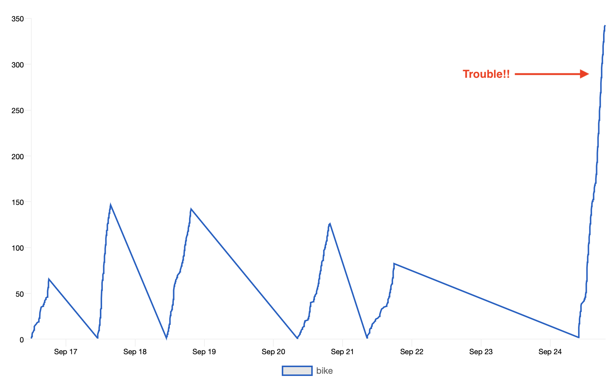
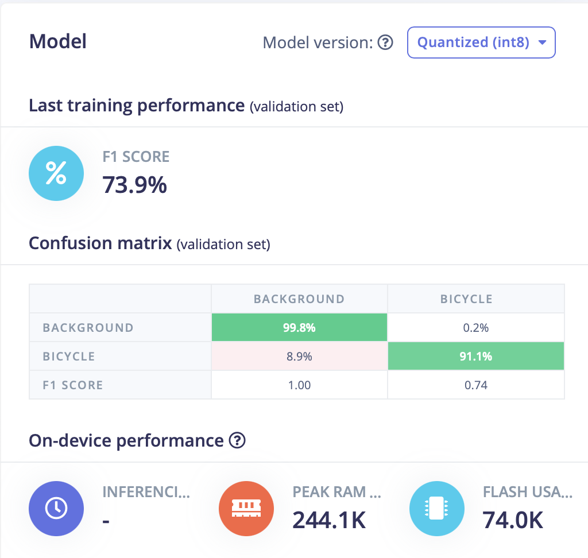

# Bicycle Counting with a Sony Spresense

Created By:
Luke Berndt 

Public Project Link:
[Coming Soon]()

## Intro

I live on a pretty quiet, one-way street. Recently, the city added a counter-flow bikelane and I was very interested in finding out how often it was getting used. Earlier in the pandemic it might've been possible for me to sit on my porch and count cyclists as they go bye. However, now that things are picking up I decided this could be a good job for a Tiny ML powered sensor.

## Existing Approaches
There are a number of different sensors being using to count cyclists. (Check out the table at the end). When the count is being done on a dedicated bike lane, a simple optical beam break sensors or inductive loops can be used. These approaches are less reliable when the bike lane is part of the street and the sensor needs to be able to differentiate between lots of different objects.

A human can of course act as a sensor and manual count the number of cyclists that go by a spot. An easy improvement is to record video of a location and then have a human manually review it. The next evolution of this approach is using computer vision to review this video and count the cyclists. With a traditional machine learning (ML) model that requires a lot of processing. The video can either be transported and processed at a server, or if there is a enough power, the processing can happen at the sensor. Both options increase the cost and complexity of deploying a sensor. However, with a TinyML model you can build a vision sensor with the model running at the edge using low-cost, low-power hardware. The only question is if it will be accurate enough... read on to find out!

## Sensor Hardware
 Sony was nice enough to send me one of their [Spresense development boards](https://developer.sony.com/develop/spresense/), along with the LTE Extension board and camera to use for this project. My judgment may have been a little bit swayed because the board was free, but I have to say it really is a pleasure to use.

To start with, the LTE-M Extension board is amazing and easy to work with. With the included libraries, it's very easy to send out MQTT messages or TCP/IP traffic right from the dev board. Another thing this board has going for it is the camera. Sony has a lot of experience building image sensors and it shows. The auto white balance and auto exposure were spot on - allowing it to handle a wide range of lighting conditions with ease. I used the camera from sun up to sundown and it managed to get shots the whole time. There is also hardware accelerated support for common image tasks, like clipping and resizing. The board also has phenomenal audio capabilities - I didn't get to use them for this project but I'm looking forward to trying them out in some future builds. Another feature I didn't get to put to use was the boards multiple cores. Sony has provided libraries that make it easy to run independent programs on each of the five sub cores and the main core.

Of course no dev board is perfect - While there is a breakout connection for line-power, neither the dev board or extension board come with a connector for hooking up a LiPo battery. The documentation recommends just using a USB battery instead, but I was unable to easily fit that into the case I was using. I did solder on a JST connector and was able to add a LiPo battery and power it. However, unlike the Adafruit boards that I am used to, this board does not provide any way to charge for the battery. I am planning on eventually adding solar charging so this isn't a big problem.

## Building a Model
In order to build a Tiny ML model, you of course need a dataset. I wanted to be able to count the number of cyclists in an image, incase a group of riders passes the sensor. With Image Classification, you just know if there is one or more bicycles in an image - you don't get a count of how many. Edge Impulse's FOMO model is based on Object Detection and allows you to count how many instances of an object are present in an image. Object Detection models need images with bounding boxes defined for objects and labeled appropriately. I started out by looking for existing data sets with labeled images of cyclists. I did find a couple data sets that included labeled cyclists: ([BDD-100](https://www.bdd100k.com), and [Tsinghua-Daimler Cyclist Detection Benchmark Dataset](https://www.kaggle.com/datasets/f445f341fc5e3ab58757efa983a38d6dc709de82abd1444c8817785ecd42a1ac)). 

However these models I trained from these dataset did not work well. While the images in the dataset were rather large, many of the labeled instances of cyclists were very small. When these images were shrunken down in order to match the model's size (96x96px), the resulting cyclist was only a few pixels high. While this approach initially looked promising, clearly this was not going to work.

Luckily Edge Impulse makes it easy to [collect your own dataset](https://docs.edgeimpulse.com/docs/development-platforms/using-your-mobile-phone) using a smart phone and their web app. In order to bootstrap my model with images of cyclists, I walked around town and took pictures of the different riders, as well as similar photos with no cyclist present. After about 100 images or so, I labeled all of the images with bicycles in them. For the images I captured, I tried to make sure the cyclist took up a lot of the frame to help make sure the model had enough data to train on. The photos were taken in an area near where I would be placing the sensor, so the backgrounds were representative of what the sensor would see. When I trained the model on this data set, I ended with a model that was a lot more accurate. Of course with 100 images it was still far from perfect but it was good enough to deploy in a sensor and begin automatically collecting images to help further grow a data set.

*These are all the objects the sensor detected during a day, with a range of confidence*

While you can build an initial vision model using images from the internet or captured using your phone, it is important to eventually incorporate images from the actual camera sensor. The cameras in smartphones work amazingly well - they are almost always perfectly exposed, color corrected and in focus. The images captured by the camera modules found in sensors do not compare. The sensor may also be placed in a way that gives it a very different perspective than you would get from a phone. The sensor maybe much lower or higher - and since the sensor is capturing images at random intervals, there is a good chance the object being detected will not be centered, and maybe cut-off or occluded. 

In order to augment my dataset with real world photos, I had my sensor save photos whenever it had detection with a confidence of 10% or greater. This is well below the normal threshold for a detection and lets you help guide the model when it is uncertain. This of course means you will be working through a bunch of images and applying labels, but Edge Impulse's interface helps make quick work of it. After a number of rounds of capturing images, labeling and then training a new model the performance improved to a point where it was correctly detecting cyclists with a high degree of confidence, while still have a low number of false detections. 

## Building a Sensor

To build the sensor I started with a medium size case from [Polycase](https://www.polycase.com/wh-04). The case was easy to open and close but is also waterproof and has mounting hardware which after a quick trip to the hardware store made it easy to mount to a sign post. One of the stop signs on my street was nicely positioned and provided an angle where you could observe both the bike lane and the road. I drilled a small hole in the cover of the case and used superglue to position two screws to the cover. This let me mount the camera board to the cover of the case. Using a piece of packing tape I simply positioned the Dev board over the camera. I fastened a large LiPo battery to the main section of the case and connected the two together using a JST push button on and off switch. In the future I would love to build a better mounting frame, but my 3D design skills are not at that level yet.

## The Software

I used the Arduino IDE to program the sensor, and the Spresense has a nice Arduino library and documentation. The program is rather simple, it runs through a loop, constantly taking a picture and then running the model I trained against it. If any cyclists are detected then the following happens: both the input image for the model, which was downsized and converted into RGB 888, along with the original photo that was captured are saved to the MicroSD card on the dev board. All of the information about the detections: the object label, the bounding boxes that were detected, and the confidence, are saved in JSON format to a file alongside the images. I used the LTE connection from the board to help keep track of how the sensor is doing throughout the day. Each time there is a detection with a confidence above a configurable threshold, an MQTT message gets sent. I am using [adafruit.io](https://io.adafruit.com/) to capture and graph this data. It has been really helpful to see when the model is getting confused by an object in the frame and continually counting it as a cyclist.

The source code for the project is available here: [https://github.com/robotastic/ei-spresense-bicycle](https://github.com/robotastic/ei-spresense-bicycle)

## Improving Performance

Having an ML Model work reliably, over a long period of time, in the real world is challenging. Through out a day, there will be some random occurrence that was not part of the training set, leading to a false detection. Or there will be a cyclist with a crazy recumbent bike that the model will miss. It is sometimes too easy to focus solely on building a better model, but it is important to take a holistic look at the problem. Finding ways to reduce the variance in a scene's background will result in fewer false detections. Having a consistent perspective of an object will provide more accurate detection. 

While I am going to continue to expand the dataset for the sensor, I am also going to look at other locations for the camera. Right now, the camera captures cyclists from a number of angles as they ride up the street. The background is made up of a row of parked cars, which are constantly changing. Setting up the sensor so that riders are only captured from the side as they bike by would help distinguish them from pedestrians. There would also be less variation in the size of cyclists. In the current location, riders get smaller and smaller as they ride away down the street, making them tough to distinguish from pedestrians at certain distances. Having a more consistent background would make it easy for the model to learn what to ignore. 

## Conclusion

This appears to be a very effective way to count the number of cyclists in an area. Since it is low power and low cost, it could be deployed in a wide range of scenarios. Using a similar approach, it would be possible to build a sensor that could detect and count other classes of objects, such as school buses or trash trucks.

## Appendix

**A survey of existing approaches for counting cyclists and pedestrians.**

From: [Exploring Pedestrian Counting Procedures](https://www.fhwa.dot.gov/policyinformation/travel_monitoring/pubs/hpl16026/)
 
| Technology | Typical Applications | Strengths | Weaknesses |
| --- | --- | --- | --- |
| Manual Counts In-Field| Short-duration counts | * Can gather gender and behavioral information * Portable * No installation costs | * Limited to short-duration counts only * Accuracy may depend on data collector * At high-volume locations, additional personnel are needed, which can result in higher costs |
| Manual Counts from Video | Short-duration counts | * Can gather gender and behavioral information * Video can be reviewed in the office, data collector can view the video at fast and/or slow speeds to extract counts * If existing cameras are available, costs can be low | * Limited to short-duration counts only * Frequent  visits may be required to download data, replace batteries * Data reduction is labor intensive * Equipment may be susceptible to theft or damage |
| Automated Counts from Video| Short-duration or continuous counts | * Portable * Time effort is low * Video can be used for additional purposes | * May be expensive to collect data at several locations |
| Passive Infrared| Short-duration or continuous counts | * Portable, easy to install * External power source not required | * Cannot distinguish between cyclists and pedestrians, unless combined with bicycle specific counting equipment * Cannot be used for crosswalks * Occlusion errors may result if large groups of pedestrians are crossing simultaneously * Extreme ambient temperatures may affect accuracy |
| Active Infrared | Short-duration or continuous counts | * Portable, easy to install * Error is linear, a factor can be used to provide accurate counts | * Cannot distinguish between cyclists and pedestrians, unless combined with bicycle specific counting equipment * Not suitable for on-street monitoring * Occlusion errors may result if large groups of pedestrians are crossing simultaneously * Requires fixed objects or poles on either side of path or trail |
| Radio Beam | Short-duration or continuous counts | * Portable, easy to install * Does not need external power source | * Occlusion errors with large groups of pedestrians * Requires fixed objects on either side of trail or path to mount transmitter and receiver |
| Pressure and Acoustic Pads| Continuous counts | * Less prone to vandalism due to in-ground installation | * Mostly used on unpaved trails * Requires users to pass directly over the sensor |
| Thermal Cameras| Continuous counts | * Not available | * Not available |
| Laser Scanners | Short-duration or continuous counts | * Not available | * Not available |

