# Surface Crack Detection and Localization 

Created By:
Naveen Kumar 

Public Project Link:
[https://studio.edgeimpulse.com/public/119583/latest](https://studio.edgeimpulse.com/public/119583/latest)

## Project Demo



## Overview

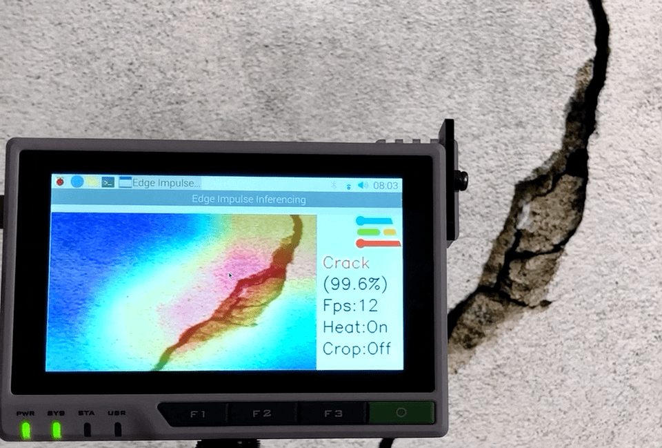

A 50-year-old bridge collapsed in Pittsburgh (Pennsylvania) on January 28, 2022. There is only one reason why a sturdy structure such as a concrete bridge could suddenly collapse: wear and tear.


Concrete structures generally start deteriorating after about 40 to 50 years. For this reason, overlooking signs of wear can result in severe accidents, which is why the inspection and repair of concrete structures are crucial for safeguarding our way of life. Cracks are one of the important criteria used for diagnosing the deterioration of concrete structures. Typically, a specialist would inspect such structures by checking for cracks visually, sketching the results of the inspection, and then preparing inspection data based on their findings. An inspection method like this is not only very time-consuming and costly but it also cannot accurately detect cracks. In this project, I built a surface crack detection application using machine learning. A pre-trained image classification model is fine-tuned using the Transfer Learning with the Edge Impulse Studio and deployed to the Seeed reTerminal (based on Raspberry Pi Compute Module 4) which detects surface cracks in real-time and also localizes them.

## Why localization?

Why do we want to localize the detection using an image classification model? Can't we use the object detection model? Yes, we can use the object detection model but we would need to add bounding boxes to thousands of samples manually. Existing object detection models may not be a good choice to auto-annotate these cracks since they are trained on definite shape objects. Repurposing the classification model for localizing the detection saves a lot of effort and still would be able to identify the regions of interest.

## How does it work?

The **CNN** (convolutional neural networks) with **GAP** (Global Average Pooling) layers that have been trained for a classification task can also be used for object localization. That is, a GAP-CNN not only tells us what object is contained in the image - it also tells us where the object is in the image, and through no additional work on our part! The localization is expressed as a heat map (class activation map) where the color-coding scheme identifies regions that are relatively important for the **GAP-CNN** to perform the object identification task.

## Hardware Setup

Since I wanted a compact and portable hardware setup, we will be using [Seeed reTerminal](https://www.seeedstudio.com/reterminal-with-cm4-p-4904.html) which comes with an LCD and buttons in a compact form. It is powered by a Raspberry Pi 4 Compute Module with 4 GB RAM which would be sufficient for this proof-of-concept project. We would need Raspberry Pi Camera V2 and an acrylic mount for it.

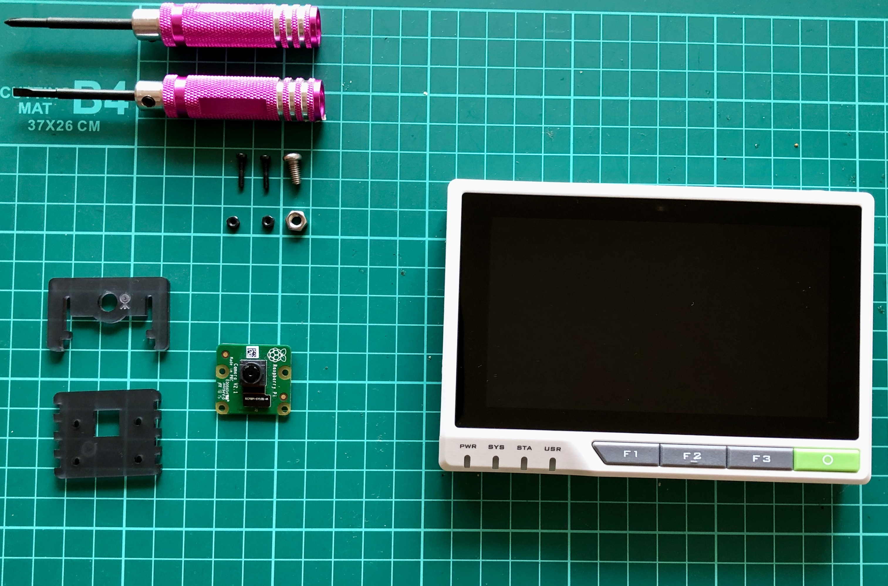

We would need to open the back cover of the reTerminal to access the 15-pin FPC camera connector. Please follow the step-by-step instructions here: [https://wiki.seeedstudio.com/reTerminal](https://wiki.seeedstudio.com/reTerminal).

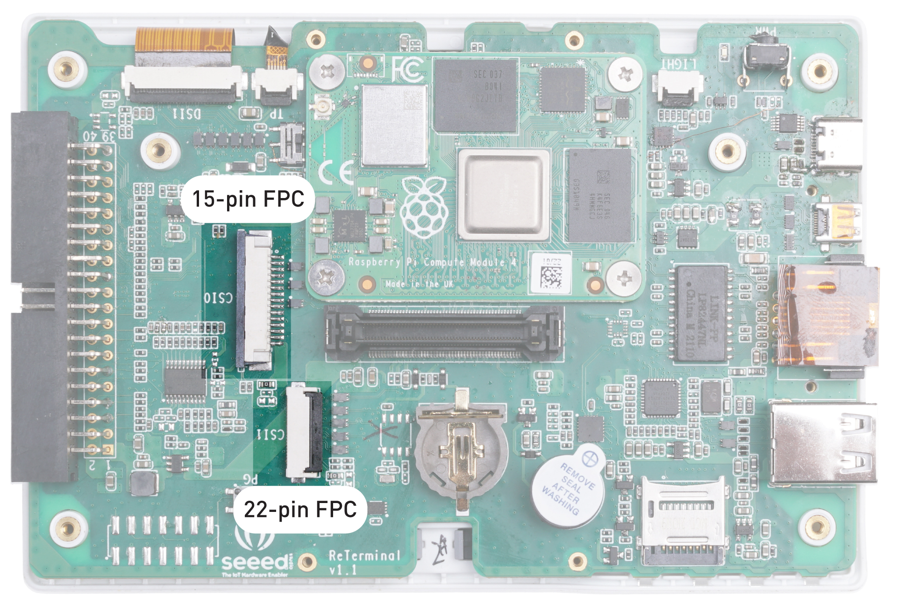

The camera is connected using the FPC ribbon cable and attached to the reTerminal using the mount.

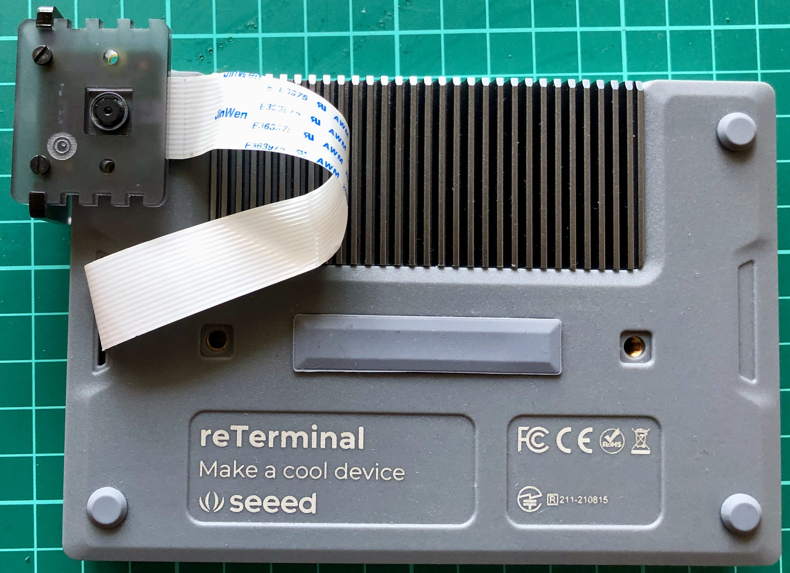

## Setup Development Environment
The reTerminal comes with 32-bit Raspberry Pi OS but We will be using 64-bit Raspberry Pi OS for better performance. Please follow the instructions here to flash the 64-bit Raspberry Pi OS: [https://wiki.seeedstudio.com/reTerminal-FAQ](https://wiki.seeedstudio.com/reTerminal-FAQ).

To install the python packages which we will be using in the inferencing code, execute the commands below.

```
$ sudo pip3 install seeed-python-reterminal
$ sudo apt install -y libhdf5-dev python3-pyqt5 libatlas-base-dev
$ pip3 install opencv-contrib-python==4.5.3.56
$ pip3 install matplotlib
```

## Data collection
The datasets were downloaded from the Mendeley Data (Concrete Crack Images for Classification). The dataset contains various concrete surfaces with and without cracks. The data is collected from multiple METU Campus Buildings. The dataset is divided into two negative and positive crack images for image classification. Each class has 20,000 images with a total of 40,000 images with 227 x 227 pixels with RGB channels.


To differentiate crack and non-crack surface images from the other natural world scenes, 25,000 randomly sampled images for 80 object categories from the COCO-Minitrain, a subset of the COCO train2017 dataset, were downloaded. The data can be accessed from the links below.

- **Surface Crack Dataset:** [https://data.mendeley.com/datasets/5y9wdsg2zt/2](https://data.mendeley.com/datasets/5y9wdsg2zt/2)
- **COCO-Minitrain dataset**: [https://github.com/giddyyupp/coco-minitrain](https://github.com/giddyyupp/coco-minitrain)

## Uploading data to Edge Impulse Studio
We need to create a new project to upload data to Edge Impulse Studio.

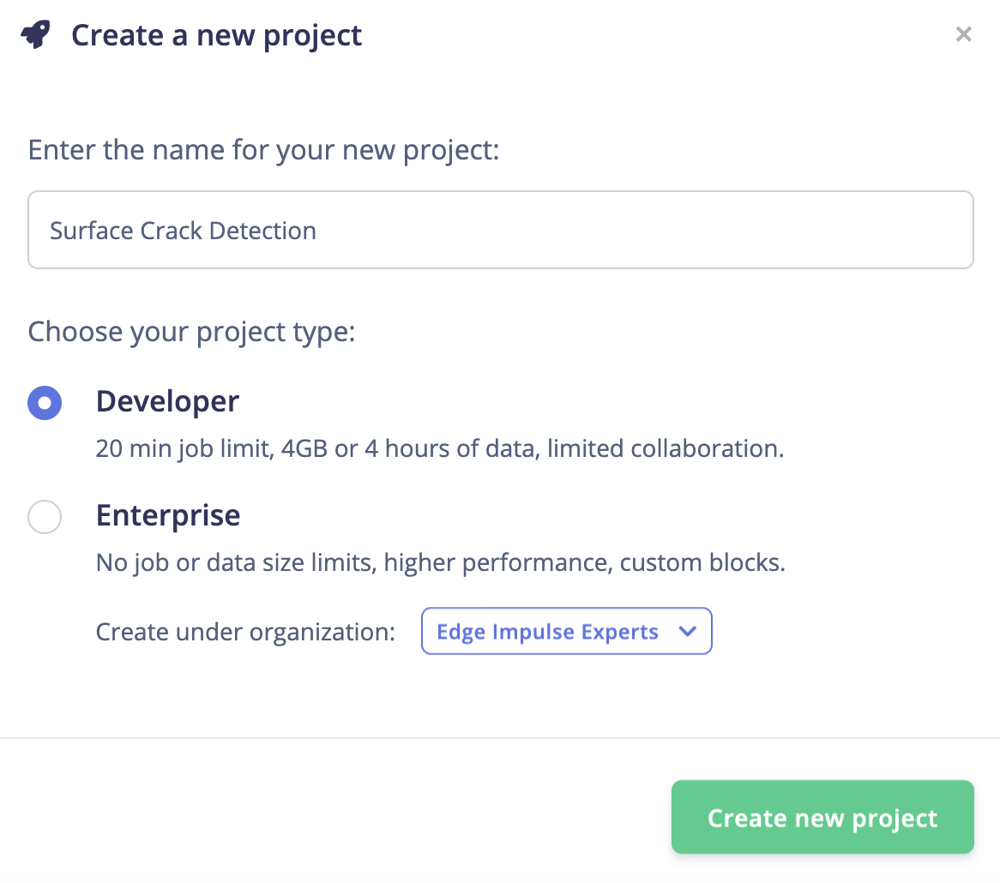

The data is uploaded using the Edge Impulse CLI. Please follow the instructions to install the CLI here: [https://docs.edgeimpulse.com/docs/cli-installation](https://docs.edgeimpulse.com/docs/cli-installation).

The downloaded images are labeled into 3 classes and saved into the directories with the label name.

- **Positive** - surface with crack
- **Negative** - surface without crack
- **Unknown** - images from the 80 objects

Execute the following commands to upload the images to the Edge Impulse Studio. 
The datasets are automatically split into training and testing datasets.

```
$ edge-impulse-uploader --category split  --label positive positive/*.jpg
$ edge-impulse-uploader --category split  --label negative negative/*.jpg
$ edge-impulse-uploader --category split  --label unknown  unknown/*.jpg
```

We can see the uploaded datasets on the Edge Impulse Studio's Data Acquisition page.


## Training
Go to the **Impulse Design** > **Create Impulse** page, click **Add a processing block**, and then choose **Image**, which preprocesses and normalizes image data, and optionally reduces the color depth. Also, on the same page, click **Add a learning block**, and choose **Transfer Learning (Images)**, which fine-tunes a pre-trained image classification model on the data. We are using a 160x160 image size. Now click on the **Save Impulse** button.

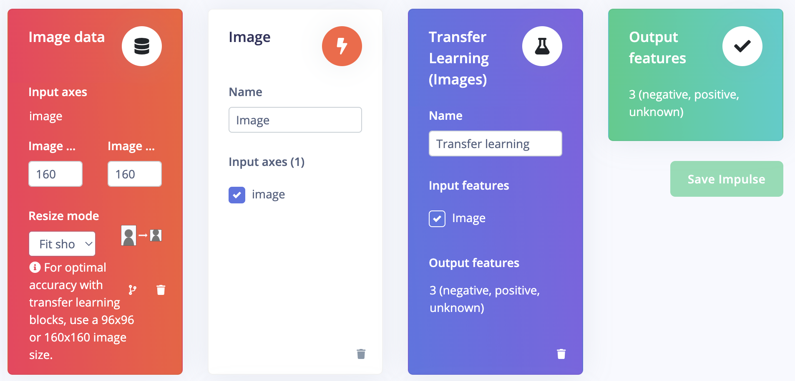

Next, go to the **Impulse Design** > **Image** page and set the *Color depth* parameter as RGB, and click the **Save parameters** button which redirects to another page where we should click on the **Generate Feature** button. It usually takes a couple of minutes to complete feature generation.

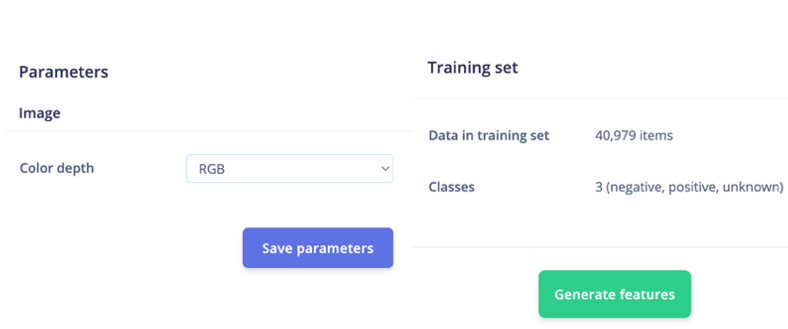

We can see the 2D visualization of the generated features in Feature Explorer.

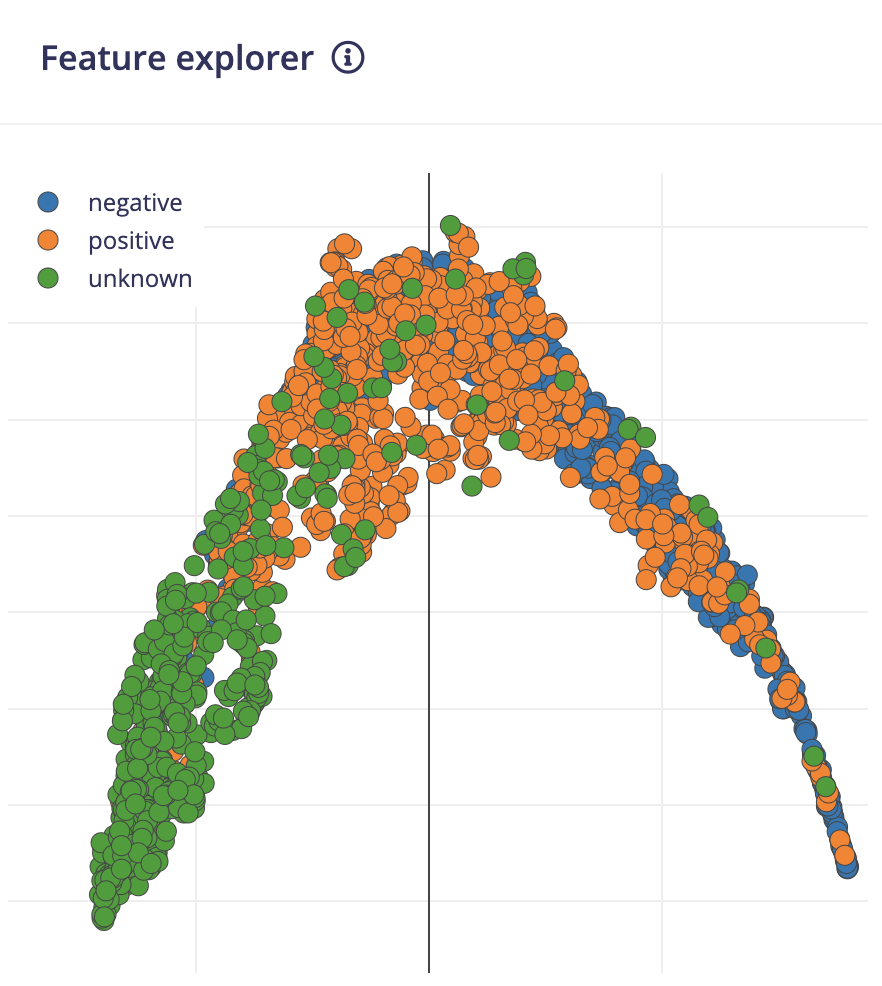

Now go to the **Impulse Design** > **Transfer Learning** page and choose the Neural Network architecture. We are using the **MobileNetV2 160x160 1.0** transfer learning model with the pre-trained weight provided by the Edge Impulse Studio.

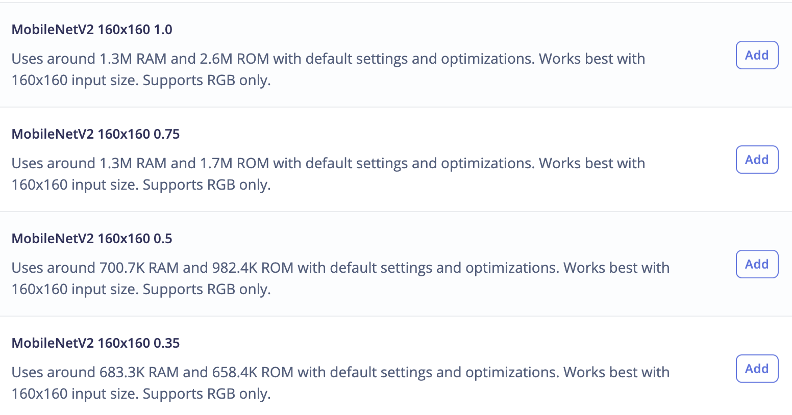

The pre-trained model outputs the class prediction probabilities. To get the class activation map, we need to modify the model and make it a multi-output model. To customize the model, we need to switch to **Keras (expert) mode**.


We can modify the generated code in the text editor as shown below.


We will connect the 2nd last layer which is a **GAP** layer to the **Dense** layer with 3 neurons ( 3 classes in our case). We will be using this **Dense** layer's weights for generating a class activation map later.

```
base_model = tf.keras.applications.MobileNetV2(
    input_shape = INPUT_SHAPE, alpha=1,
    weights = WEIGHTS_PATH
)
last_layer  = base_model.layers[-2].output
dense_layer = Dense(classes)
output_pred = Softmax(name="prediction")(dense_layer(last_layer))
```

For the class activation map, we need to calculate the dot product of the last convolutional block output and the final dense layers' weight. The Keras **Dot** layer does not broadcast the multiplier vector with the dynamic batch size so we can not use it. But we can take advantage of the **Dense** layer which internally does the dot product of the kernel weight with the input. There is a side effect in this approach, the **Dense** layer adds up bias weight to each dot product. But this bias weight is very small and does not change the final normalized values of the class activation map so we can use it without any problems.

```
conv_layer  = base_model.layers[-4].output
reshape_layer = Reshape((conv_layer.shape[1] * conv_layer.shape[2] , -1))(conv_layer)
dot_output = dense_layer(reshape_layer)
```

We need to resample the dot product output to the same size as the input image (160x160) so that we can overlay the heat map. We use the **UpSampling2D** layer for this purpose.

```
transpose = Permute((2, 1))(dot_output)
reshape_2_layer = Reshape((-1, conv_layer.shape[1] , conv_layer.shape[2]))(transpose)
SIZE = (int(INPUT_SHAPE[1] / conv_layer.shape[2]), 
 int(INPUT_SHAPE[0] / conv_layer.shape[1]))
output_act_map = UpSampling2D(size=SIZE, interpolation="bilinear", data_format="channels_first", name="activation_map")(reshape_2_layer)
model = Model(inputs=base_model.inputs, outputs=[output_pred, output_act_map])
```

Also, we will be training the model from the last two convolutional blocks and freezing all layers before that.

```
TRAINABLE_START_IDX = -12
for layer in model.layers[:TRAINABLE_START_IDX]:
    layer.trainable = False
```

The modified network architecture after the last convolutional block is given below. This is a multi-output model where the first output provides the prediction class probabilities and the second output provides the class activation map.

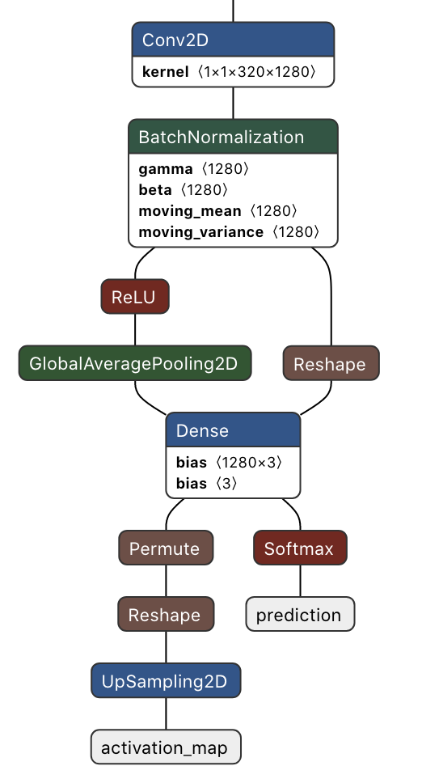

The full modified training code is as follows.

```
import math
from pathlib import Path
import tensorflow as tf
from tensorflow.keras import Model
from tensorflow.keras.layers import Dense, UpSampling2D, Permute, Reshape, Softmax
from tensorflow.keras.optimizers import Adam
from tensorflow.keras.losses import categorical_crossentropy

sys.path.append('./resources/libraries')
import ei_tensorflow.training

WEIGHTS_PATH = './transfer-learning-weights/keras/mobilenet_v2_weights_tf_dim_ordering_tf_kernels_1.0_160.h5'

INPUT_SHAPE = (160, 160, 3)

base_model = tf.keras.applications.MobileNetV2(
    input_shape = INPUT_SHAPE, alpha=1,
    weights = WEIGHTS_PATH
)

last_layer  = base_model.layers[-2].output
dense_layer = Dense(classes)
output_pred = Softmax(name="prediction")(dense_layer(last_layer))


conv_layer  = base_model.layers[-4].output
reshape_layer = Reshape((conv_layer.shape[1] * conv_layer.shape[2] , -1))(conv_layer)

dot_output = dense_layer(reshape_layer)
transpose = Permute((2, 1))(dot_output)
reshape_2_layer = Reshape((-1, conv_layer.shape[1] , conv_layer.shape[2]))(transpose)

SIZE = (int(INPUT_SHAPE[1] / conv_layer.shape[2]), 
 int(INPUT_SHAPE[0] / conv_layer.shape[1]))

output_act_map = UpSampling2D(size=SIZE, interpolation="bilinear", data_format="channels_first", name="activation_map")(reshape_2_layer)

model = Model(inputs=base_model.inputs, outputs=[output_pred, output_act_map])

TRAINABLE_START_IDX = -12
for layer in model.layers[:TRAINABLE_START_IDX]:
    layer.trainable = False

model.compile(optimizer=tf.keras.optimizers.Adam(learning_rate=0.0005),
      loss={'prediction': 'categorical_crossentropy', 'activation_map': None},
      metrics={'prediction': ['accuracy'], 'activation_map': [None]})
                
BATCH_SIZE = 32
EPOCHS=5

train_dataset = train_dataset.batch(BATCH_SIZE, drop_remainder=False)

validation_dataset = validation_dataset.batch(BATCH_SIZE, drop_remainder=False)

callbacks.append(BatchLoggerCallback(BATCH_SIZE, train_sample_count, epochs=EPOCHS))

model.fit(train_dataset, validation_data=validation_dataset, epochs=EPOCHS, verbose=2, callbacks=callbacks)

```

Now click the **Start Training** button and wait around 30 minutes until training is completed. We can see the Training output below. The quantized (int8) model has 99.6% accuracy which is pretty good.


## Model Deployment

Currently, **Edge Impulse for Linux** SDK does not support a multi-output model so we will be using the compiled TensorFlow Lite runtime for inferencing. This interpreter-only package is a fraction of the size of the complete TensorFlow package and includes the bare minimum code required to run inferences with TensorFlow Lite. To accelerate the inferencing, the TFLite interpreter can be used with **XNNPACK** which is a highly optimized library of neural network inference operators for ARM, and other platforms. To enable **XNNPACK** for 64-bit Raspberry Pi OS, we need to build the TFLite Runtime Python package from the source. We will need to execute the following commands on a faster Debian/Ubuntu Linux machine with Docker to cross-compile and build the package.

```
$ git clone -b v2.9.0 https://github.com/tensorflow/tensorflow.git
$ cd tensorflow
$ curl -L -o tensorflow/tools/ci_build/Dockerfile.pi-python37   \
  https://github.com/tensorflow/tensorflow/raw/v2.8.0/tensorflow/tools/ci_build/Dockerfile.pi-python37
$ sed -i -e 's/FROM ubuntu:16.04/FROM ubuntu:18.04/g' tensorflow/tools/ci_build/Dockerfile.pi-python37
$ sed -i '30a apt-get update && apt-get install -y dirmngr' tensorflow/tools/ci_build/install/install_deb_packages.sh
$ sed -i -e 's/xenial/bionic/g' tensorflow/tools/ci_build/install/install_pi_python3x_toolchain.sh
```

To enable **XNNPACK** for the floating-point (F32) and quantized (INT8) models, add the lines below (shown in the bold) to the `tensorflow/lite/tools/pip_package/build_pip_package_with_bazel.sh` file.

```
aarch64)
BAZEL_FLAGS="--config=elinux_aarch64
--define tensorflow_mkldnn_contraction_kernel=0
--define=tflite_with_xnnpack=true
--define=tflite_with_xnnpack_qs8=true
--copt=-O3"
;;
```

Execute the command below to build the pip package.

```
$ sudo CI_DOCKER_EXTRA_PARAMS="-e CI_BUILD_PYTHON=python3.7 -e CROSSTOOL_PYTHON_INCLUDE_PATH=/usr/include/python3.7"  tensorflow/tools/ci_build/ci_build.sh PI-PYTHON37  tensorflow/lite/tools/pip_package/build_pip_package_with_bazel.sh aarch64
```

Copy the pip package to the reTerminal.

```
$ scp tensorflow/lite/tools/pip_package/gen/tflite_pip/python3.7/dist/tflite_runtime-2.9.0-cp37-cp37m-linux_aarch64.whl \
   pi@raspberrypi.local:/home/pi
```

To install the package, execute the command below.

```
$ pip3 install -U tflite_runtime-2.9.0-cp37-cp37m-linux_aarch64.whl
```

Now We can download the quantized model from the Edge Impulse Studio Dashboard.


Below is the complete Python script for the inferencing.

```
#!/usr/bin/python3

import sys
import signal
import time
import cv2
import numpy as np
import traceback
import threading
import logging
import queue
import collections
import matplotlib.pyplot as plt
from matplotlib import cm
from tflite_runtime.interpreter import Interpreter

def avg_fps_counter(window_size):
    window = collections.deque(maxlen=window_size)
    prev = time.monotonic()
    yield 0.0  # First fps value.

    while True:
        curr = time.monotonic()
        window.append(curr - prev)
        prev = curr
        yield len(window) / sum(window)

def sigint_handler(sig, frame):
    logging.info('Interrupted')
    sys.exit(0)

signal.signal(signal.SIGINT, sigint_handler)

def capture(queueIn):
    global terminate
    global zoom
    videoCapture = cv2.VideoCapture(0)

    if not videoCapture.isOpened():
        logging.error("Cannot open camera")
        sys.exit(-1)

    while True:
        if terminate:
            logging.info("Capture terminate")
            break

        prev = time.time()
        try:
            success, frame = videoCapture.read()
            if success:
                frame = cv2.rotate(frame, cv2.ROTATE_90_CLOCKWISE)
                img = cv2.cvtColor(frame, cv2.COLOR_BGR2RGB)

                if zoom:
                    w, h = 320, 320
                    x = (img.shape[1] - w) / 2
                    y = (img.shape[0] - h)/ 2
                    img = img[int(y):int(y+h), int(x):int(x+w)]

                img = cv2.resize(img, (width, height))
                img = img / 255.0
                img = img.astype(np.float32)
                img_scaled = (img / input_scale) + input_zero_point
                input_data = np.expand_dims(img_scaled, axis=0).astype(input_details[0]["dtype"])

                if not queueIn.full():
                    queueIn.put((img, input_data))
                    logging.info('Image Captured')
            else:
                raise RuntimeError('Failed to get frame!')
        except Exception as inst:
            logging.error("Exception", inst)
            logging.error(traceback.format_exc())
            videoCapture.release()
            break

def inferencing(interpreter, queueIn, queueOut):
    global terminate
    global show_heatmap

    while True:
        if terminate:
            logging.info("Inferencing terminate")
            break
        start_time = time.time()
        try:
            if queueIn.empty():
                time.sleep(0.01)
                continue

            img, input_data = queueIn.get()
            interpreter.set_tensor(input_details[0]['index'], input_data)
            interpreter.invoke()

            output_0_tensor = interpreter.tensor(output_details[0]['index'])
            output_1_tensor = interpreter.tensor(output_details[1]['index'])

            output_1 = output_1_scale * ((output_1_tensor()).astype(np.float32) - output_1_zero_point)

            pred_class = np.argmax(np.squeeze(output_1))
            pred_score = np.squeeze(output_1)[pred_class]

            dp_out = None

            if pred_class == 1 and show_heatmap is True :
                dp_out = output_0_scale * (np.squeeze(output_0_tensor())[pred_class].astype(np.float32) - output_0_zero_point)

            if not queueOut.full():
                queueOut.put((img, pred_class, pred_score, dp_out))
        except Exception as inst:
            logging.error("Exception", inst)
            logging.error(traceback.format_exc())
            break
        
        logging.info('Inferencing time: {:.3f}ms'.format((time.time() - start_time) * 1000))

def display(queueOut):
    global show_heatmap
    global zoom
    global terminate

    dimension = (960, 720)
    ei_logo = cv2.imread('/home/pi/surface_crack_detection/ei_logo.jpg')
    ei_logo = cv2.cvtColor(ei_logo, cv2.COLOR_BGR2RGB)
    ei_logo = ei_logo / 255.0
    ei_logo = ei_logo.astype(np.float32)
    ei_logo = cv2.copyMakeBorder(ei_logo, 0, dimension[1] - ei_logo.shape[0], 70, 70, cv2.BORDER_CONSTANT, None, (255, 255, 255))  
    ei_logo = cv2.copyMakeBorder(ei_logo, 0, dimension[1] - ei_logo.shape[0], 70, 70, cv2.BORDER_CONSTANT, None, (255, 255, 255))  
    
    fps_counter = avg_fps_counter(30)

    while True:
        if queueOut.empty():
            time.sleep(0.2)
            continue

        start_time = time.time()
        img, pred_class, pred_score, dp_out = queueOut.get()

        if pred_class == 1:
            label = 'Crack'
            color = (0, 0, 255)

            if show_heatmap and dp_out is not None:
                heatmap = None
                heatmap = cv2.normalize(dp_out, heatmap, alpha=0, beta=255, norm_type=cv2.NORM_MINMAX, dtype=cv2.CV_8U)
                colormap = plt.get_cmap('jet')
                img = cv2.addWeighted(img, 1.0, colormap(heatmap).astype(np.float32)[:,:,:3], 0.4, 0)
        else:
            if pred_class == 0:
                label = 'No Crack'
                color = (0, 0, 0)
            else:
                label = 'Unknown'
                color = (255, 0,  0)
        
        final_img = cv2.resize(img, dimension, interpolation=cv2.INTER_CUBIC) 

        font  = cv2.FONT_HERSHEY_SIMPLEX 
        final_img = np.hstack((final_img, ei_logo))
        final_img = cv2.cvtColor(final_img, cv2.COLOR_RGB2BGR)
        final_img = cv2.putText(final_img, label, (980, 200), font, 2, color, 3, cv2.LINE_AA)
        final_img = cv2.putText(final_img, f'({pred_score*100:0.1f}%)', (980, 280), font, 2, (0, 0, 0), 3, cv2.LINE_AA)

        fps = round(next(fps_counter))

        final_img = cv2.putText(final_img, f'Fps:{fps}', (980, 360), font, 2, (0, 0, 0), 3, cv2.LINE_AA)
        final_img = cv2.putText(final_img, f'Heat:{"On" if show_heatmap else "Off"}', (980, 440), font, 2, (0, 0, 0), 3, cv2.LINE_AA)
        final_img = cv2.putText(final_img, f'Crop:{"On" if zoom else "Off"}', (980, 520), font, 2, (0, 0, 0), 3, cv2.LINE_AA)

        window_name = "Edge Impulse Inferencing"
        cv2.imshow(window_name, final_img)


        key = cv2.waitKey(1)  
        if key == ord('a'):
            show_heatmap  = not show_heatmap
            logging.info(f"Heatmap: {show_heatmap}")

        if key == ord('s'):
            zoom  = not zoom
            logging.info(f"Zoom: {zoom}")

        if key == ord('f'):
            terminate = True
            logging.info("Display Terminate")
            break

        logging.info('Display time: {:.3f}ms'.format((time.time() - start_time) * 1000))
        

if __name__ == '__main__':
    log_fmt = "%(asctime)s: %(message)s"
    logging.basicConfig(format=log_fmt, level=logging.ERROR, datefmt="%H:%M:%S")

    model_file = '/home/pi/surface_crack_detection/model/quantized-model.lite'
    interpreter = Interpreter(model_path=model_file, num_threads=2)
    interpreter.allocate_tensors()

    input_details  = interpreter.get_input_details()
    #logging.debug(input_details)
    output_details = interpreter.get_output_details()

    height = input_details[0]['shape'][1]
    width  = input_details[0]['shape'][2]
    input_scale, input_zero_point = input_details[0]['quantization']
    output_0_scale, output_0_zero_point = output_details[0]['quantization']
    output_1_scale, output_1_zero_point = output_details[1]['quantization']

    queueIn  = queue.Queue(maxsize=1)
    queueOut  = queue.Queue(maxsize=1)
    show_heatmap = False
    zoom = False
    terminate = False

    t1 = threading.Thread(target=capture, args=(queueIn,), daemon=True)
    t2 = threading.Thread(target=inferencing, args=(interpreter, queueIn, queueOut), daemon=True)
    t3 = threading.Thread(target=display, args=(queueOut,), daemon=True)

    t1.start()
    logging.info("Thread start: 1")
    t2.start()
    logging.info("Thread start: 2")
    t3.start()
    logging.info("Thread start: 3")

    t1.join()
    t2.join()
    t3.join()
```

## Application Workflow Diagram
The application implements multithreading to use all available 4-cores on the Raspberry Pi 4 Compute Module to achieve low latency and better FPS.


## The Desktop App
The inferencing script is executed by clicking on the Desktop App icon which is created by adding an `ei.desktop` file at the `/home/pi/Desktop` directory.

```
[Desktop Entry]
Version=1.0
Comment=Run Inferencing Quantized Model
Terminal=false
Name=Surface Crack Detection
Exec=/home/pi/surface_crack_detection/surface_crack_detection_quant.py
Type=Application
Icon=/home/pi/surface_crack_detection/images/ei_logo.jpg
```

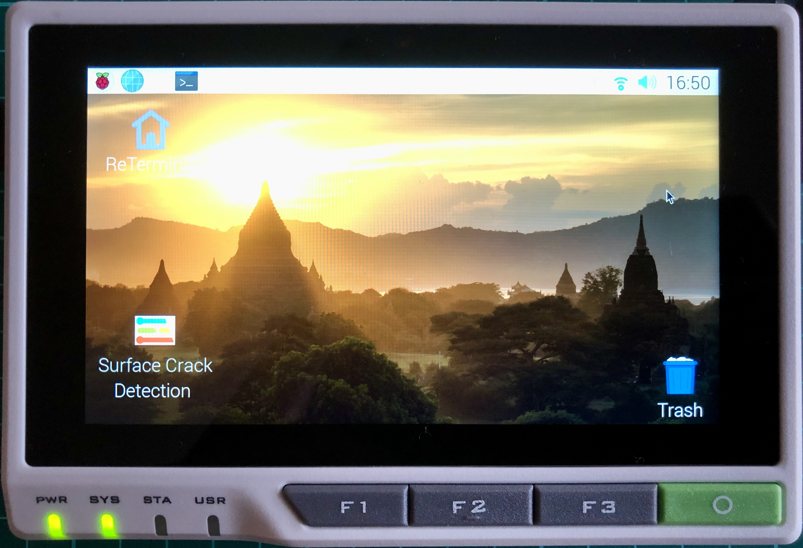

Also, the reTerminal front panel buttons (in the above image) are used for the following functionalities.

- **F1** button: to toggle heat map
- **F2** button: to toggle center crop (zoom in) the preview image
- **O** button: to close the app

## Conclusion
This project showcases an industrial use case for surface crack detection which can be used for predictive maintenance. The project has the following key characteristics.

- Customize the pre-trained transfer learning model in the Edge Impulse Studio Expert Mode
- Demonstrate use of a multi-output model trained using Edge Impulse
- Runtime heat-map visualization to localize the detected cracks.
- Multi-threaded application to increase FPS
- A scalable and portable solution

Although the project was created using a Raspberry Pi 4 Compute Module, it can be ported easily to higher-spec edge devices for improved FPS and real-time detection.


