# TI CC1352P Launchpad - Getting Started with Machine Learning 

Created By:
Swapnil Verma 

Public Project Link:
[https://studio.edgeimpulse.com/public/238204/latest](https://studio.edgeimpulse.com/public/238204/latest)

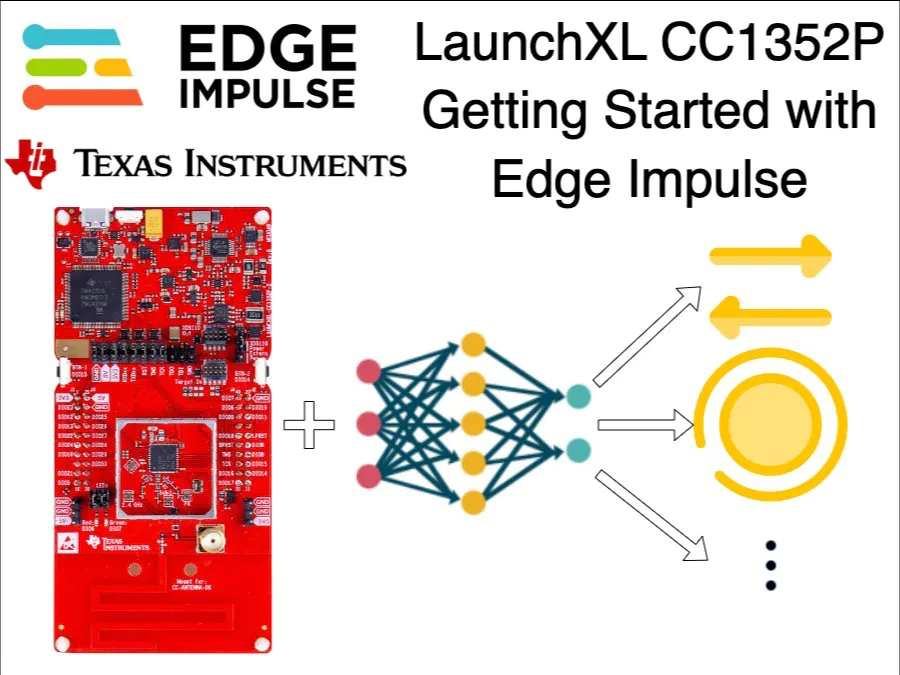

## Introduction

The [Texas Instruments CC1352P Launchpad](https://www.ti.com/tool/LAUNCHXL-CC1352P) is a development board equipped with the multiprotocol wireless CC1352P microcontroller. The Launchpad, when paired with the [BOOSTXL-SENSORS](https://www.ti.com/tool/BOOSTXL-SENSORS) is [fully supported by Edge Impulse](https://docs.edgeimpulse.com/docs/development-platforms/fully-supported-development-boards), and can sample sensor data, build models, and deploy directly to the device without any programming required.

This is a Getting Started Guide for the TI LAUNCHXL-CC1352P development board with Edge Impulse. Here we will connect the board to the Edge Impulse Studio, collect sensor data directly from the board, prepare a machine learning model using the collected data, deploy the model back to the board, and perform inferencing locally on the board. Let's get started!

## Unboxing

The Launchpad Kit comes with the following items in the box:

- The LAUNCHXL-CC1352P development board
- Micro-USB to USB-A Cable
- Documentation

The BOOSTXL sensor comes with:

- BOOSTXL sensor board
- Documentation

## Quick Start Project

Each LAUNCHXL-CC1352P board comes preinstalled with a quick-start project called Project Zero. Let's run the quick-start project to verify our board is working properly.

- Connect the board to the computer using the provided micro-USB cable.
- Download the SimpleLink Starter smartphone app on your smartphone. This app lets you control the LEDs, see the state of the buttons and send data to the UART.
- Open the app, select Project Zero from the list of available devices, and click on Sensor View to get the GUI.

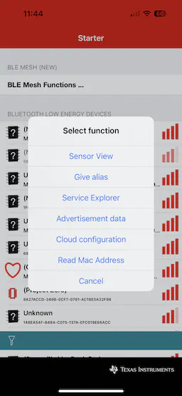

In the Project Zero GUI, tap on the lights to turn them On/Off on the board. Press the user buttons on the board to see their status on the app.In the Project Zero GUI, tap on the lights to turn them On/Off on the board. Press the user buttons on the board to see their status on the app.



To learn more about Project Zero or user guide please follow [this link](https://dev.ti.com/tirex/explore/node?devtools=LAUNCHXL-CC1352P-2&node=A__AP29fH4CgXFx6NzMPibGgg__cc13xx_devtools__FUz-xrs__LATEST).

## Updating the Firmware

In this section, we will upgrade the firmware of the development board so we can connect it to the Edge Impulse Studio.

Please follow this official guide to update the firmware:

> Firmware Update Guide - [https://docs.edgeimpulse.com/docs/development-platforms/officially-supported-mcu-targets/ti-launchxl](https://docs.edgeimpulse.com/docs/development-platforms/officially-supported-mcu-targets/ti-launchxl)

## Edge Impulse Project

To begin, you'll need to create an Edge Impulse account and a project in the Edge Impulse Studio. Please follow the below steps to do so:

- Navigate to the [Edge Impulse Studio](https://studio.edgeimpulse.com/login) and create an account. If you already have an account then please login using your credentials.

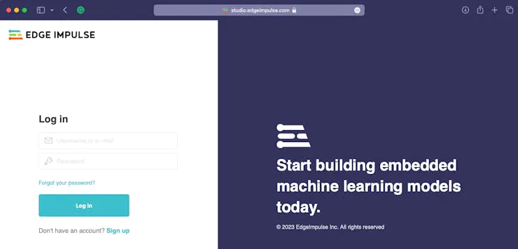

- After login, please create a new project, give it a suitable name, and select an appropriate _Project type_.

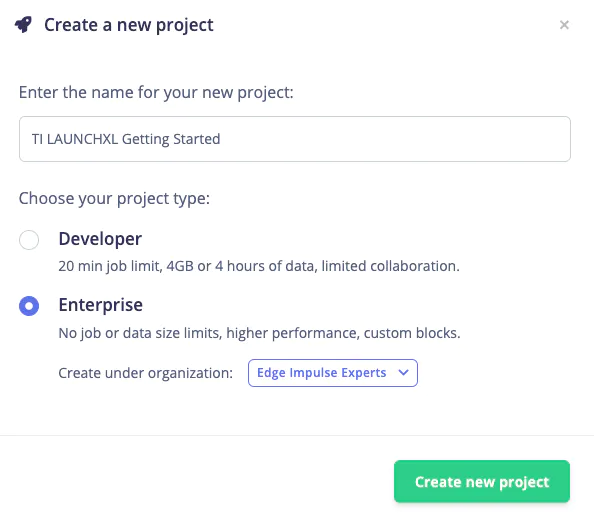

- After creating a new project, let's connect the development board to the Studio.

## Connecting TI Launchpad Kit to Edge Impulse

The next step is connecting our TI LAUNCHXL board to the Edge Impulse Studio, so we can ingest sensor data for the machine learning model. Please follow the below steps to do so:

- Open a terminal or command prompt and type `edge-impulse-daemon`. The [Edge Impulse daemon](https://docs.edgeimpulse.com/docs/Edge Impulse-cli/cli-daemon) will start and prompt for user credentials. If you have not installed Edge Impulse CLI as part of the **Update the Firmware** section, then please install it now.
- After providing user credentials, it will prompt you to select an Edge Impulse project. Please navigate and select the project created in the previous steps, using the arrow keys.

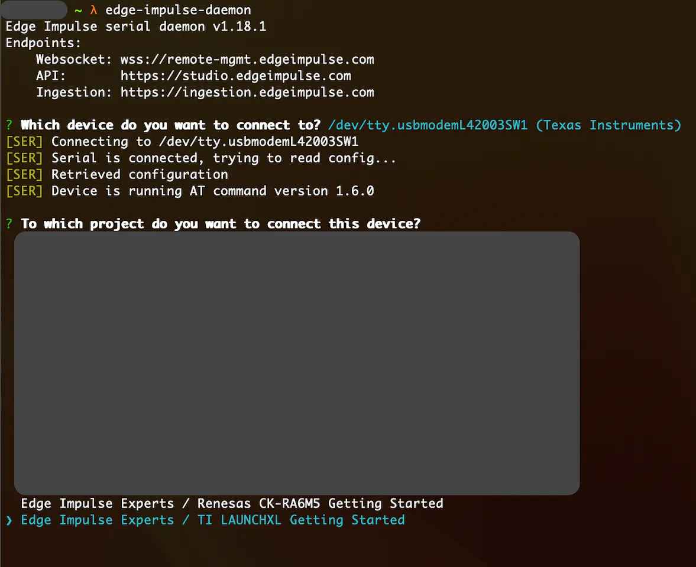

- After selecting the project, it will ask you to give the connected board a name. It is useful when you want to connect multiple boards to the same project.

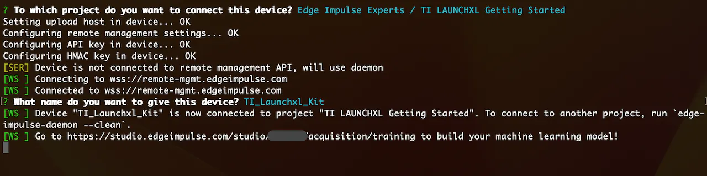

- Now the board should be connected to the selected project. The `edge-impulse-daemon` will tell you which project the board is connected to. We can also verify by checking the devices tab of that project.

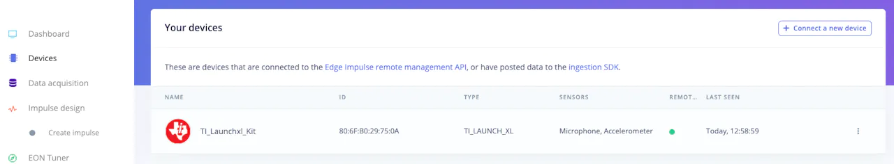

## Data Gathering

Edge Impulse provides multiple options for [data acquisition](https://docs.edgeimpulse.com/docs/edge-impulse-studio/data-acquisition). In this Getting Started Guide, we will look at the direct data ingestion from the board using `edge-impulse-daemon`. Please follow the below steps for data acquisition:

- Navigate to the _Data Acquisition_ tab in the Edge Impulse Studio.

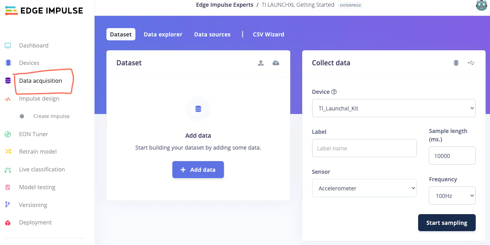

- Here you will find the _Device_ we connected in the previous step and the sensor list. Please select the suitable sensor from the drop-down menu. For this project, I have selected the _Accelerometer_ sensor and used default parameters.
- Add a _Label name_ for the sample you are about to collect. I am collecting up-down, side-to-side and circular motion data therefore I will use up_down, side_to_side and circle as labels. As a default motion, I will also collect stationary data.
- Clicking _Start Sampling_ will start the sample collection process. Once the sample is collected, it will be automatically uploaded to the Edge Impulse Studio.

When enough samples are collected, [balance the data](https://docs.edgeimpulse.com/docs/Edge Impulse-studio/data-acquisition#dataset-train-test-split-ratio) and if required [clean the data](https://docs.edgeimpulse.com/docs/Edge Impulse-studio/data-acquisition#cropping-samples) as well.

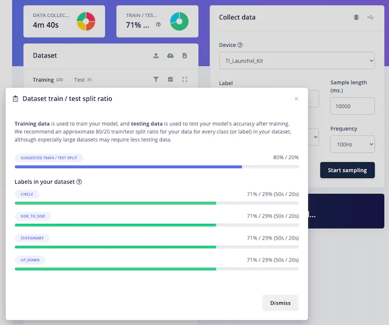

## Machine Learning Model Preparation

After data collection, the next step is machine learning model preparation. To do so, please navigate to the [_Impulse design_ tab](https://docs.edgeimpulse.com/docs/edge-impulse-studio/impulse-design) and add relevant [preprocessing](https://docs.edgeimpulse.com/docs/edge-impulse-studio/processing-blocks) and [learning blocks](https://docs.edgeimpulse.com/docs/edge-impulse-studio/learning-blocks) to the pipeline.

- Edge Impulse Studio will automatically add an [input block](https://docs.edgeimpulse.com/docs/edge-impulse-studio/impulse-design#input-block) and it will recommend a suitable preprocessing and a learning block based on the data type. I have used the recommended ones in this project with the default arguments.

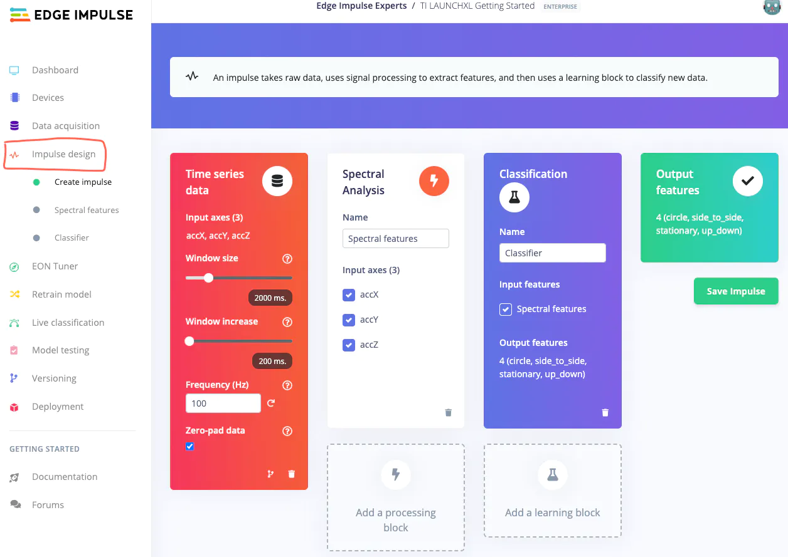

- After Impulse design is complete, save the design and navigate to the preprocessing tab (Spectral features in this case) for the feature generation.

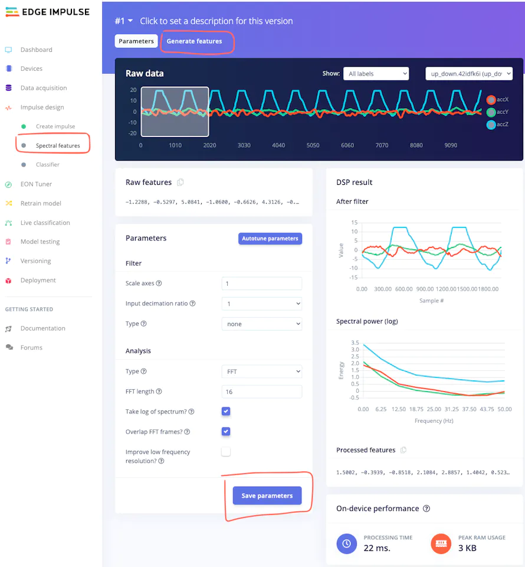

Click on the _Save parameters_ button, then navigate to the _Generate features_ tab and click _Generate features_ button for data preprocessing.

- After feature generation, please navigate to the _Learning Tab_ ([Classifier](https://docs.edgeimpulse.com/docs/edge-impulse-studio/learning-blocks/classification) in this case) to design the neural network architecture. I have used the default architecture and parameters recommended by the Edge Impulse Studio. After selecting a suitable configuration, click on the _Start training_ button.

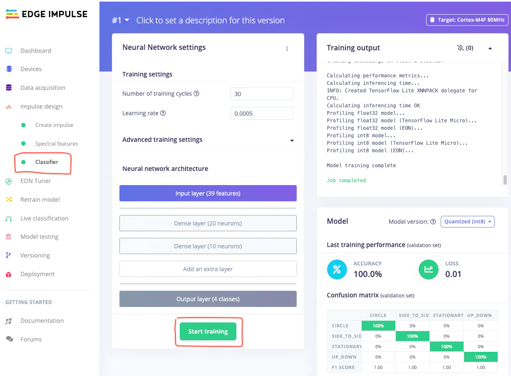

- Once the training is complete, please navigate to the [Model testing](https://docs.edgeimpulse.com/docs/Edge Impulse-studio/model-testing) tab, and click _Classify all_ button.

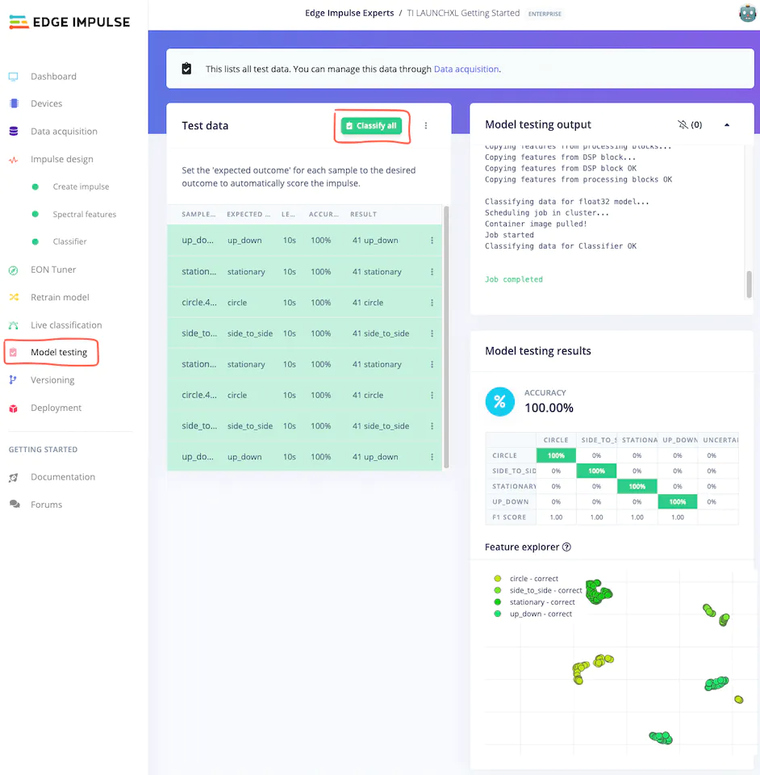

After testing is finished, the Edge Impulse Studio will show the model accuracy, and other parameters.

> Even though it is a simple example, the Edge Impulse Studio prepared an excellent machine learning model just by using the default recommended parameters, in just a couple of minutes.

## Deployment

In this step, we will deploy our prepared model to the TI LAUNCHXL-CC1352P development board, so we can perform  inference locally on the board.

- Please navigate to the [Deployment](https://docs.edgeimpulse.com/docs/Edge Impulse-studio/deployment) tab, select the TI LAUNCHXL-CC1352P board using the search bar, and click on the _Build_ button.

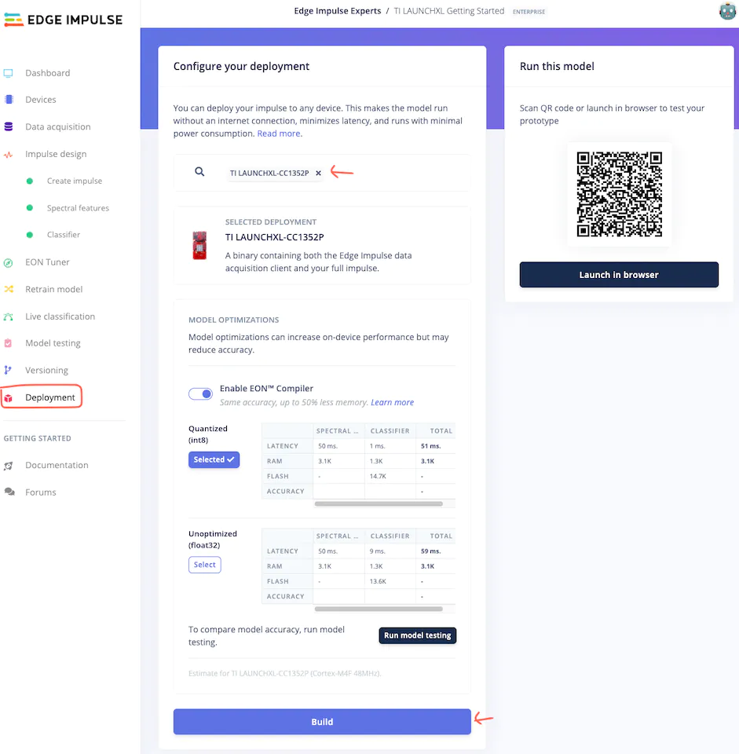

- After the _build_ is finished, the new firmware will be downloaded automatically to your computer, and the Edge Impulse Studio will provide next-step instructions.

- Please extract the folder and double-click the `flash_<operating-system>` file. This will flash the newly created firmware on the TI LAUNCHXL-CC1352P board. This firmware contains the machine learning model we prepared in the above steps.

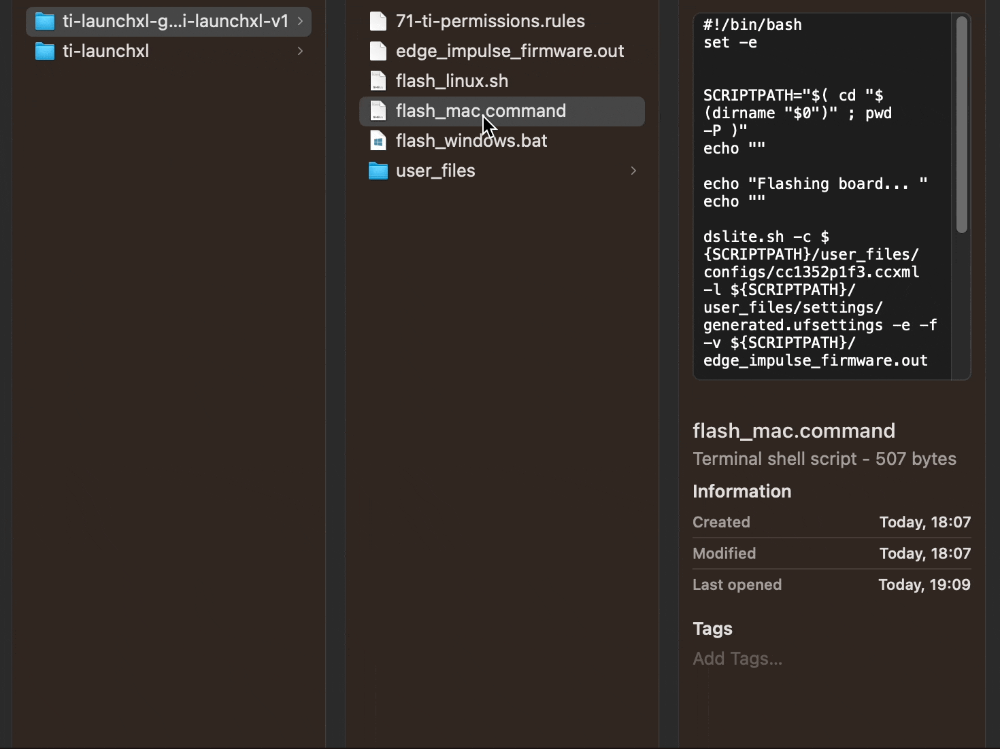

## Inferencing

The next step is testing!! Let's see how well our model performs when run locally on the LAUNCHXL-CC1352P board. To start local inferencing, type `edge-impulse-run-impulse` from your terminal or command prompt.



And, that's it. I hope this Getting Started Guide will be useful for you when using the TI LAUNCHXL-CC1352P with Edge Impulse.

If you have any questions, please check out the [Edge Impulse Forum](https://forum.edgeimpulse.com/).

