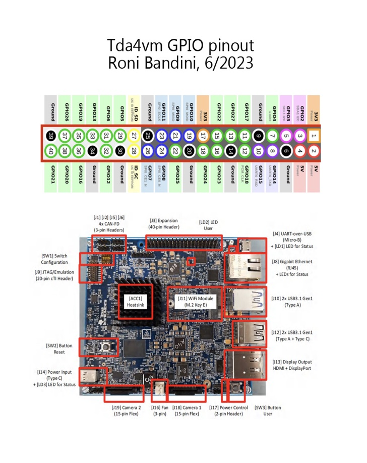
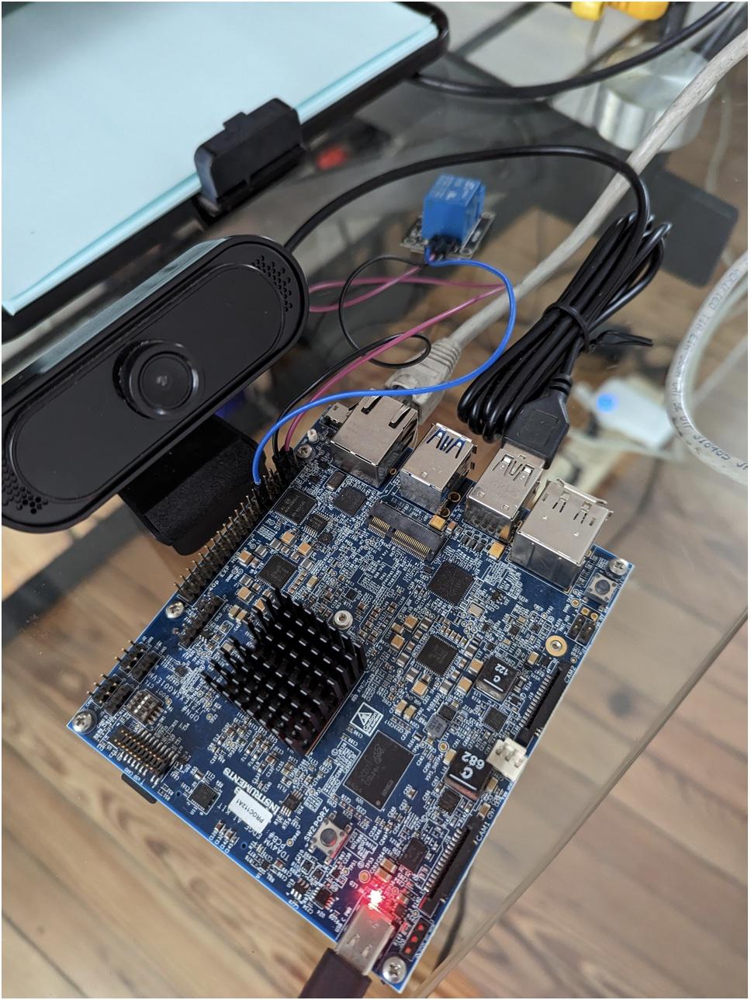
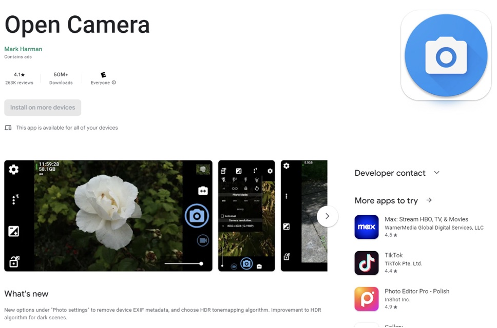
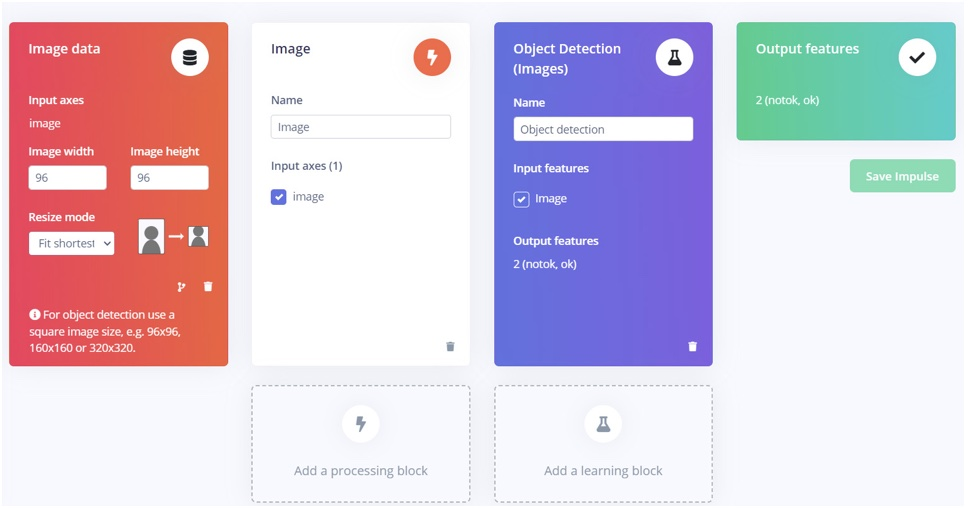
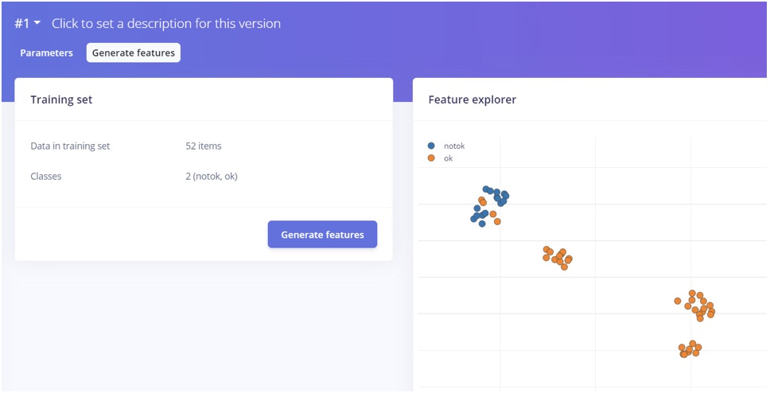

# TI TDA4VM - Correct Posture Detection and Enforcement

Created By:
Roni Bandini 

Public Project Link:
[https://studio.edgeimpulse.com/public/222158/latest](https://studio.edgeimpulse.com/public/222158/latest)


## Intro

Certain machines used by leather craftsmen involve continuous, repetitive tasks like hard pressing. Not using the correct posture while using this equipment may cause musculoskeletal disorders affecting the muscles, tendons, ligaments, joints, peripheral nerves and supporting blood vessels in the body. During a training phase, a supervisor could teach the correct posture, but after training is complete, constantly verifying and enforcing could be expensive and not viable. 

Is it possible to develop an automatic system to constantly monitor a craftsman's posture? Is this problem a good fit for Machine Learning?

While heuristic programming works perfectly for limited and known data and states, in this case, that won’t work, due to the fact that posture will not be the same as in sampling. Clothing, background and even the worker could be different compared with our samples. An algorithm to learn subtle patterns in pictures could be the solution and that is exactly what Machine Learning could do.

For this project I will use the [SK-TDA4VM board from Texas Instruments](https://www.ti.com/tool/SK-TDA4VM), since it was designed for Edge AI vision systems and it has impressive features like multi-camera support, onboard machine learning accelerators, and a powerful dual-core Arm Cortex A72 processor.

What else will be required? A Logitech C270, C920 or C922 USB Webcam, a 5V/3A USB-C power supply, a microSD card, an Ethernet cable, and an Edge Impulse account (free for developers).

## TDA4VM Board Setup

- Download the latest TDA4VM image at [https://www.ti.com/tool/download/PROCESSOR-SDK-LINUX-SK-TDA4VM](https://www.ti.com/tool/download/PROCESSOR-SDK-LINUX-SK-TDA4VM)

- Flash the image to the microSD card and place the card into the board. 

- Connect the Logitech camera to a USB port and power on the board.

TI does not use a version of Linux that most developers might be familiar with, instead using Arago Linux as it offers some unique security and features for embedded development. Connecting a USB keyboard and HDMI screen to use the command line won't work. I can connect to the board with the included UART cable but since the software tools included are limited (For example no Nano editor, just VI and I cannot remember all the commands like `:q`, etc.), I have decided to use an Ethernet cable connected to the router, obtain the IP by checking DHCP in the router admin page, and access through SSH and SFTP.


The default TDA4VM login credentials are:
 
User: root 
Password: (empty) 


## TDA4VM Circuits and Connections

I have connected the Logitech USB camera to the first USB port, the Power Supply to the back USB-C connector (the other one is for UART over USB) and I still had to connect the 1-channel Relay that will be used to provide power to the theoretical machine being operated. 


According to the documentation "The EVM includes a 40-pin (2x20, 2.54mm pitch) expansion interface [J3]. The expansion connector supports a variety of interfaces including: I2C, serial peripheral interface (SPI), I2S with Audio clock, UART, pulse width modulator (PWM), and GPIO. All signals on the interfaces are 3.3 V levels" 

There is no Pinout map for TDA4VM in the documentation that I could find, but since this is a standard 40 pin header and pins #1 and #39 are marked on the PCB, I was able to determine the complete pinout and I have created this reference to simplify future connections.



Now I was able to connect the 1-channel Relay module to 5V and GND (2 and 3 from right in second row) and GPIO 18 (same row, pin 6)

I executed a Python code snippet to test the Relay with no luck:

```
import RPi.GPIO as GPIO
# Relay output pin
output_pin = 18
GPIO.setmode(GPIO.BCM)
GPIO.setwarnings(False)
GPIO.setup(output_pin, GPIO.OUT)
print("Testing relay")
GPIO.output(output_pin, GPIO.HIGH)
time.sleep(3)
GPIO.output(output_pin, GPIO.LOW)
```

Power was being sent to the module, so the issue was related to the GPIO signal.

After some research I learned that the 40-pin header comes Disabled by default. To enable the GPIO I have connected with FTP to `/run/media/mmcblk0p1`

I have downloaded `uenv.txt` and added this line at the end:

```
name_overlays=k3-j721e-edgeai-apps.dtbo k3-j721e-sk-rpi-exp-header.dtbo
```

Then I uploaded the file back and… that did it!



## Data Acquisition

For Machine Learning I will use Edge Impulse. The platform is free for developers and the link to sign up for a new account is [https://studio.edgeimpulse.com/signup](https://studio.edgeimpulse.com/signup)

_Note: for testing purposes you can skip the data acquisition phase, since you can clone my entire Edge Impulse project._

Data is the foundation of any Machine Learning project and in this case data means pictures. I have selected the correct board for calculation in the EI Dashboard and also Bounding Boxes as the Labeling method.



Edge Impulse allows you to take pictures with the TDA4VM, uploading them directly to the platform, but since I had to go to the Leather place, I have used my Android phone with [*Open Camera*](https://play.google.com/store/apps/details?id=net.sourceforge.opencamera&hl=en&gl=US&pli=1). Why _Open Camera_ instead of the default phone app? Open Camera has a repeater function to take X pictures every Y seconds and a configuration to use small images, and 96px x 96px is what will be used for the model. 


I took about 50 pictures of the correct postures in different stages. I took another 50 pictures of incorrect postures in different stages. Then I uploaded those images using Data Acquisition, with Automatically split between Training and Testing checked. I went to Labeling Queue and for each picture drew a bounding box and label as 'ok' or 'notok' to easily differentiate the proper posture from the incorrect posture.


_Note: some pictures were not uploaded due to the fact that they had just the background or a non representative stage of the machine operation._


## Model Training

With all the pictures uploaded and labeled, the next phase in the process is the Impulse Design. I clicked on _Create Impulse_ and I used the following parameters:

- First block is Image Data, 96x96 pixels, Resize fit shortest axis. Then Image for the Processing block. Then Object Detection for the Learning block.  You can read more about these blocks here:  [https://docs.edgeimpulse.com/docs/edge-impulse-studio/processing-blocks](https://docs.edgeimpulse.com/docs/edge-impulse-studio/processing-blocks)



- I went to _Image_, _Generate Features_. Since the data usually has redundant information, this option is used to extract relevant features used to detect patterns. It is also useful to visualize the complexity of a feature classification.



- I went to _Object Detection_ and I have configured 60 Training cycles, 0.001 Learning rate, Data augmentation and FOMO (Faster Objects More Objects) model.


I have got a 71.4% F1 Score with 100% detection rate for incorrect posture, so some added data (images) might help improve the F1 score, but for testing purposes this is acceptable and we can proceed to the deployment.

## Deployment

I went back to the TDA4VM board SSH connection, and installed the [Edge Impulse Linux](https://docs.edgeimpulse.com/docs/edge-impulse-for-linux/edge-impulse-for-linux) package using this command:

```
npm install -g --unsafe-perm edge-impulse-linux
```

Then I executed:

```
edge-impulse-linux-runner --force-engine tidl --force-target runner-linux-aarch64-tda4vm 
```

Since it was the first time connecting, I had to enter my Edge Impulse credentials (email and password) and then I had to select which of my projects I was connecting to.

To confirm the camera position I opened a browser and loaded the TDA4VM's IP address with port 4912 -- http://deviceIP:4912. This will give you a preview of the camera stream. 

After confirming that postures were detected, I stopped the running process.

## Output Examples

Here is the output generated by the Edge Impulse Linux runner:

```
No posture detected

boundingBoxes 2ms. []
boundingBoxes 1ms. []
boundingBoxes 1ms. []

Correct posture

boundingBoxes 1ms. [{"height":8,"label":"ok","value":0.5057658553123474,"width":8,"x":48,"y":24}]

Incorrect posture

boundingBoxes 1ms. 
[{"height":8,"label":"notok","value":0.7100046873092651,"width":8,"x":64,"y":72}]
boundingBoxes 1ms. [{"height":8,"label":"notok","value":0.6312366724014282,"width":8,"x":64,"y":72}]
boundingBoxes 1ms. [{"height":8,"label":"notok","value":0.6827908158302307,"width":8,"x":64,"y":72}]
```

## Parsing Script

At this point I have acquired the data, I have trained the model and I also have deployed the model to the TDA4VM board, but the output is simply probabilistic data displayed on screen. In Machine Learning projects there is usually a "precondition" and an "action". The precondition is completed and working. But what can be done for the action side whenever an incorrect posture could harm the worker? 

I could parse `edge-impulse-linux-runner` output, detect the "ok" and "notok" labels, and produce some action. What do I mean by "some action"? In my [previous TDA4VM project](https://docs.edgeimpulse.com/experts/prototype-and-concept-projects/deter-shoplifting-with-computer-vision) I have used Telegram to send notifications. In this case, I will try to turn off the machine whenever an incorrect posture is detected.

With a simple *HIGH* and *LOW* signal to the appropriate GPIO pin, the relay will enable or disable the Power to the machine. 

Download the `posture1.py` Python script from [https://github.com/ronibandini/tda4vmPostureEnforcer](https://github.com/ronibandini/tda4vmPostureEnforcer), and then upload the script with FTP to `/opt/edge_ai_apps` on the TDA4VM. 

Now execute the script using:

```
python3 posture1.py 
```

Now, posture is being monitored, model output parsed, and the machine is enabled and disabled automatically using the Relay.


## Where To Go From Here

One interesting feature of the TI TDA4VM is the ability to use multiple cameras. That could mean different point of views of the same event or multiple-event handling. So, maybe this will be the requirement for the next project.

## Contact

[https://www.instagram.com/ronibandini](https://www.instagram.com/ronibandini)
[https://twitter.com/RoniBandini](https://twitter.com/RoniBandini)
[https://bandini.medium.com](https://bandini.medium.com)

## Sources

[https://www.ncbi.nlm.nih.gov/pmc/articles/PMC7502893](https://www.ncbi.nlm.nih.gov/pmc/articles/PMC7502893)
[https://www.ti.com/lit/ug/spruj21c/spruj21c.pdf](https://www.ti.com/lit/ug/spruj21c/spruj21c.pdf)


