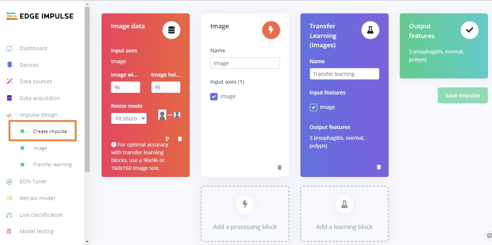
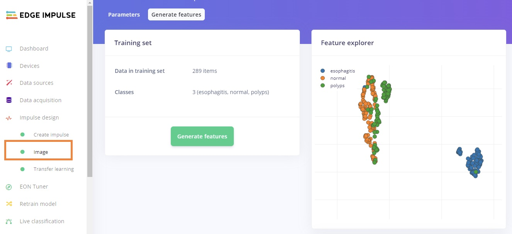
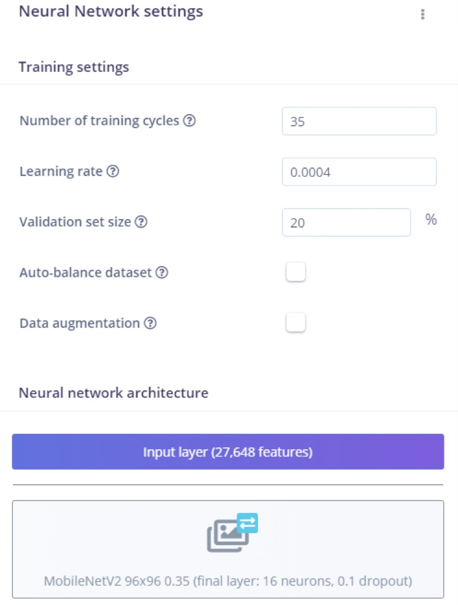
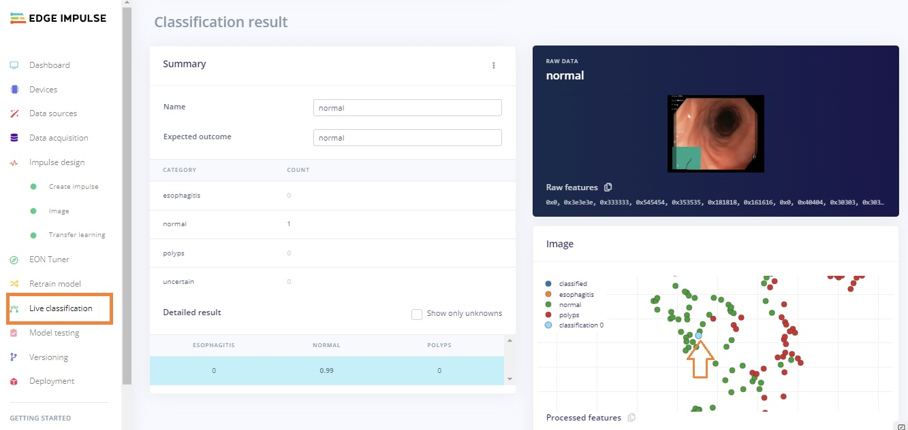
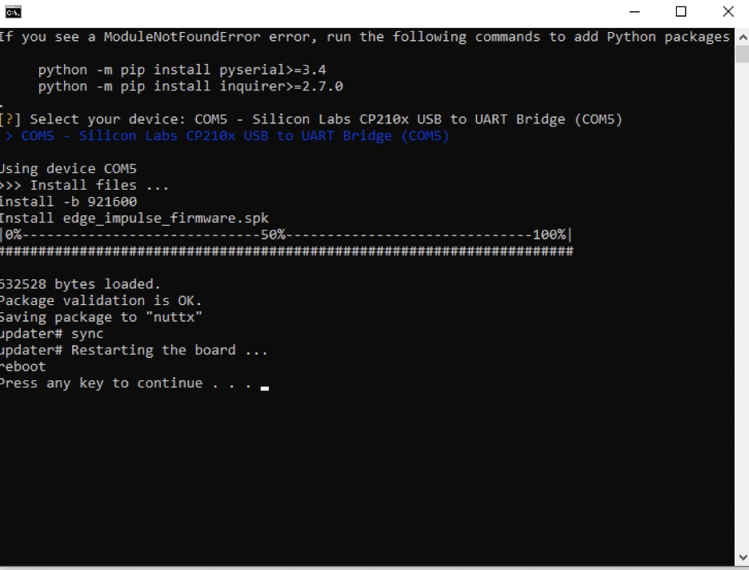
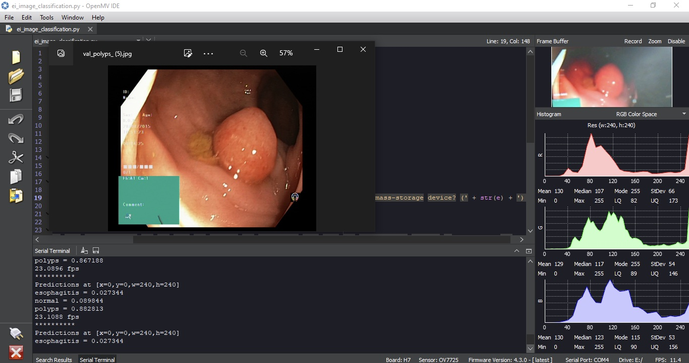
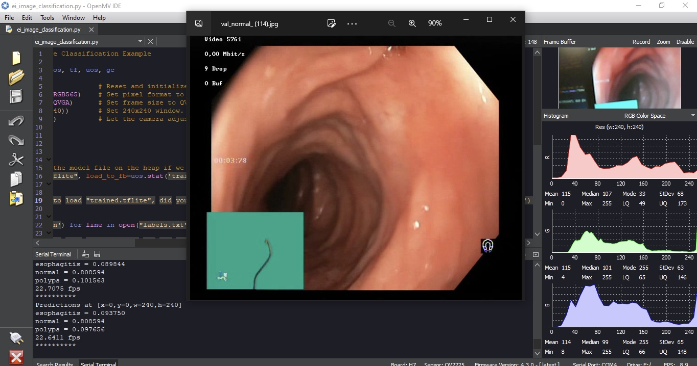
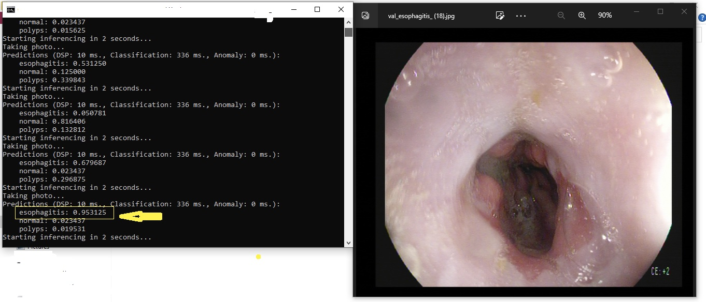

# TinyML for Gastroscopic Image Processing 

Created By:
Wamiq Raza 

Public Project Link:
[https://studio.edgeimpulse.com/public/163127/latest](https://studio.edgeimpulse.com/public/163127/latest)

## Introduction

Gastric disease and medical issues pertaining to the GI tract including the mouth, esophogus, stomach, and intestinges are a major health problem worldwide. Gastroscopy is the main method and the gold standard used to screen and diagnose many gastric diseases. However, several factors, such as the experience and fatigue of endoscopists, limit its performance. With recent advances in deep learning, an increasing number of studies have used this technology to provide on-site assistance during real-time gastroscopy procedures. 

The goal of this project is to train a TinyML model on three classes of diagnosis, and then test in real time using Edge Impulse to build a TinyML model and deploy it on a microcontroller. As artificial intelligence is expected to help endoscopists provide a more accurate diagnosis by automatically detecting and classifying lesions, it is essential that endoscopists focus on this novel technology. The main idea for this project is that an endoscopy probe already contain a camera on the end of them, so in this case we will use computer vision and a microcontroller to assist with real time diagnosis classifications. 

## Dataset

For this project, the publicly available [WCE Curated Colon Disease Dataset Deep Learning](https://www.kaggle.com/datasets/francismon/curated-colon-dataset-for-deep-learning) dataset that is hosted on Kaggle is being used. The dataset contains 4 classes, but only three classes were used here: normal, polyps and esophagitis. Once the data is downloaded from Kaggle, it can be uploaded to Edge Impulse via the **Upload data** process, which is [documented here](https://docs.edgeimpulse.com/docs/edge-impulse-studio/data-acquisition/uploader).  The images from Kaggle are already classified, so, they just have to be given the same label in Edge Impulse. 

## Impulse Design

After uploading and labeling is completed, our dataset is ready to train our model. This requires two important features: a processing block and a learning block. Documentation on Impulse Design can be [found here](https://docs.edgeimpulse.com/docs/edge-impulse-studio/create-impulse).

We first click "Create Impulse". Here, set the image width and height to 96x96 pixels; and **Resize mode** to Squash. The Processing block is set to "Image" and the Learning block is "Transfer Learning (Images)". Click **Save Impulse** to use this configuration. The 96x96 image size also helps to lower RAM usage.

Next, on the "Image" processing block, set Color depth to RGB. Click on "Save parameters", and this will open the "Generate Features" tab. On the **Generate features** page, we click the "Generate features" button. Upon completion we should see a 3D-representation of our dataset. These is what will be passed into the neural network, and the visualization will look similar to this figure:

## Building and Training the Model

To train our model, the MobileNetV2 96x96 0.35 algorithm was used. As MobileNetV2 is a unique machine learning approach that extends object classification to devices with limited processing power, it allows you to count things, locate objects in an image, and track numerous objects in real time while consuming less computing power. Even after rescaling and color conversions, image features have a high dimensionality that prevents suitable visualization. The number of epochs is the number of times the entire dataset is passed through the neural network during training. There is no ideal number for this, it depends on the data in total. This model was run for 35 epochs, with the learning rate set to 0.0004 and the dataset is split into training, validation, and testing. After introducing a dynamic quantization from a 32-bit floating point to an 8-bit integer, the resulting optimized model showed a significant reduction in size.

## Live Classification

After the training is complete, the **Live classification** page allows us to test the algorithm both with the existing testing data that came with the dataset, or by streaming data from your mobile phone or on any microcontroller with image data processing compatibility. We can start with a simple test by choosing any of the test samples and pressing "Load sample". This will classify the test sample and show the results. Here we can see the results of a live classification with probability score:

## Model Deployment

In order to deploy the model on a microcontroller, the model is converted to a `.tflite` file then deployed on the MCU. Here in our case, we must build firmware using the Edge Impulse platform.  We're going to use two different platforms for the sake of testing, the OpenMV Cam H7 and a Sony Spresense. Impulses can also be deployed as a C++ library and can be included in your own application to run the impulse locally.

To use the model on the OpenMV Cam H7, copy the `.tflite` and label file from the folder that is downloaded from the **Deployment** page. Next, paste it into the OpenMV drive that get's mounted on your computer when the OpenMV Cam is attached via USB. Open the python script file in the OpenMV IDE and start inference. 

For the Sony Spresense, unzip the downloaded file that is provided on the **Deployment** page, and click on the `flash` command that corresponds to your operating system. In my case, this was Windows. A Terminal will open and it will begin flashing the board, then open a new Terminal and run the command **edge-impulse-run-impulse –continuous** as shown in the below image.

## Output

Now that the camera is started and running, live testing can be completed, this would require the OpenMV Cam be placed in a position to be able to review the endoscope camera feed. The input image is taken as a parameter, though we need to ensure that we are using the same dimensions that we used during the training phase. Here, the image is by default the same dimension.  The figures below show the results of the model running on both an OpenMV Cam H7 and a Sony Spresense.

## Conclusion

Deep learning algorithms can be used to process gastroscopic images in order to extract useful information from them. These algorithms can be trained to identify and classify different features in the images, such as the presence of ulcers or tumors. This can be done using a variety of deep learning techniques, including convolutional neural networks (CNNs) and recurrent neural networks (RNNs). Overall, the idea of the project was to deploy and test on different microcontrollers and compare the results. However, deep learning has the potential to be an effective tool for processing gastroscopic images and extracting useful information from them. This project is only a proof-of-concept, focused on model creation and testing the theory, and further work would be needed to take a camera feed directly from an endoscope and run the model on the live video feed generated by the probe, instead of using the camera of the OpenMV Cam or Sony Spresense.  However, this test does help prove that it is possible to realize this potential in future work.

