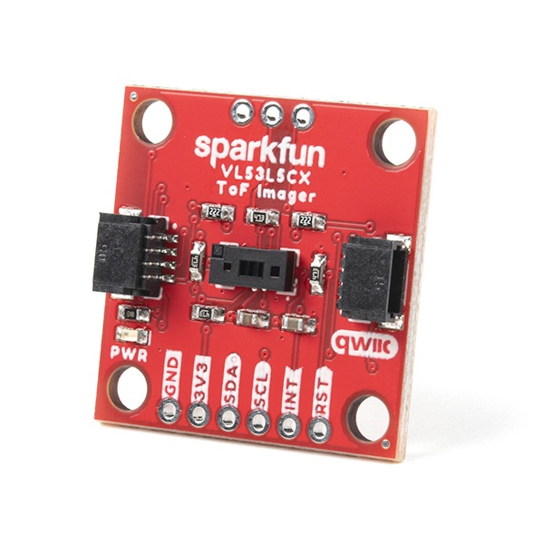
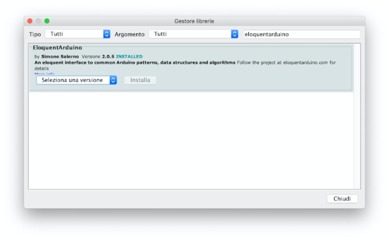
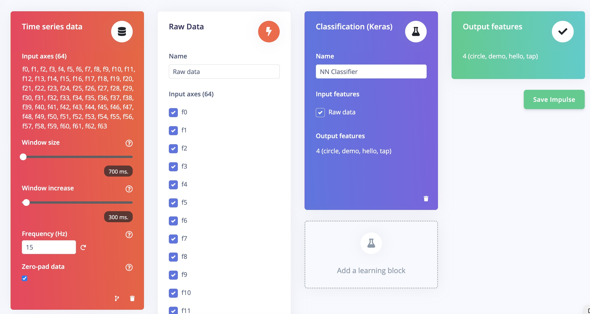

# Gesture classification with an 8x8 Time of Flight sensor and Edge Impulse

Created By:
Simone Salerno 

Public Project Link:
[https://studio.edgeimpulse.com/public/94474/latest](https://studio.edgeimpulse.com/public/94474/latest)



## Introduction

Human-Computer Interfaces come in many shapes and sizes in our everyday life. We're greatly accustomed to point-and-click devices, touchscreens and voice commands.

In recent years (and even more since the beginning of the pandemic), touchless interfaces have grown in popularity and have proven to work well in different use-cases:

- [Elevator controls](https://www.openpath.com/touchless-elevators)
- [Home thermostats](https://www.youtube.com/watch?v=ufkdqY4NJMo)
- [Automotive dashboard controls](https://www.youtube.com/watch?v=_mGwJh4da5w)

Among the many technologies that enable touchless interfaces, one that is low power and suitable for the embedded industry is known as "Time of Flight".

[Time of Flight](https://en.wikipedia.org/wiki/Time_of_flight) measures the distance of objects from the sensor, either via direct or indirect measurement. Arranged in a matrix scheme, these sensors can be used as a *depth imaging system*, making it possible to extract useful knowledge about the nearby environment.

There are many types available in the market, but this project employs a [VL53L5CX chip](https://www.st.com/en/imaging-and-photonics-solutions/vl53l5cx.html) from ST Microelectronics, which is capable of producing an 8x8 distance array at 15 FPS. You can buy a development board for it with I2C connectivity for easy prototyping from many online resellers.

The main objective of this project is to **recognize user gestures** from the sensor imaging data. The gestures can either be:

1. of "fixed" length, like a swipe (Project A)
2. or continous motion, like waving your hand (Project B)

Both of these sub-projects share most of the code and application logic, so it's probably best not to not to skip any sections in this tutorial.


## Hardware and Software Setup

To implement this project on your own, you will need:

1. a board supported by Edge Impulse (I'm using an Arduino RP2040 Connect)
2. a VL53L5CX 8x8 Time of Flight sensor

The VL53L5CX communicates via the I2C protocol; default address is 0x52, but you can change this via software if you have other devices (or if you want to use more than one at the same time!)

On the software side, you need to install a couple of Arduino libraries:

1. [SparkFun_VL53L5CX_Arduino_Library](https://github.com/sparkfun/SparkFun_VL53L5CX_Arduino_Library) for direct access to the VL53L5CX sensor
2. [EloquentArduino library](https://github.com/eloquentarduino/EloquentArduino) for high level VL53L5CX data manipulation



You can find both of them in the Arduino Library Manager.

### Hardware and Software Check

Once you're done with the setup, let's check that everything is wired correctly and that you can access the VL53L5CX sensor from the EloquentArduino library.

Load this demo sketch on your board and confirm that you're not getting any error messages.

```cpp
/**
 * Capture data from VL53L5CX 8x8 Time of Flight sensor
 */

#include  <Wire.h>
#include  <eloquent.h>
#include  <eloquent/modules/vl53l5cx/8x8.h>


void  setup() {
	Serial.begin(115200);
	Wire.begin();

	// (optional) turn on high speed communication
	Wire.setClock(1000000);
	vllcx.highFreq();

	// (optional) truncate readings lower than 30 (3 cm) 
	// and higher than 500 (50 cm)
	vllcx.truncateLowerThan(30);
	vllcx.truncateHigherThan(500);

	// (optional) rescale distances from millimeters to 0-1 range 
	// (aka normalize distances)
	vllcx.scaleToRange(0, 1);

	if (!vllcx.begin())
		eloquent::abort(Serial, "vl53l5cx not found");

	Serial.println("vl53l5cx is ok");
}

void  loop() {
	// await for new data
	if (!vllcx.hasNewData() || !vllcx.read())
		return;

	// print readings to Serial
	vllcx.printTo(Serial);
}
```

If you see the `vl53l5cx not found` message, first thing you should check is the wiring. 

Otherwise, if everything is working fine, it's time to start creating our dataset for model training and testing.

We begin from *Project A: Fixed Length Gestures*.


## Project A. Fixed-Length Gestures

Fixed-length gestures have a clear beginning and a clear ending. They start when our hand enters the field of view of the sensor and end when our hand exits the field of view.

This means that, first and foremost, we need to detect when *something* is in the field of view of the VL53L5CX and when not. The EloquentArduino library implements this basic check by testing each of the 64 distances that the sensor captures: if *N* (configurable) of them are below a given threshold, it returns *true*. Otherwise it returns *false*.

Examples of fixed-length gestures are swipe left/right, swipe up/down and tap (approximate to the sensor then leave).


### Data Collection

To collect our dataset, we'll configure this kind of *object detection* and we'll print the sensor readings only when something is in the field of view.


```cpp
#include  <Wire.h>
#include  <eloquent.h>
#include  <eloquent/modules/vl53l5cx/8x8.h>

void  setup() {
	Serial.begin(115200);
	Wire.begin();
	Wire.setClock(1000000);

	vllcx.highFreq();
	vllcx.truncateLowerThan(30);
	vllcx.truncateHigherThan(200);
	vllcx.scaleToRange(0, 1);

	// detect object when at least 10 values out of 64 are below 0.95
	vllcx.detectObjectsWhenNearerThan(0.95, 10);

	if (!vllcx.begin())
		eloquent::abort(Serial, "vl53l5cx not found");

	Serial.println("vl53l5cx is ok");
	Serial.println("Start collecting data...");
	delay(3000);
}

void  loop() {
	if (!vllcx.hasNewData() || !vllcx.read())
		// await data is ready
		return;
	
	if (!vllcx.hasObjectsNearby())
		// await object in field of view
		return;

	vllcx.printTo(Serial);
}
```

The `vllcx.printTo(Serial)` line prints the sensor data to the Serial port in CSV format, so we can use the `edge-impulse-data-forwarder` tool to load our data directly into the Edge Impulse Studio.

Load the sketch and start `edge-impulse-data-forwarder`: now choose a gesture that you can perform in about 0.5 - 1 seconds and start iterating in front of the sensor.

For optimal accuracy, you should repeat each gesture at least 50 times. It will be even better if different people perform it, so as to capture more intra-gesture variability. *(For the sake of this project, though, 30 repetitions of each should suffice)*

After you finish collecting data, you can move on the Impulse design.

### Impulse Design

If we consider a single sensor array capture as an 8x8 matrix, we can (conceptually) assimilate it to a grayscale image.

Since each gesture is made of many frames, our features are, in fact, a time series of images.

As you may already know, when working with images Convolutional Neural Networks (CNN) on the raw pixel values, without much pre-processing (apart from data augmentation, if any), proved to work really well. Even though our "images" are pretty tiny, the 2D convolution approach will still suit our needs.

Keeping this in mind, we will design our Impulse as follows:

- Window size of 700 ms with 300 ms overlap (change according to your requirements!)
- Raw data processing block
- CNN made of:
  - Input layer
   - reshape to 8 columns
  - 2D conv with 8 filters
  - Dropout at 0.2
  - 2D conv with 16 filters
  - Dropout at 0.2
  - Flatten
  - Output layer



You are free to edit the above topology as you see fit. On my own dataset, it achieved 99% accuracy on the validation set.


### Deployment

After you have tweaked the model to fit your requirements, it is time to deploy it back to your board.

The Edge Impulse library contains a few skeleton sketches for a supported list of sensors, but the VL53L5CX is not one of them, so we need to write the acquisition and inference logic by ourselves.

The EloquentArduino library comes in handy once again here.

Other than a VL53L5CX wrapper, it also implements a `circular buffer` data structure that we can use to replicate the Edge Impulse windowing function without hassle.

Once we fill the buffer, we can feed it as input to the Edge Impulse network and get the predictions back.

```cpp
#include  <Wire.h>
#include  <eloquent.h>
#include  <eloquent/modules/vl53l5cx/8x8.h>
#include  <eloquent/collections/circular_buffer.h>

// replace this with the library downloaded from Edge Impulse
#include  <tof_inferencing.h>
#include  <eloquent/tinyml/edgeimpulse.h>


Eloquent::Collections::FloatCircularBuffer<EI_CLASSIFIER_DSP_INPUT_FRAME_SIZE> buffer;
Eloquent::TinyML::EdgeImpulse::Impulse  impulse;

void  setup() {
	Serial.begin(115200);
	Wire.begin();
	Wire.setClock(1000000);

	vllcx.highFreq();
	vllcx.truncateLowerThan(30);
	vllcx.truncateHigherThan(100);
	vllcx.scaleToRange(0, 1);
	vllcx.detectObjectsWhenNearerThan(0.95, 10);

	if (!vllcx.begin())
		eloquent::abort(Serial, "vl53l5cx not found");

	Serial.println("vl53l5cx is ok");
	Serial.println("Start collecting data...");
}

void  loop() {
	if (!vllcx.hasNewData() || !vllcx.read())
		// await data is ready
		return;

	if (!vllcx.hasObjectsNearby()) {
		// No object detected, clear buffer to start 
		// data collection from scratch
		buffer.clear();
		return;
	}

	if (!buffer.push(vllcx.distances, 64))
		// Queue is not full yet
		return;

	// we are ready to classify the gesture
	uint8_t prediction = impulse.predict(buffer.values);

	Serial.print("Predicted label: ");
	Serial.print(impulse.getLabel());
	Serial.print(" with probability ");
	Serial.println(impulse.getProba());

	// debug class probabilities and timings
	//impulse.printTo(Serial);
}
```

Load the sketch to your board and start performing your gestures in front of the sensor. 

You should see the predicted gesture's name and confidence score on the Serial monitor.

The `FloatCircularBuffer` is a data structure that holds an array where you can push new values. When the buffer is full, it shifts the old elements to make room for the new ones. This way, you an an "infinite" buffer that mimics the windowing scheme of Edge Impulse.

By allocating a buffer of `EI_CLASSIFIER_DSP_INPUT_FRAME_SIZE` items, you are always sure that the impulse model will get the exact number of features it needs to perform inference.

That completes the Fixed-Length Gesure Project.  You can have a look at a video of this project, here:

[[@todo add demo video here]]

The next project follows the same guidelines of this one, but implements a few changes that allow you to perform gesture inference on *continous* data, instead of discrete as this one.

One main change is the introduction of a **voting mechanism** to make more robust predictions in sequence.
  
## Project B. Continuous-Motion Gestures

Continuous-motion gesture detection behaves a bit differently from the discrete case.

This time the model has to classify a stream of gestures, instead of one at a time. The application code we already discussed in the previous project will still remain valid, but we will introduce a few modifications:

1. we change the object detection logic
2. we add a voting mechanism to *smooth* the stream of predictions and make it less noisy

### Data Collection

The data collection sketch is pretty much the same as earlier. The only modification is the object detection algorithm: instead of checking if *N* out of 64 values are below a given threshold, we check if the mean value of the readings is below a threshold.

The core idea here is that if no object is present, all the distances will map to 1 (max distance). If an object is in the field of view, some of the values will be lower, and so will be the mean value.

```cpp
#include  <Wire.h>
#include  <eloquent.h>
#include  <eloquent/modules/vl53l5cx/8x8.h>

void  setup() {
	Serial.begin(115200);
	Wire.begin();
	Wire.setClock(1000000);

	vllcx.highFreq();
	vllcx.truncateLowerThan(30);
	vllcx.truncateHigherThan(200);
	vllcx.scaleToRange(0, 1);

	if (!vllcx.begin())
		eloquent::abort(Serial, "vl53l5cx not found");

	Serial.println("vl53l5cx is ok");
	Serial.println("Start collecting data...");
	delay(3000);
}

void  loop() {
	if (!vllcx.hasNewData() || !vllcx.read())
		// await data is ready
		return;
	
	if (vllcx.mean() > 0.98)
		// await object is in field of view
		return;

	vllcx.printTo(Serial);
}
```

As always, boot the `edge-impulse-data-forwarder` tool and collect your own dataset.

In this case I suggest you collect at least 60 seconds of continuous motion for each gesture to get good results.

### Impulse Design

Nothing needs to be changed here.

### Deployment

As stated earlier, the main difference here is that we want to reduce the amount of noise in the predictions.

By classifying a stream of data, it is very likely that once in a while the model will output wrong predictions due to the high variability of the input data.

For example, it would be pretty normal that while performing gesture A, you see these kind of predictions from the model: `AAAA B AAA C AAAA`.

Our main goal is to eliminate those spot, isolated predictions.

A naive but effective strategy is to use a *running voting scheme*: every time a new prediction is made, we check the last few ones. If the latest agrees with the others, we can be more confident that it is accurate (**this only applies in this case of continous motion!**).

The EloquentArduino library has such a voting scheme.

```cpp
#include  <Wire.h>
#include  <eloquent.h>
#include  <eloquent/modules/vl53l5cx/8x8.h>
#include  <eloquent/collections/circular_buffer.h>

// replace this with the library downloaded from Edge Impulse
#include  <tof_inferencing.h>
#include  <eloquent/tinyml/edgeimpulse.h>
#include  <eloquent/tinyml/voting/quorum.h>

Eloquent::Collections::FloatCircularBuffer<EI_CLASSIFIER_DSP_INPUT_FRAME_SIZE> buffer;
Eloquent::TinyML::EdgeImpulse::Impulse  impulse(false);
// replace 7 with the number of votes you want to use
// the higher the value, the less noisy the predictions will be
// setting a too high value, though, will make the classifier less responsive
Eloquent::TinyML::Voting::Quorum<7> voting;


void  setup() {
	Serial.begin(115200);
	Wire.begin();
	Wire.setClock(1000000);

	vllcx.highFreq();
	vllcx.truncateLowerThan(30);
	vllcx.truncateHigherThan(100);
	vllcx.scaleToRange(0, 1);

	// a prediction is considered not noisy if it equals 
	// at least half of the last N
	voting.atLeastMajority();

	if (!vllcx.begin())
		eloquent::abort(Serial, "vl53l5cx not found");

	Serial.println("vl53l5cx is ok");
	Serial.println("Start collecting data...");
}

void  loop() {
	if (!vllcx.hasNewData() || !vllcx.read() || vllcx.mean() > 0.98)
		// await data is ready or object is in the field of view
		return;

	if (!buffer.push(vllcx.distances, 64))
		// Queue is not full
		return;

	// we are ready to classify the gesture
	uint8_t prediction = impulse.predict(buffer.values);

	if (impulse.getProba() < 0.7)
		// (optional) discard weak predictions
		return;

	if (voting.vote(prediction) < 0)
		// prediction is noisy
		return;

	Serial.print("Predicted label: ");
	Serial.print(impulse.getLabel());
	Serial.print(" with probability ");
	Serial.println(impulse.getProba());

	// debug class probabilities and timings
	//impulse.printTo(Serial);
}
```

As you can see, we introduced only a few modifications from the previous project.

Tweaking the number of votes to use and the weak prediction threshold is a process of trial and error, but it can have a huge impact on the accuracy of your model if done correctly.

Load the sketch on your board and start performing your continuous motion gestures.

You will find that there is a lag when you switch gesture: this is because the buffer will contain mixed data from the old gesture and the new, so the model will be confused.

After the buffer fills with all data from the current gesture, the model will pick it up.

[[@todo add demo video here]]

## Conclusion

This project described two different kinds of gesture classification with Time of Flight technology:

 1. Fixed-length gesture
 2. Continous-motion gesture

These same concepts will apply to other kind of classification problems, as well.  For example, gesture classification from accelerometer and gyroscope data.

