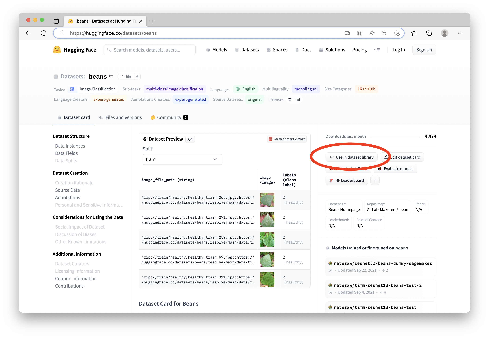
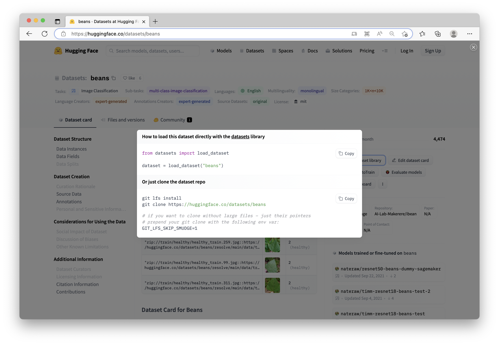
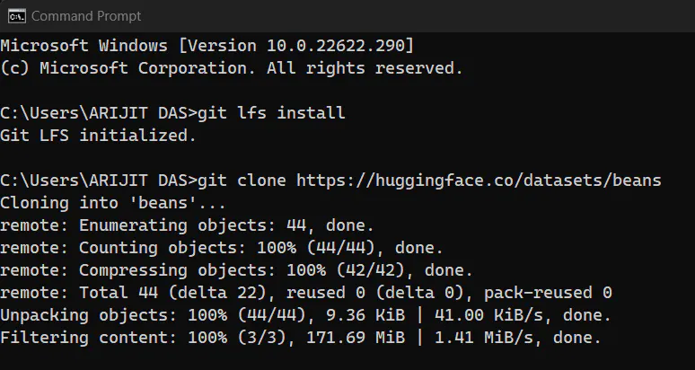
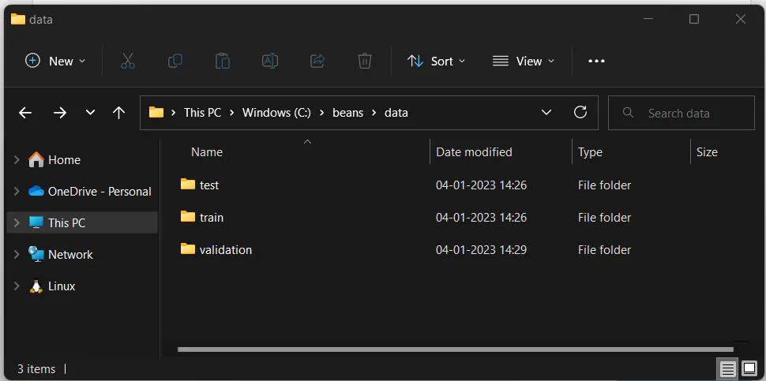
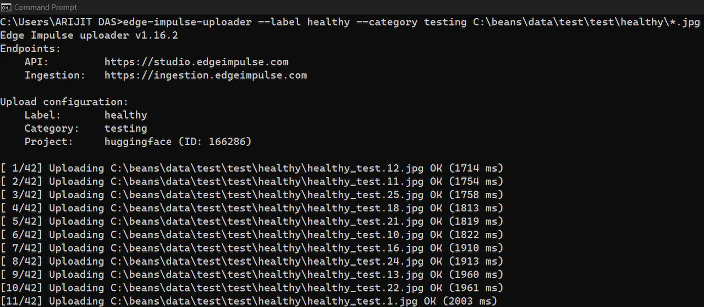
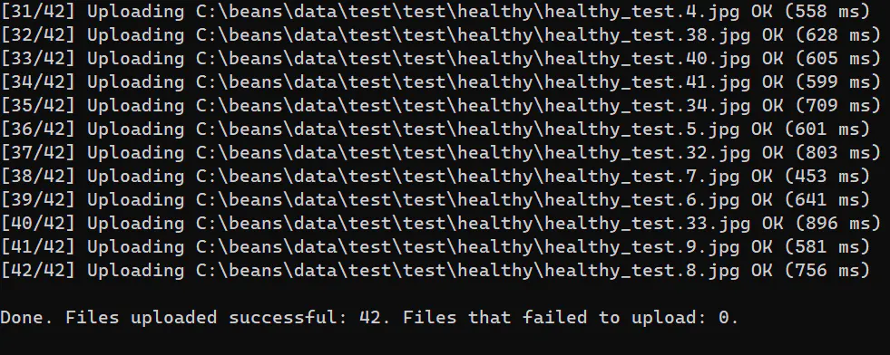
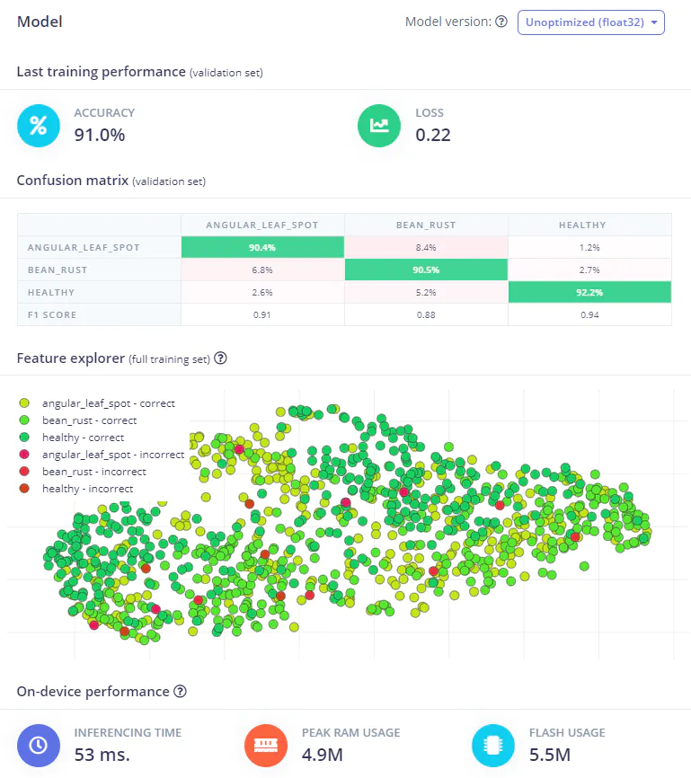
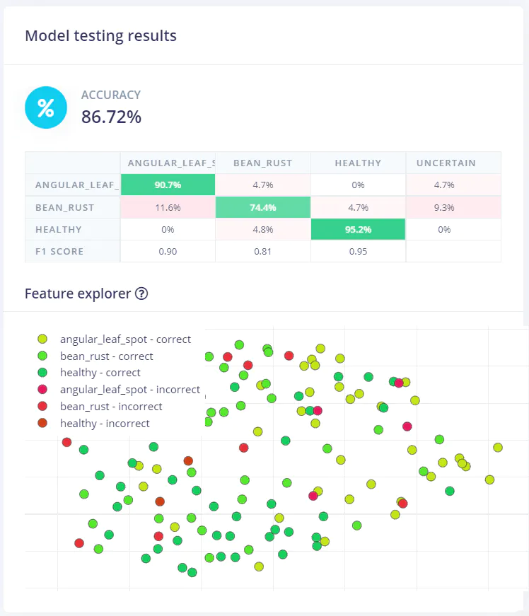
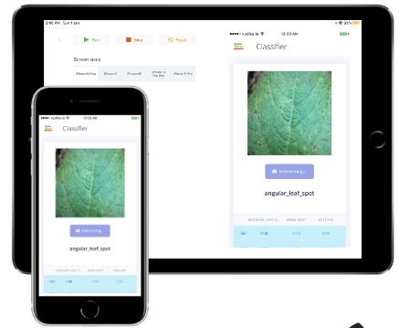

# Using Hugging Face Datasets in Edge Impulse

Created By:
Arijit Das 

Public Project Link:
[https://studio.edgeimpulse.com/public/166286/latest/](https://studio.edgeimpulse.com/public/166286/latest/)


## Intro to Hugging Face

The Hugging Face Hub is a large machine learning community and platform with over 18,000 open-source and publicly available datasets, over 120,000 created models, and applications (called Spaces) that leverage AI to perform a task. This open and community-centric approach allows people to easily collaborate and build ML projects together. The Hub is a central place where anyone can explore, experiment, and work together to build projects with machine learning.

Hugging Face Datasets are a library of high quality datasets curated by ML researchers and professionals. We will be using the [beans dataset from Hugging Face Datasets](https://huggingface.co/datasets/beans) in this project, and we'll upload it to Edge Impulse to use for AI model training and then for deployment on an edge device.

## Working with the Dataset

First, open the dataset on the Hugging Face website. Next, download it to your local computer by following the instructions shown when clicking on the "Use in dataset library" option on the right side of the page.





Open a terminal or command line on your machine, and run the code shown in the detailed view of the dataset:

```
git lfs install
git clone https://huggingface.co/datasets/beans
```



Navigate to the folder where you performed the `git clone`, and you'll have a `.zip` file there. Unzip that file, and you will then have a series of folders.  Inside of the `data` folder, you will have 3 more folders, where the images are located for Training, Testing, and Validation.  (We actually don't need the Validation set of images for this project).



At this point we're ready to upload this data to Edge Impulse for our model creation.

## Uploading the Dataset to Edge Impulse

We'll use the Edge Impulse CLI Uploader, which signs local files and uploads them to the ingestion service. This is useful to upload existing data sets, or to migrate data between Edge Impulse projects. The Uploader currently handles these type of files:

1. `.cbor` - Files in the Edge Impulse Data Acquisition format. The uploader will not resign these files, only upload them.

2. `.json` - Files in the Edge Impulse Data Acquisition format. The uploader will not resign these files, only upload them.

3. `.csv` - Files in the Edge Impulse Comma Separated Values (CSV) format.

4. `.wav` - Lossless audio files. It's recommended to use the same frequency for all files in your data set, as signal processing output might be dependent on the frequency.

5. `.jpg` - Image files. It's recommended to use the same pixel ratio for all files in your data set.

Files are automatically uploaded to the **Training** category, but you can override the category with the `--category` option. For example:

```
edge-impulse-uploader --category testing path/to/a/file.jpg
```

A label is automatically inferred from the file name, see the [Ingestion service documentation](https://docs.edgeimpulse.com/reference/data-ingestion/ingestion-api#ingestion-api) for more details. You can override this with the `--label` option. For example:

```
edge-impulse-uploader --label noise path/to/a/file.jpg
```

So, to make use of our Hugging Face dataset, we will have the upload the files in the following manner:

```
edge-impulse-uploader --label <enter label name> --category <training/testing> path/to/a/file.jpg
```

To begin, here's how we can upload **Healthy** images in the **Training** category.

```
edge-impulse-uploader --label healthy --category training path/to/a/file/*.jpg
```





Repeat this process for each different class of data in the dataset: Angular Leaf Spot and Bean Rust in our case, but if you are using a different dataset you might have more classes. We won't make use of "Validation" images, they're not needed with Edge Impulse. It is important to make note of the difference between Training and Testing, however. **Training** is the data that will be used in the creation of the machine learning model.  Testing is data that is left aside and used **after** the model has been built, to verify and "test" if the model can make accurate predictions on data it has not seen before.  The **Testing** data is NOT used in the model creation process.

## Creating and Testing the Model

With the data uploaded to the Edge Impulse Studio, we can start training our model. I'm using MobileNet V2 160x160 0.75, with a training cycle of 20 epochs, and a learning rate of 0.0005. I'm able to achieve 91% accuracy, which is great (unoptimized float32).



You can also take advantage of the Edge Impulse EON Tuner to minimize memory usage or improve your results depending upon the hardware you intend to deploy with your model.

With the model built, now we can make use of those images we set aside for Testing.  Click on "Model testing" on the left menu so that we can now test out the results on the unseen Testing images.



If your testing looks good, as it does in this case with 89% accuracy on the Testing data, we can proceed with deploying the model to a real device!

## Deployment of the Model

Edge Impulse supports model deployment for a wide variety of devices. There are microcontroller targets such as the Arduino Nicla, Portenta, and Nano, the Sony Spresense, Syntiant TinyML Board, and many more, there are linux-based devices such as the Raspberry Pi, Jetson Nano, and Renesas RZ/V2L, or you can deploy it directly to a phone or tablet.

The Documentation for each device is [located here](https://docs.edgeimpulse.com/docs/development-platforms/fully-supported-development-boards), and because the instructions vary depending upon your chosen board, you'll want to follow the official Docs.

For a quick way to see if everything is working, you can actually deploy straight to your smartphone or tablet.  Here I've deployed it on an iPhone and iPad using my [previous project documentation](https://www.hackster.io/arijit_das_student/design-develop-deploy-ml-powered-mobile-apps-in-an-hour-3d189e).



## Conclusion

Following this same methodology, you can make use of any Hugging Face dataset to help build and train a machine learning model with Edge Impulse.
