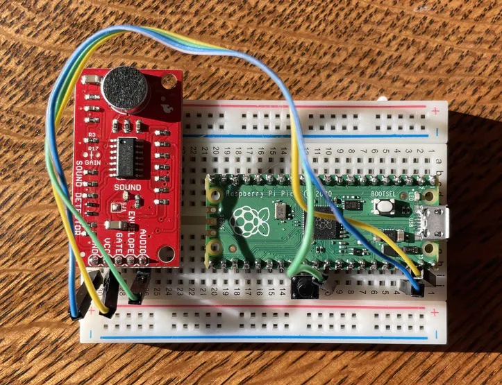
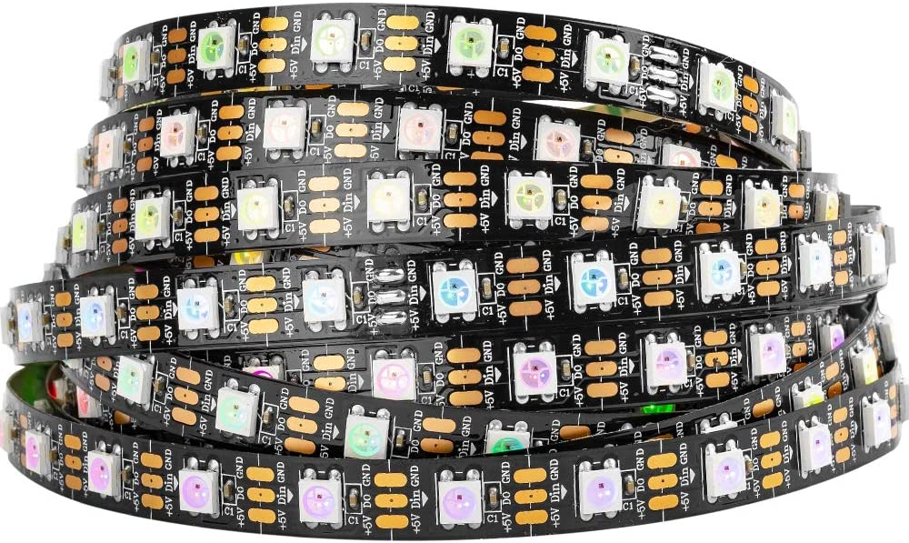
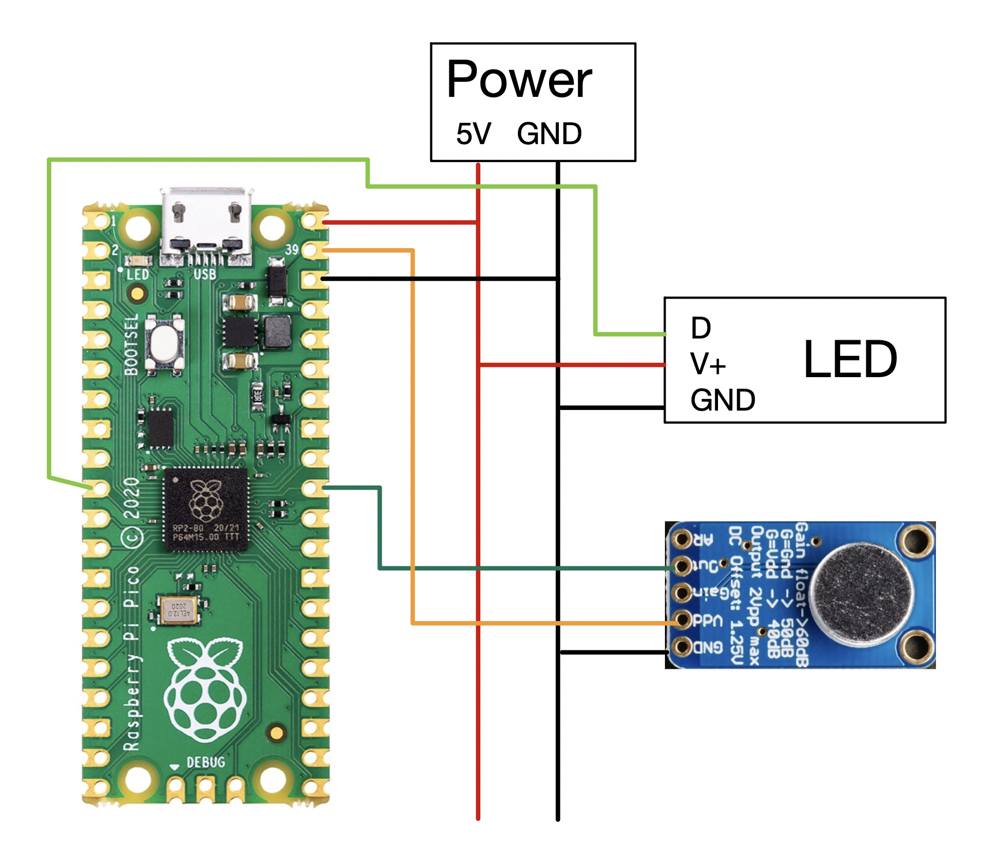

# Voice-Activated LED Strip for $10: Raspberry Pi Pico and Edge Impulse

Created By:
[Alex Wulff](https://www.alexwulff.com/)

Public Project Link:
[https://studio.edgeimpulse.com/public/117150/latest](https://studio.edgeimpulse.com/public/117150/latest)

## Project Overview


LED light strips, sometimes called “Neopixels” in the maker community, are the perfect choice for interior lighting. They’re easy to install, inexpensive, and are completely programmable. Simply connect the light strips to a microcontroller, write some code to make whatever lighting pattern you want, and you’re good to go!

Unfortunately for me, however, I’m lazy. I have no desire to get up and change the pattern if I get bored or turn it off if I want to go to bed. I could buy some Wi-Fi connected light strip on Amazon, but these are expensive and fiddling with some app on my phone is not peak laziness. Some light strips come with remotes, but I know that I’d lose the remote within days of having it.

What if we could use the $4 Raspberry Pi Pico to control lighting strips with voice commands? With Edge Impulse, we can! With just the Pico, a cheap microphone, and a power supply, you can make a voice-controlled lighting system.

## Why Raspberry Pi Pico?

The Pico is actually an excellent microcontroller for machine learning projects. First, it’s extremely inexpensive, so I don’t feel bad about leaving them inside a project instead of cannibalizing it when I’m done. Second, the Pico is an incredibly capable machine. It runs at a base frequency of 125 MHz so it can execute most machine learning pipelines in only a few hundred milliseconds, and it features a whole host of other peripherals like PIO and a second core. Third, writing code for Pico is an extremely pleasant experience. Pico supports normal C++, CMake, and Make, so development is very familiar. Actually programming the board itself is also as simple as possible.

Perhaps most important of all is that Pico is extremely well documented. It’s difficult to overstate how nice it is to have a well-document board; this saves countless hours of troubleshooting doing tasks as simple as setting up your development environment to experimenting with advanced features like PIO.

I firmly believe that the Raspberry Pi Pico offers the most bang for your buck out of all the Microcontrollers currently on the market. Additionally, with its new [$6 Wi-Fi-equipped cousin](https://www.raspberrypi.com/news/raspberry-pi-pico-w-your-6-iot-platform/), I can envision Pico becoming a formidable contender in a crowded field of microcontrollers.

## Parts

You’ll only need a few components to make this project work:

* Raspberry Pi Pico
* [Microphone with AGC](https://amzn.to/3Iiy597)
* LED Light Strip
* 5V Power Supply
* Breadboard

Most LED strips labelled as “addressable” or “Neopixel” will work. The main thing you’re looking for is a strip based on the WS2812 driver. You can find these on [Amazon](https://amzn.to/3R9REES), Adafruit, Sparkfun, etc. in varying sizes and configurations.

Also ensure that you select a power supply that can deliver a suitable amount of current to your project. 60 LEDs can draw up to 2A at full brightness. [This power supply](https://amzn.to/3R8dLeO) should do the trick for most projects.

## Step 1: Assembling the Circuit

Assembling this project should take less than 5 minutes on a breadboard. One important thing to note is that you should not tie the microphone to the 5V output from the power supply—instead, make sure it’s connected to the Pico’s 3V regulator. With the lights attached on, the 5V power supply is very noisy.

## Step 2: Collecting Training Data
The Edge Impulse Studio only supports collecting data from Pico at a relatively low sample rate, so we need to use some custom code to collect training data. See [this tutorial](https://docs.edgeimpulse.com/experts/collect-data-raspberrypi-pico) for information on how to collect data from the Pico’s AGC, upload it to Edge Impulse, and train a machine learning model on it.

You’ll need two keywords for this project. I used “start” and “stop”. When the lights are off, “start” will turn them on. When the lights are on and you say “start” again, the lights will cycle to a new lighting mode. Saying “stop” when the lights are on will turn them off. It took me a few tries to get my model working well, so don’t get discouraged if your system doesn’t work well at first!

## Step 3: The Code

[The code for this project](https://github.com/AlexFWulff/awulff-pico-playground/tree/main/pico-light-voice) really pushes the Raspberry Pi Pico to its limits. I use a variety of Pico-specific features, including direct memory access (DMA), PIO state machines, and multicore processing. First, we’ll start with the things you need to modify to make your project work. Start by cloning the `awulff-pico-playground` repository, and navigate to the `pico-light-voice` folder. This is the main folder for this project.

### Things you need to modify

* Check the indices of the keywords used in your model, and make sure those match with what the `if (ix == ...)` part of the code in `main.cpp`. Your “start” and “stop” keywords should match with what’s in the code.
* Adjust `thresh` in `main.cpp` to control the sensitivity of the keyword detection.
* Change `NUM_LIGHTS`  in `lights.cpp` to the number of LEDs in your strip.

Now let’s take a quick tour through the code so you can learn how to modify it to fit your needs.

### Folder Structure

The base of this code is built on top of [Edge Impulse’s standalone inferencing starting point](https://github.com/edgeimpulse/example-standalone-inferencing-pico).  You can follow the instructions [here](https://github.com/raspberrypi/pico-sdk) for setting up your development environment and downloading the Pico SDK. Additionally, once you’re finished with your voice model, copy over the folders from your deployed C++ library into the main project folder as described in this project’s README.

### Main Sampling Code

Let’s start in the `main` code loop. You can find this in `source/main.cpp`. 

**Input Parameters**

At the top of the file, you can find parameters for the model inputs and sample rates. A `CLOCK_DIV` of 12,000 gives a sample rate of 4 kHz. This is low for audio, but still intelligible to a machine learning model. This value needs to match the sample rate that you used to collect data in the data collection tutorial! We trained the model to respond to sample lengths of 4,000 samples (`NSAMP`), which works out to be exactly 1 second of data.

For more information on ADC sampling and DMA with Pico, check out [my tutorial on this subject](https://www.hackster.io/AlexWulff/adc-sampling-and-fft-on-raspberry-pi-pico-f883dd).

In this code I also do something called [continuous inferencing](https://docs.edgeimpulse.com/docs/tutorials/continuous-audio-sampling), which can improve the performance of the keyword detection drastically by passing in overlapping buffers of samples into the model. All the math takes under 250ms to execute, so I maintain a sliding buffer of data and run the model on it every quarter of a second. Edge Impulse doesn’t support continuous inferencing natively on Pico, so I implemented a form of it in software.

**Setup Code**

All the code in `main()` before the `while (true)` portion gets executed once. This is all setup code used to configure the model and sampling.

**Main Code Loop**

We take advantage of Pico’s many hardware features to form a very efficient data processing pipeline, which you can find in the `while (true)` portion of the code. The basic operation of this is as follows:

1. The code starts the ADC sampling routine on Pico. This tells the ADC to start running, and fill up the memory location we passed to the function with samples. All of this happens in the background and does not hang the main loop, so while we’re sampling we can also be running the machine learning code.
2. As soon as the ADC setup is finished, we move samples from the raw sample buffer into the feature buffer for the model in a form the model expects (floats normalized to between 2^15 and -2^15). The very first time this function runs, the buffer will be filled with garbage (since the ADC hasn’t populated it yet), but every subsequent time this runs it will be filled with actual audio data.
3. Next we begin executing the machine learning routine on the populated feature buffer.
4. Based on the output from the model, we send a state update to the other core that handles the lighting. One keyword is used to turn the lights on and cycle through different lighting modes, and the other keyword will turn the lights off.
5. We now block and wait for the ADC sampling to finish: `dma_channel_wait_for_finish_blocking(dma_chan)`
6. As soon as sampling is done we move samples into an intermediate buffer. We want to minimize the amount of time here spent not sampling, so we don’t do any processing here and just leave that for while the ADC is busy.
7. We then loop and do it all again!

### Continuous Inferencing Complications

The execution time of your model is very important for this application. As the code is configured, we run the model four times a second. The ADC is set to collect 1000 samples per shot (`NSAMP`); every time this collection is done, we shift samples out of the ADC buffer and into an intermediate buffer with past audio data. 

The green LED on the Pico is configured to be on while the Pico is busy executing the ML code and off while the Pico is waiting for the ADC. Thus, you can use the duty cycle of the flashing to get a handle on how close your model is to the 250 ms inferencing limit. You are losing data if the light stays on continuously—if this is the case, try reducing the execution time of your model, or increase `NSAMP` so the model runs more often.

### Lighting Code

We execute code to control the lighting on Pico’s second core while the first handles the sampling and machine learning. You can find the code for this in `source/lights.cpp`.

The second core executes a simple state machine based on input from the first core. Let’s look at the `core1_entry()` function to see how this works.

**Setup Code**

The first part of this code sets up the light strip. The `Adafruit_NeoPixel` library API should be the same as that which you find in other tutorials online, with some caveats. See the library’s [GitHub page](https://github.com/martinkooij/pi-pico-adafruit-neopixels) for more information.

**Lighting Loop**

The lights operate in a relatively simple manner. If we get the off keyword, the lights will stay off. When we get the “on” keyword, the lights will turn on in the previous lighting mode active when the lights were turned off. When we get the "on" keyword when the lights are already on, the code will cycle to a new lighting state. Add new lighting modes as you see fit, and make sure to update `NUM_STATES` to reflect how many states you’d like to use.

If your lighting code is relatively computationally intensive, make sure you periodically check for state updates (like I do in the rainbow mode) to ensure that your lighting system is responsive.

**Multicore Communications**

The `update_state()` function handles the communication between the two cores. Pico implements this communication using two FIFO queues — we can use this as a bi-directional pipe to send information back and forth between the cores. From the lighting core we tell the sampling core that we’re ready for data using `multicore_fifo_push_blocking(0)`. If the sampling core sees that the lighting core is ready for a state update, and it has a state update to give, it will send this update to the lighting core. Once the lighting core receives an update it will change the state accordingly.

This code initially looks a little complicated, but it’s a relatively simple way to synchronize two independent processing cores. Read the [Raspberry Pi documentation on FIFO and multicore processing](https://raspberrypi.github.io/pico-sdk-doxygen/group__pico__multicore.html) if you’re stuck.

## Step 4: Building and Flashing

You should be able to build this code using standard CMake tools. [Follow the instructions here](https://github.com/edgeimpulse/example-standalone-inferencing-pico) to compile the project using `CMake` and `make`, and flash it using the `.uf2` file. If your code is failing to build, you might not have copied all the folders you needed from your deployed C++ Edge Impulse model, or the path to the Pico SDK might not be set correctly.

## Troubleshooting and Modifying
Machine learning can be very tough. Any deviation from an environment similar to your training data can cause your model to stop working entirely. Here is a small selection of the many mistakes I made along the way while making this project:

* Using a different sample rate in my training data vs. the actual data collected by this code
* Accidentally passing in buffers of `uint16_t`s to the model when it was expecting floats
* Consuming too much RAM on the Pico which causes it to silently break things instead of erroring out (keep `NSAMP/INSIZE` small!)
* Not rate-limiting the FIFO buffers and causing them to fill up with stale state data
* Switching the index of the keywords used in my model

Chances are, you’ll encounter some issues too. Spend some time to understand the code and you’ll have a much easier time debugging.

That’s all! I hope you enjoyed this tutorial. If you found it helpful, check out [my writing](https://alexwulff.medium.com), [my website](https://www.alexwulff.com), and [some of my other projects](https://www.hackster.io/AlexWulff).

