# Warehouse Shipment Monitoring using a Thunderboard Sense 2 

Created By:
Manivannan Sivan 

Public Project Link:
[https://studio.edgeimpulse.com/public/142224/latest](https://studio.edgeimpulse.com/public/142224/latest)

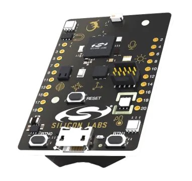

## Problem Statement

Monitoring fragile objects during shipment require more time, care, labor effort, and infrastructure support.

In an ideal scenario, shipments would travel from the warehouse directly into the hands of the customer. However, that is not always the case. In between, a shipment / package will be handled many times, and you can’t always expect the people doing the transportation to handle them in a manner that will not lead to damage.

Here are a few challenges with logistics of fragile items:
- In a warehouse, storing fragile objects in the wrong position can damage the product.
- No real time monitoring of the shipments *inside* a warehouse about placement of products.
- Handling the shipment in the wrong position during transferring to the destination might cause damage to the product.
- Computer Vision-based shipment monitoring requires infrastructure to support it.  For example, poor lightning conditions might affect the prediction.

## TinyML Solution

I have created a TinyML model which can be attached to a fragile package and it tracks and predicts the position of the  package, with the results communicated to a Mobile application through BLE. 

For hardware, I have used the [SiLabs Thunderboard Sense 2](https://www.silabs.com/development-tools/thunderboard/thunderboard-sense-two-kit?tab=overview) and Edge Impulse to train the model and deploy it to the Thunderboard Sense 2.

The predicted result will be one of four categories:

- Correct position
- Incorrect position - Upside-down
- Incorrect position - Tilted forward
- Incorrect position - Tilted backward

## Data Acquisition

Connect the Thunderboard Sense 2 board to the system and flash the firmware from this link:

[https://docs.edgeimpulse.com/docs/development-platforms/officially-supported-mcu-targets/silabs-thunderboard-sense-2](https://docs.edgeimpulse.com/docs/development-platforms/officially-supported-mcu-targets/silabs-thunderboard-sense-2)

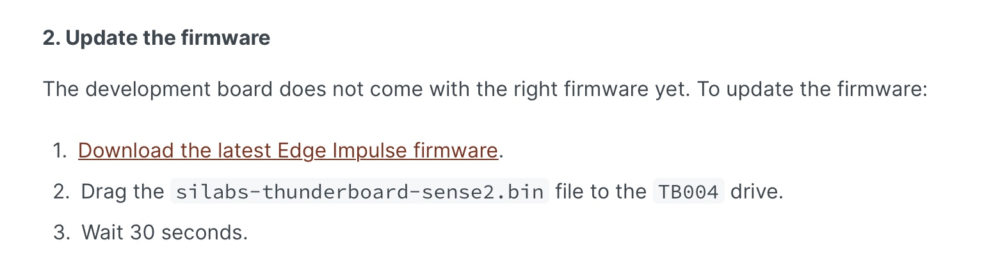

Once it is flashed, run the below command:

`edge-impulse-daemon`

Now the board is connected to your Edge Impulse account. Then place the hardware in a case, and attach it to the shipment package. In the below picture, you'll notice that the Thunderboard is placed inside the case and mounted *on top* of the  package. Now collect the accelerometer data.

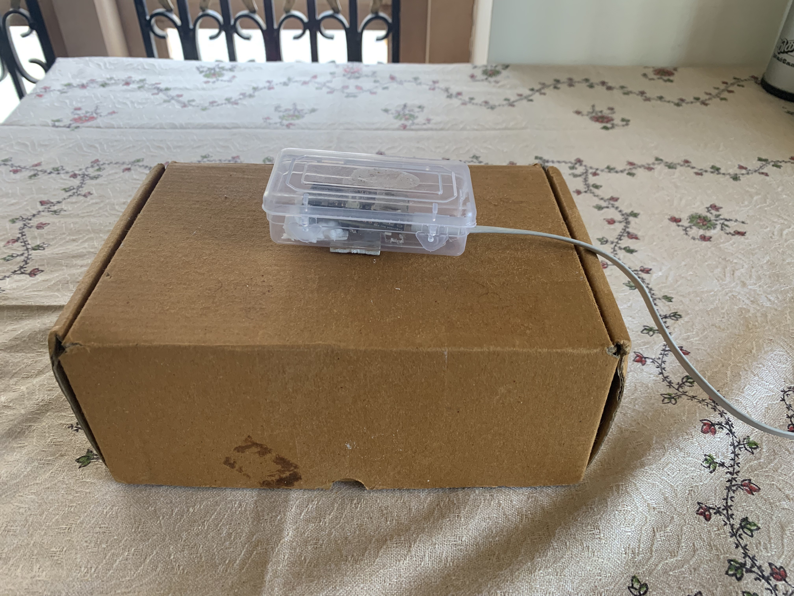

Now it’s time to collect the dataset for each of the categories.

### Correct Position

Let’s assume the package with fragile object is orientated correctly. Place the Thunderboard on top of it, for data acquisition. Now start moving the package with this position, while data acquisition is running. Collect a dataset of around 2 minutes 30 seconds.

### Incorrect Position - Upside-down

Turn the package over so that it is upside down, with the hardware still on it. Now start moving the package in this position, while data acquisition is running. Collect a dataset of around 2 minutes 30 seconds.

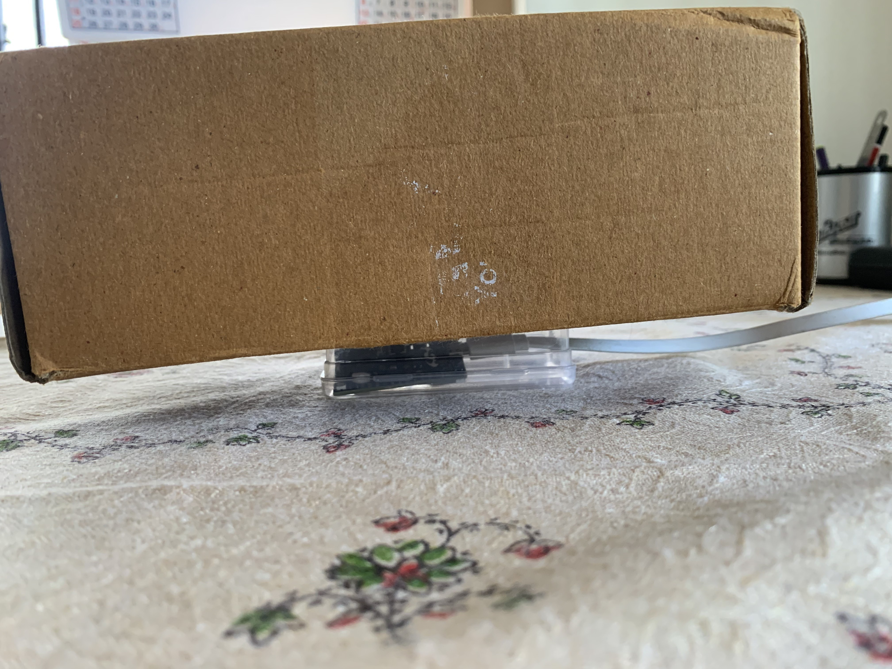

### Incorrect Position - Tilted Forward

Turn the package on it's side, with the hardware still on it, facing forward. Now start moving the package in this position, while data acquisition is running. Collect a dataset of around 2 minutes 30 seconds.

### Incorrect Position - Tilted Backward

Turn the package on it's side, with the hardware still on it, facing backward. Now start moving the package in this position, while data acquisition is running. Collect a dataset of around 2 minutes 30 seconds.

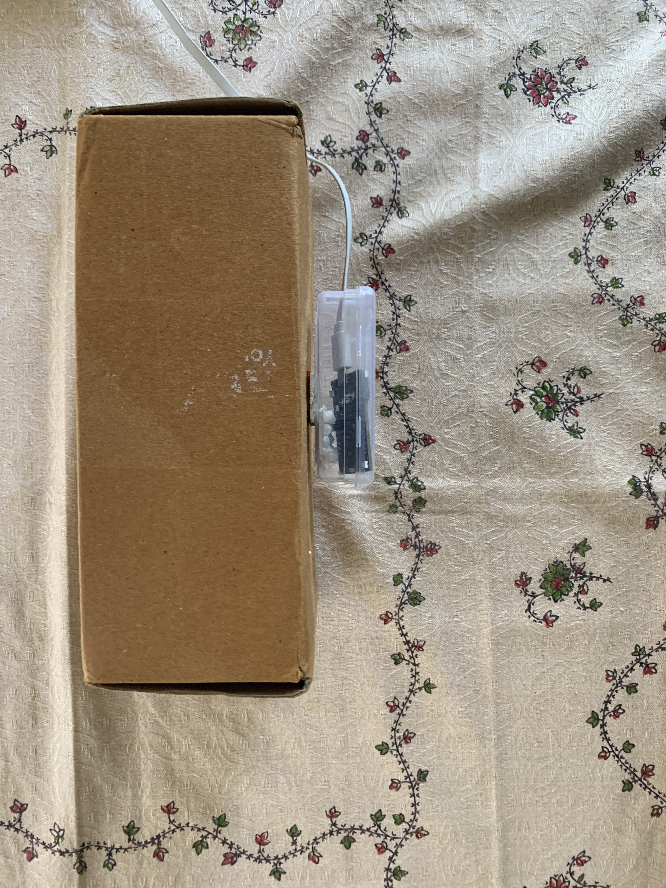

Back in the Studio, move approximately 30 seconds of data from each category to Test data. The [Training and Test dataset](https://docs.edgeimpulse.com/docs/edge-impulse-studio/data-acquisition#dataset-train-test-split-ratio) ratio should be split about 80:20.

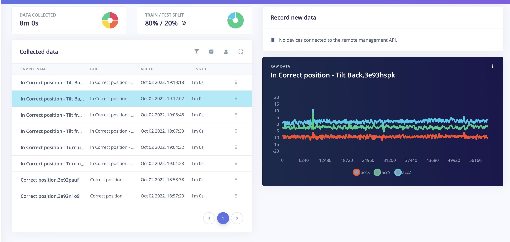

After data collection is completed, now go the Iimpulse settings and select Raw data in Processing. A Window size of 3000ms and Window increase of 500 ms is good.

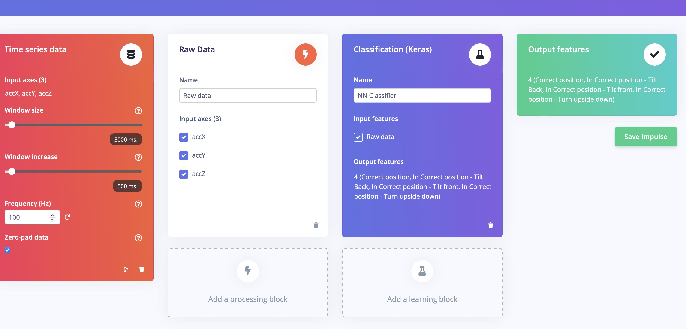

The generated Feature map from the raw data should look similar to this:

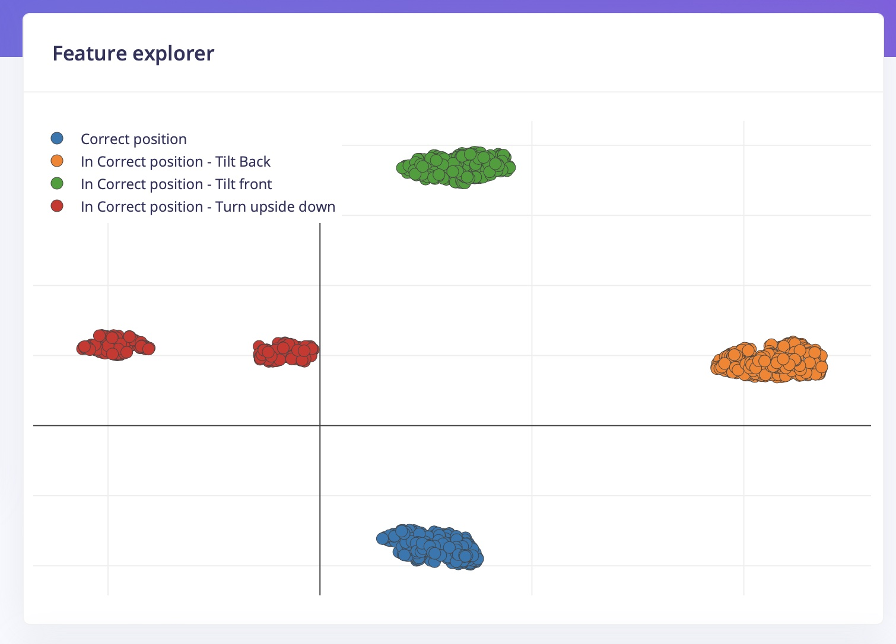

## Neural Network Training

In the Neural network training, I have used sequential layers with a Dense neural network layer and drop out of 0.1 to avoid the over fitting. I have chosen the learning rate as 0.0005 and 200 training cycles.

Upon completion, the training model Accuracy is 100%:

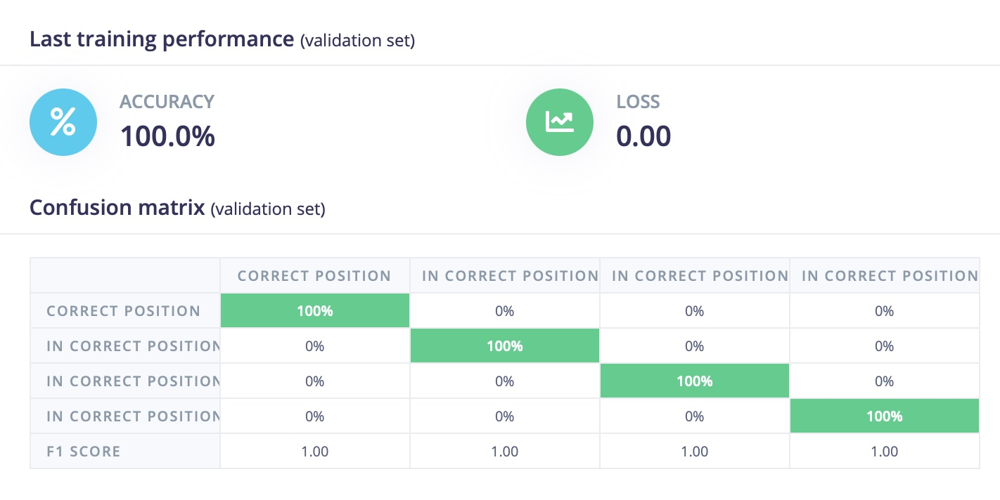

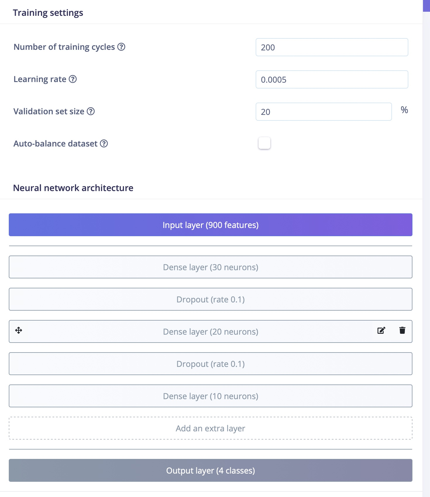

## Model Testing

In the Model testing section, I have tested the trained model with the 30-second dataset that we set aside earlier for each category.

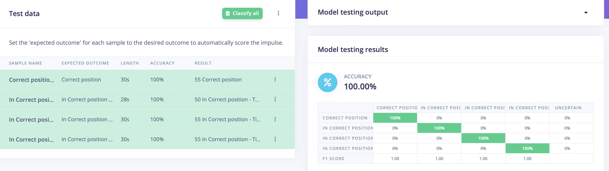

The trained model achieved 100% accuracy using the unseen testing data. This confirms the model performs great in predictions. Now the next stage is to test it in real use-case scenario.
 
For this, we need to deploy this model directly to the SiLabs Thunderboard Sense 2.

## Deployment

Go to the Deployment section, and select Firmware option "Thunderboard Sense 2". This will generate and download the firmware to your local system.

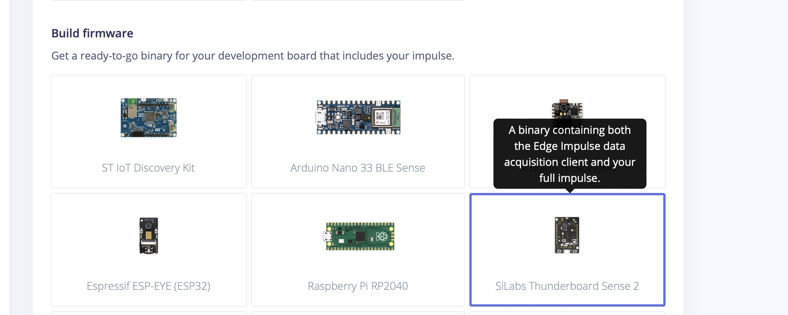

Once the firmware is downloaded, copy the `.bin` file and paste it in the TB004 drive attached to your PC. This will flash the software onto the Thunderboard Sense 2 board.

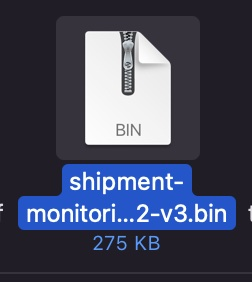

Once it is flashed, Reset the board. Connect the 3v battery into it.

## Testing in the Real World

To test it out in a real scenario, download the ["LightBlue"](https://apps.apple.com/us/app/lightblue/id557428110) app from the iOS App Store or Google Play store. This app will be used to communicate to with the Thunderboard Sense 2.

Open the App and connect to the Edge Impulse service (Make sure board is powered on).

Input settings in the application:

- Subscribe to the `2A56` characteristic.
- Decode the message as UTF-8 (click on `HEX` in the top right corner in LightBlue to switch).
- Place the package in different positions and start moving the package.
- The app will notify the Thunderboard.

Enable the "Listening" option in the app. You will be notified only when the previous prediction result differs from current prediction result.

For different positions of a shipment package, the predicted resulted is mentioned below.

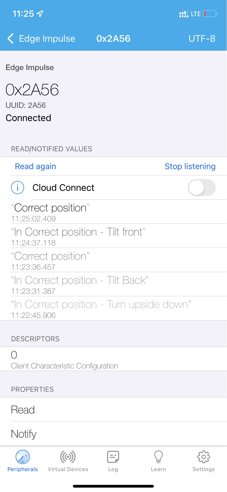

## Results

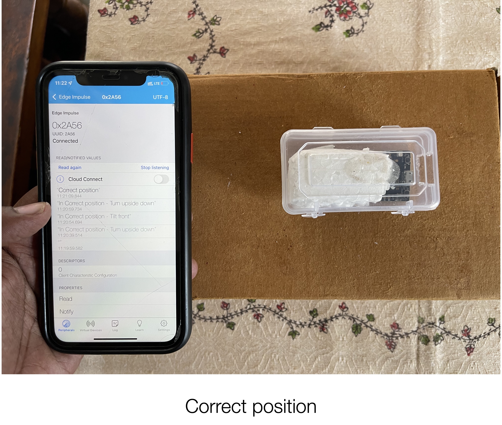

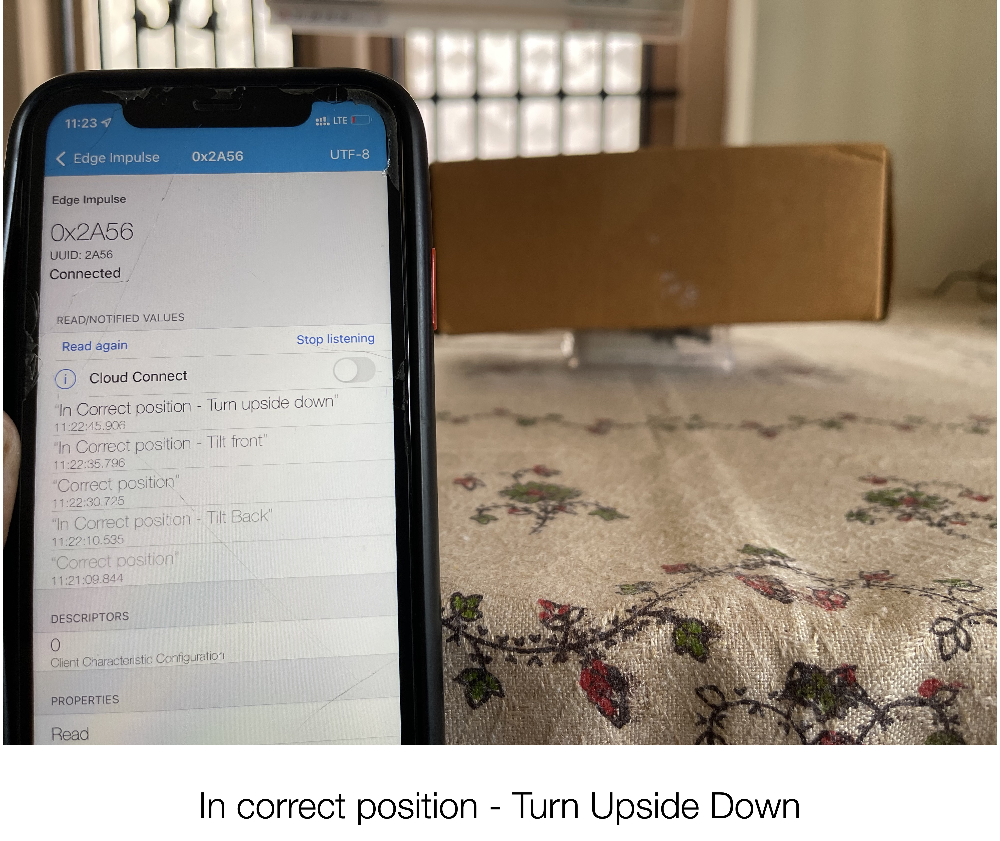

## Summary

We have seen that a TinyML-based model using accelerometer input will able to predict the placement / orientation of fragile shipments, to help avoid damage or monitor packages in a warehouse.

