# Worker Safety Monitoring with Nvidia Jetson Nano 

Created By:
Manivannan Sivan 

Public Project Link:
[https://studio.edgeimpulse.com/public/107049/latest](https://studio.edgeimpulse.com/public/107049/latest)

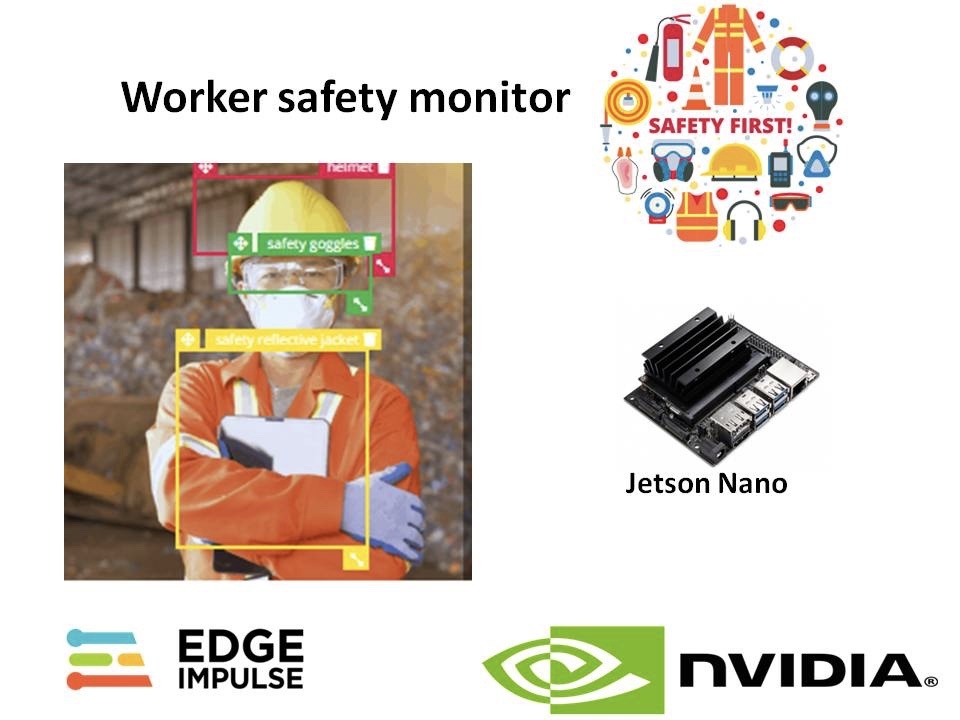

## PPE Kit Violations in Industries and its Consequences

A study by the British Safety Council reveals that nearly 80% of workers work in unsafe environments and on-site deaths are 20 times higher in India than those in Britain[1]. Nearly 48,000 workers die in the country due to occupational accidents, out of which 24.2% is recorded in the construction industry[2]. 

Since the majority of the workforce belongs to the bottom of the social pyramid, any injury and resultant expenditure adds to their financial burden, having a negative impact on their quality of life. This necessitates an urgent need for better industrial safety systems and risk assessment technologies across all construction sites.

“Increasingly high noncompliance with PPE protocols is an alarming trend and a serious threat to worker health and safety,” said Gina, manufacturing segment marketing manager for Kimberly-Clark Professional. “Whether this is a result of economic conditions, a flawed approach to safety programs, younger workers who are more inclined to take greater risks or some other reason, it’s essential that workers wear PPE when it is required. PPE protects workers against injury, but it will not work if workers fail to use it and use it properly.”

## Technology Solution

In this prototype model, an Nvidia Jetson Nano and web camera are used. For model training, the FOMO (Faster Objects, More Objects) algorithm developed by Edge Impulse is used. For data acquisition, three objects are labeled in an image – Helmet, Safety Goggles, and Safety Reflective Jacket.

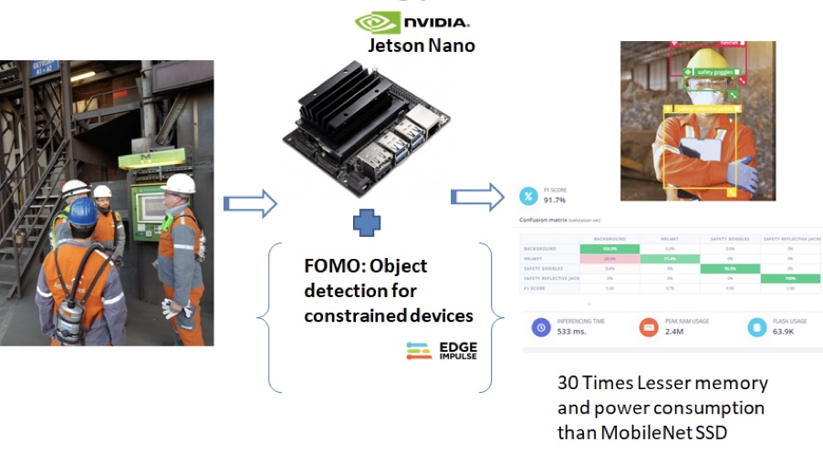

### FOMO Algorithm

The FOMO algorithm provides a variant in between; a simplified version of object detection that is suitable for many use cases where the position of the objects in the image is needed, but when a large or complex model cannot be used due to resource constraints on the device.

[FOMO (Faster Objects, More Objects)](https://www.edgeimpulse.com/blog/announcing-fomo-faster-objects-more-objects) is a brand-new approach to run object detection models on constrained devices. FOMO is a ground-breaking algorithm that brings real-time object detection, tracking and counting to microcontrollers for the first time. FOMO is 30x faster than MobileNet SSD and can run in <200K of RAM.

To configure FOMO, head over to the ‘Object detection’ section, and select 'Choose a different model' then select one of the FOMO models as shown in the image below.

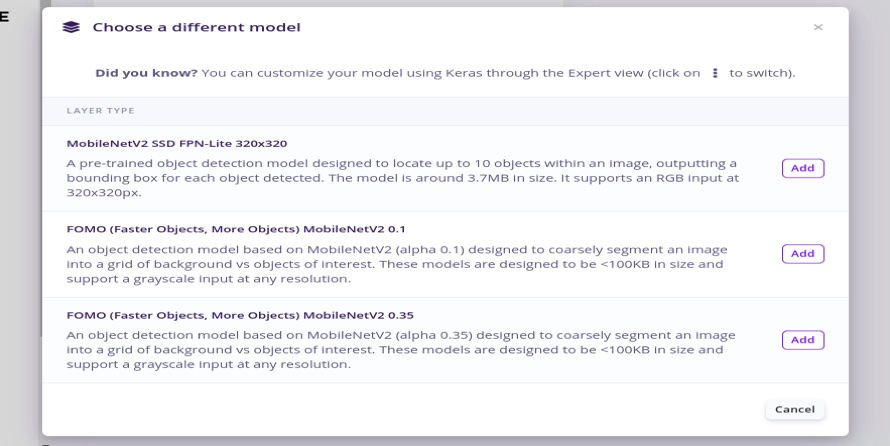

### Data Acquisition

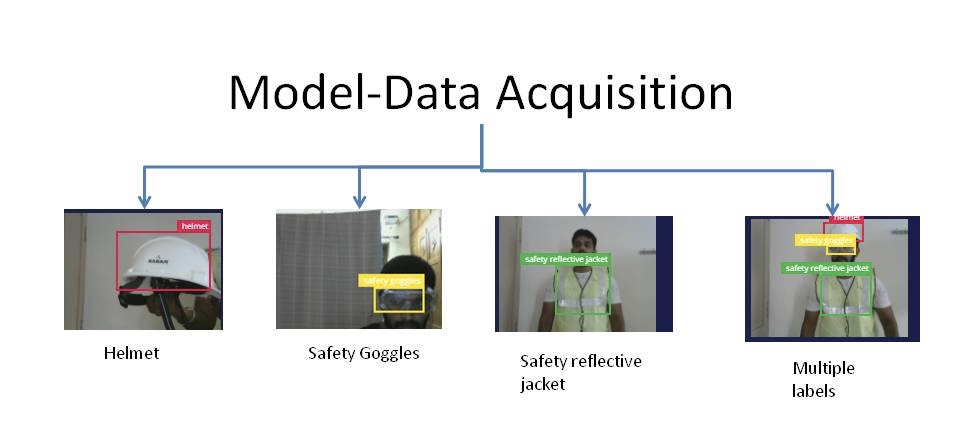

The labeling is done for individual objects like Helmet, Safety Goggles, Safety Reflective Jacket, and some cases multiple objects in a single image is also done.

I have collected around 230 images as a dataset, which is used for model training.

### Create Impulse

In the Create impulse section, configure the pixel size as 320x320, and leave the rest of the options at the default settings.

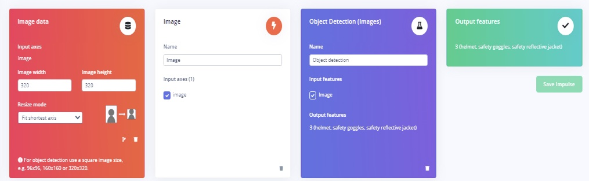

Next, in Feature Extraction, the data is converted to RGB and can be visualized in 3D as below.

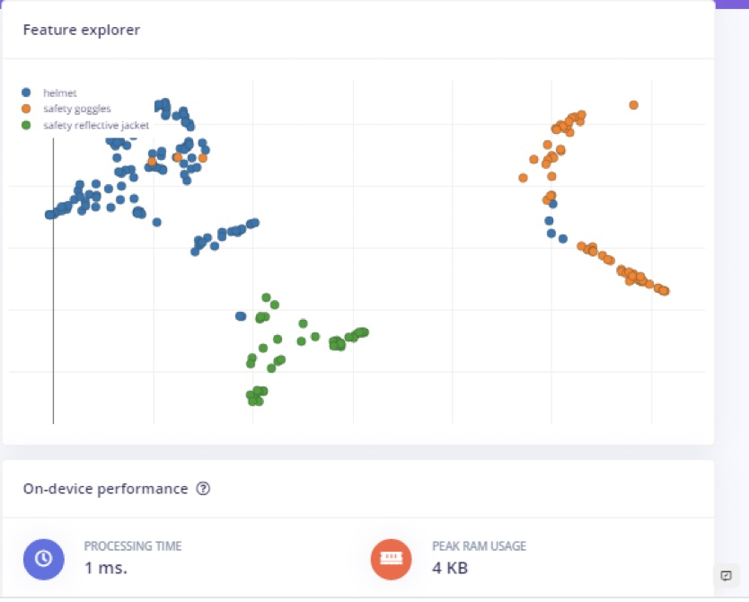

### Model Training

In Model training, I have selected FOMO (Faster Objects, More Objects) MobileNetV2 0.35 with training cycles set to 150, and Learning rate as 0.005.

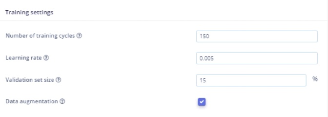

### Accuracy

The model accuracy is 91.7%.  But, the Helmet dataset only achieved 71.4% accuracy. Let's figure out why.

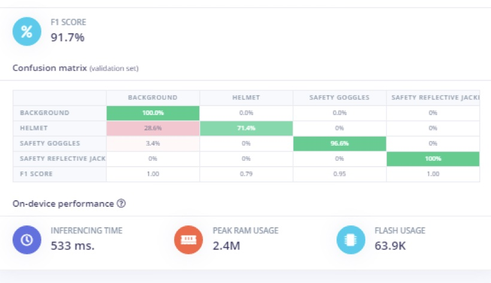

The reason for reduced accuracy for ‘helmet’ prediction is the color of the helmet.  The helmet is white, and in many of the cases the background is trained with white as well. So, the model prediction is reduced by the additional white and reduces the accuracy of the prediction. Additional images, different color helmets, different backgrounds, and different lighting could help improve the accuracy.

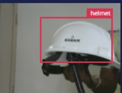

### Model Testing

In Model testing, the accuracy obtained around 83%, again due to a helmet misclassification.

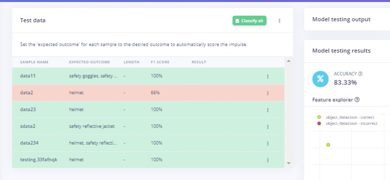

### Deployment

To run your Impulse locally, install the [Linux tooling on your Jetson](https://docs.edgeimpulse.com/docs/development-platforms/officially-supported-cpu-gpu-targets/nvidia-jetson-nano#running-the-setup-script), and run:

`edge-impulse-linux-runner`

This will start the inferencing locally on the Jetson.

## Application in Industries

In Industrial areas, some specific work locations may needs an employee to wear Safety Goggles, but in other locations they may be required to wear a helmet and safety reflective jacket. Requirements may vary by specific job site, and even zone within a site. 

Now that we have a deployed model, we need to write some application code to determine the expected gear to be used by workers in a particular area. 

Example: Here the Class A and Class B employees needs different set of safety gears.

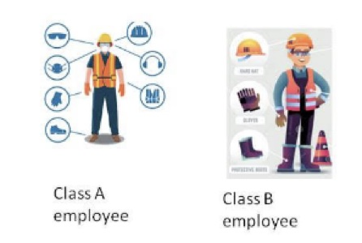

Open the terminal and run the below commands.

`sudo apt-get install libatlas-base-dev libportaudio2 libportaudiocpp0 portaudio19-dev`
`pip3 install edge_impulse_linux`

This could take a while to install, depending on the speed of your internet connection and SD Card.

Next, clone this repository to get some examples:

`git clone https://github.com/edgeimpulse/linux-sdk-python`

If the modelfile.eim is downloaded to the Desktop on your Jetson Nano, open the terminal, and change directory to `linux-sdk-python/examples/image`

Then, run the below command to run the model:

`python3 classify.py /home/username/Desktop/modelfile.eim`


Replace `username` with the user account name of your Nano 


Tweak the application code in classify.py as below. Add this code snippet in the `labels` section in classify.py:

```
for label in labels:
                        score = res['result']['classification'][label]
                        print('%s: %.2f\t' % (label, score), end='')
	         if(strcmp(label,’helmet’)==0 && score >0.75):
							printf(“Helmet detected”) 
         if(strcmp(label,’safety goggles’)==0 && score >0.75):
							printf(“Safety goggles detected”) 
         if(strcmp(label,’safety reflective jacket’)==0 && score >0.75):
							printf(“Safety reflective jacket detected”) 
```

## Summary

A FOMO-based Edge Impulse model deployed on an Nvidia Jetson Nano can monitor whether workers are wearing proper safety gear in specific locations. By tweaking the application code, the model prediction can deployed in different areas or work sites to monitor whether the workers are wearing specific PPE based on the location and type of work they are performing.


