# Posture Detection for Worker Safety

Created By:
Manivannan Sivan 

Public Project Link:
[https://studio.edgeimpulse.com/public/148375/latest](https://studio.edgeimpulse.com/public/148375/latest)

## Project Demo



## Problem Statement

Working in manufacturing can put a lot of stress on a worker's body. Depending on the worker’s role in the production process, they might experience issues related to cramped working conditions, heavy lifting, or repetitive stress.

Poor posture is another issue that can cause problems for the health of those who work in manufacturing. Along with that, research suggests that making efforts to improve posture among manufacturing employees can lead to significant increases in production. Workers can improve their posture by physical therapy, or simply by being more mindful during their work day.

Major postures include:

- Posture while sitting
- Posture while lifting

### Posture While sitting

Many manufacturing employees spend much of their day sitting in a workstation, performing a set of tasks. While the ergonomics of the workstation will make a significant difference, it is important for employees to be mindful of their sitting posture.

### Posture while lifting
Lifting can be another issue affecting the posture of those who work in manufacturing. If you are not careful, an improper lifting posture can lead to a back injury. For lifting objects off the ground, the correct posture is a "Squat" type where the incorrect posture is a "bent down" type.

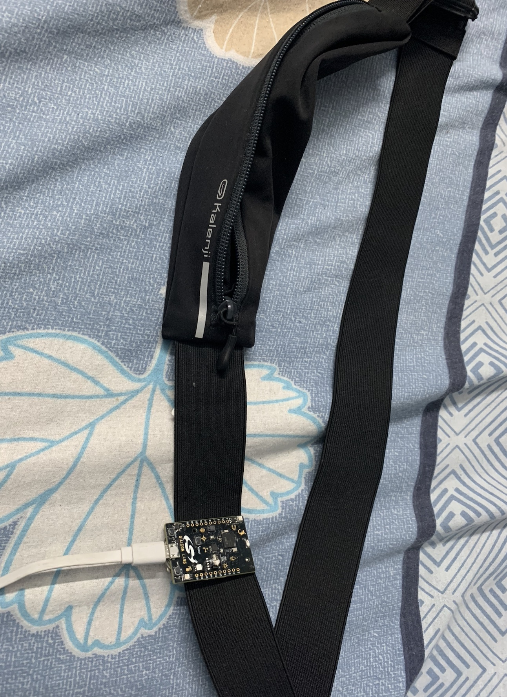

## TinyML Solution

I have created a wearable device using a [SiLabs Thunderboard Sense 2](https://docs.edgeimpulse.com/docs/development-platforms/officially-supported-mcu-targets/silabs-thunderboard-sense-2) which can be fitted to a worker’s waist. The worker can do their normal activities, and the TinyML model running on the hardware will predict the posture and communicate to the worker through BLE communication. The worker can get notified in the Light Blue App on their phone or smartwatch.

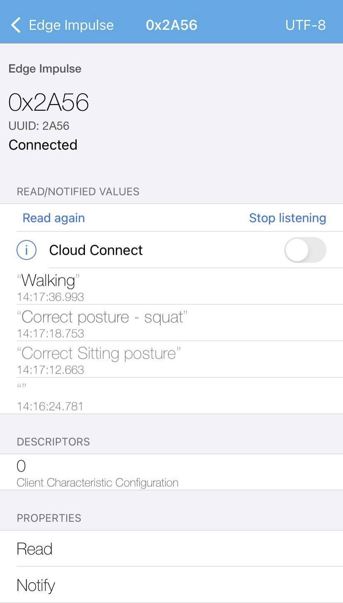

I have trained a model with several different postures, so that it can classify the correct movement postures while lifting and sitting, as well as incorrect postures. The model will predict results these 5 categories:

1. Correct Lift Posture - Squat
1. Incorrect Lift Posture - Bent Down
1. Correct Sitting Posture
1. Incorrect Sitting Posture
1. Walking

Now let’s see how I trained the model and tested on real hardware in detail.

## Data Acquisition

Connect the Thunderboard Sense 2 board to your system and flash the firmware from this below link.

`https://docs.edgeimpulse.com/docs/development-platforms/officially-supported-mcu-targets/silabs-thunderboard-sense-2`

Once it is flashed, run the below command.

`edge-impulse-daemon`

Now your board is connected to your Edge Impulse account. 

To start to collect the data for desired postures (Correct , Incorrect) I have worn the belt with the Thunderboard Sense 2 attached, and started recording accelerometer data. The data classes acquired were walking, correct sitting posture, incorrect sitting posture , correct lifting posture (squat), and incorrect lifting posture (bent down).

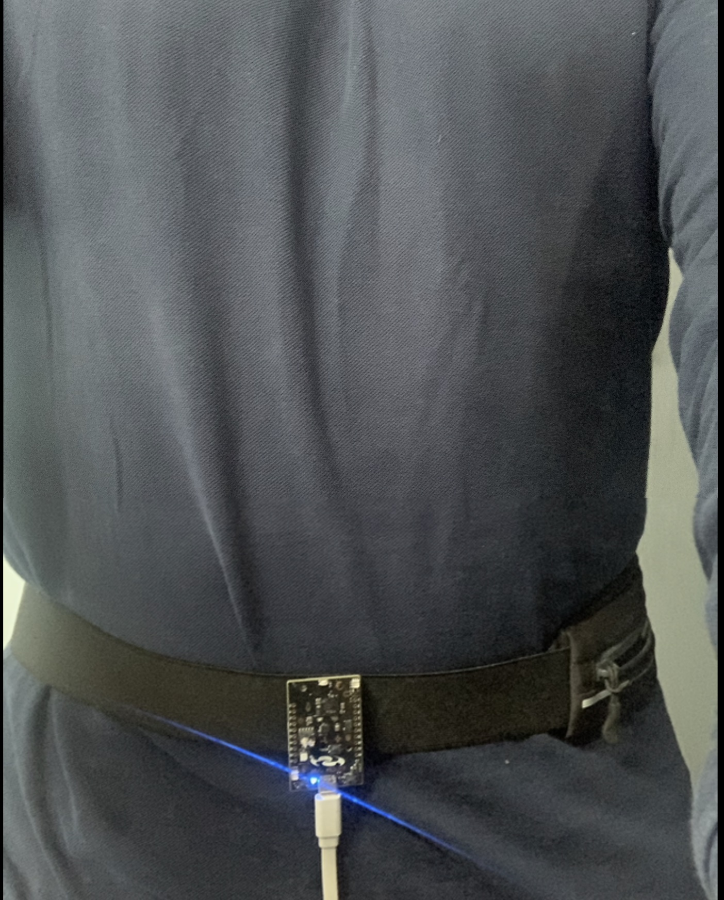

### Correct Sitting Posture

I have recorded data from the Thunderboard by sitting in the correct sitting posture.

I have collected 1 minute data of correct sitting posture for model training and 20 seconds of data for testing.

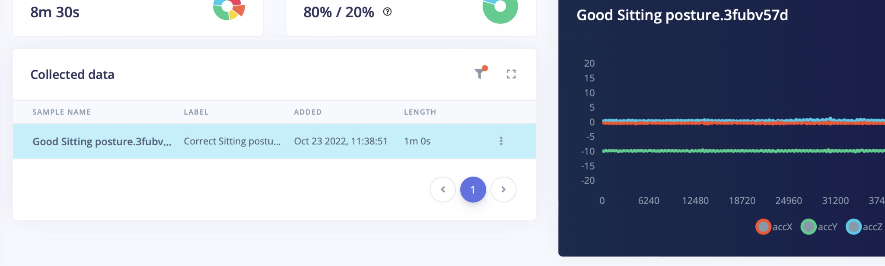

### Incorrect Sitting Posture

For the incorrect sitting posture, I have bent towards the laptop, where my back is not resting on the chair. If an employee works in this position for long hours, it can create back pain or other problems in the future. I have collected 1 minute data of improper sitting posture for model training, and 20 seconds of data for model testing.

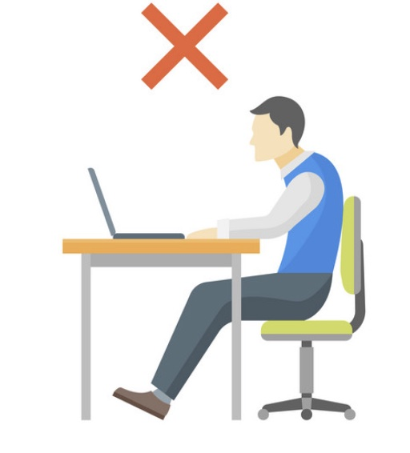

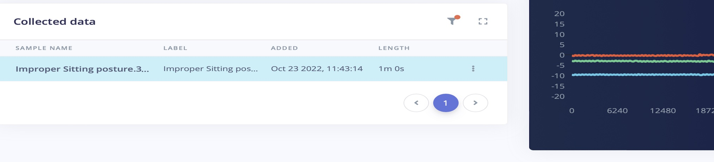

### Correct Lifting Posture

For lifting objects off the ground, the correct posture is to squat down to the object to lift it.

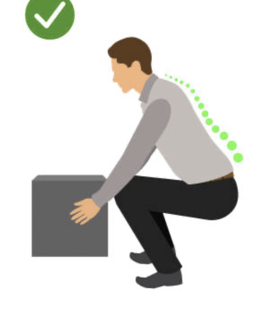

I have collected the "squat" type data for around two minutess for model training, and 20 seconds of data for model testing.

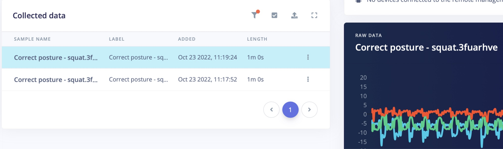

### Inorrect Lifting Posture

For incorrect lifting ("bent over") data, I have collected 2 minutes 30 seconds of data for model training, and another 30 seconds of data for model testing.

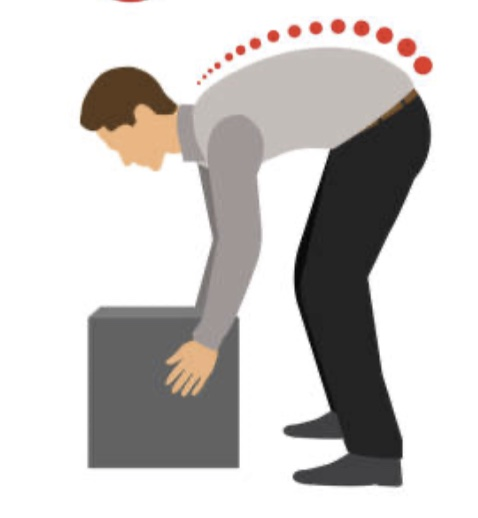

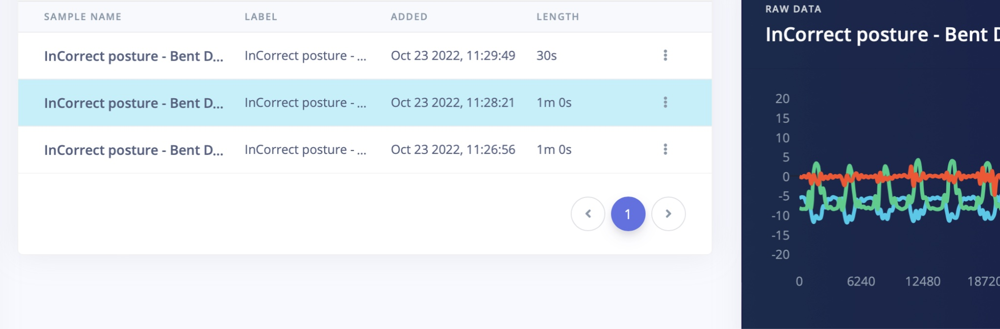

## Create Impulse

In Edge Impulse, on the Create Impulse section, set the "window sampling size" to 4000ms and the "window increase size" is also set as 4000 ms. The preprocessing is selected as "raw" data.

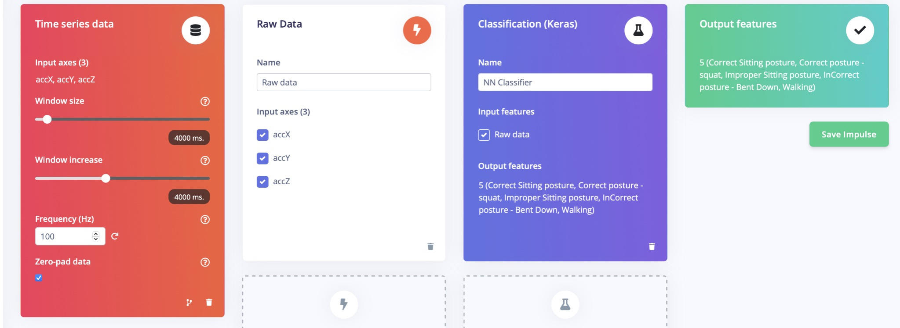

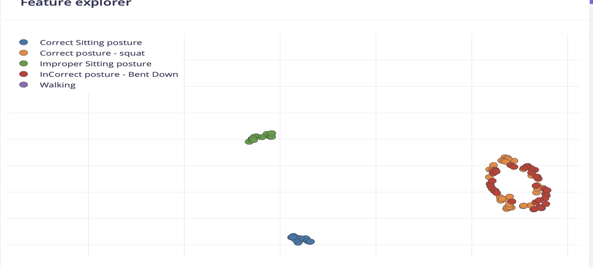

## Model Training

In Model training, I have used sequential dense neural networks, and the learning rate is set to 0.005 and the training cycle is 200 epochs.

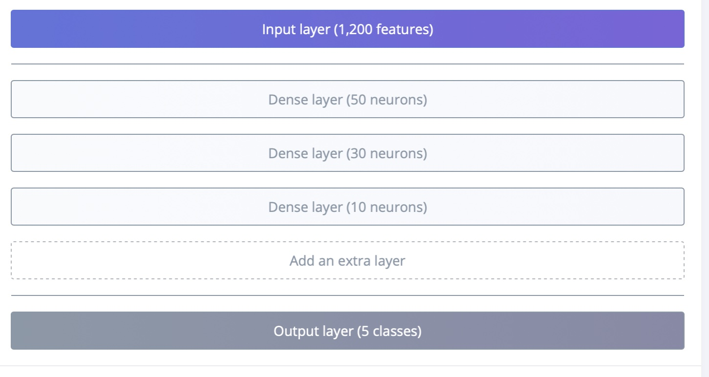

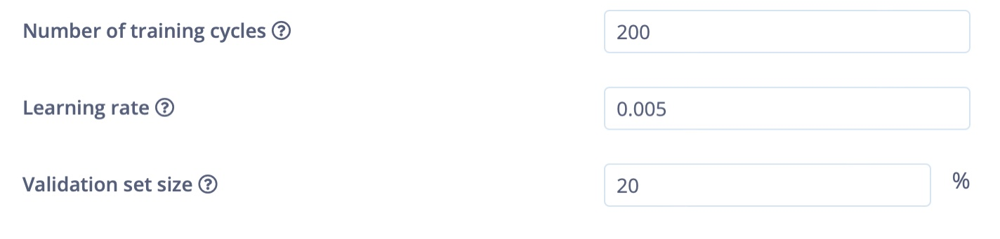

## Model Accuracy

After training was complete, the model achieved 100% accuracy and the F1 score is listed below.

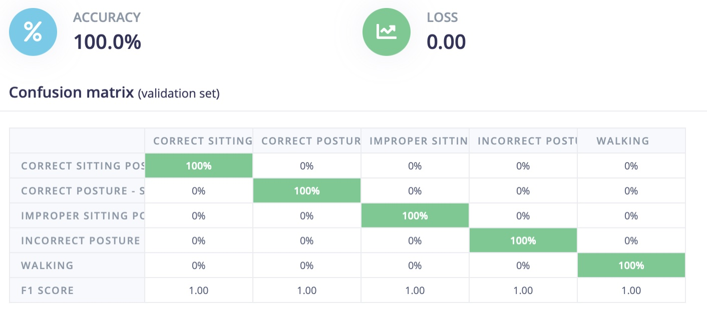

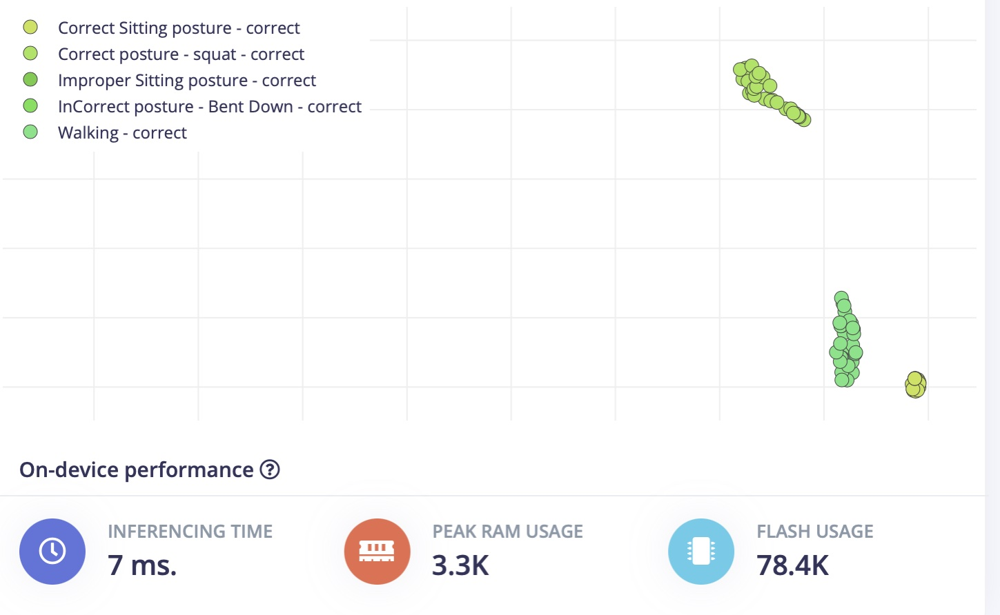

The inference time is 7ms, and flash usage is only 78.4K.

## Model Testing

In model testing, I have used the data that we collected and set aside earlier to test the model. Here, the model achieved 87% accuracy. This data is completely new and was not used in training sessions, so it is unseen up to now. The decrease in model accuracy does sometimes occur, it looks like the improper sitting position is being incorrectly classified as "squat" data. 

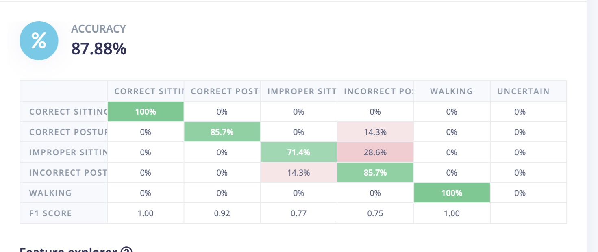

## Deployment

Go to the Deployment section in Edge Impulse, and select the firmware option for the Thunderboard Sense 2. This will generate and download the firmware files to your system.

Once the firmware is downloaded, copy the `.bin` file and paste it in the `TB004` drive (or whatever drive label appears when the Thunderboard is connected to your computer). This will flash the software on to the Thunderboard.
											
Once it is flashed, reset the board, and connect a 3V battery to it.

## Testing in the Real World

To test it in a real scenario, download the LightBlue application from the Apple App Store or Google Play Store. This application will be used to communicate to the Thunderboard Sense 2 over Bluetooth.

Open the App and connect to the Edge Impulse service (Make sure board is powered up).

Some settings in the App might need to be changed to the following values:

- Subscribe to the `2A56` characteristic.
- Decode the message as `UTF8` (click on `HEX` in the top right corner in LightBlue to switch).

Connect the wearable belt and start doing different movements.

Enable the "Listening" option in the App. You will be notified only when the previous prediction result differs from the current prediction result.

You can see the results of the predictions displayed in the App:

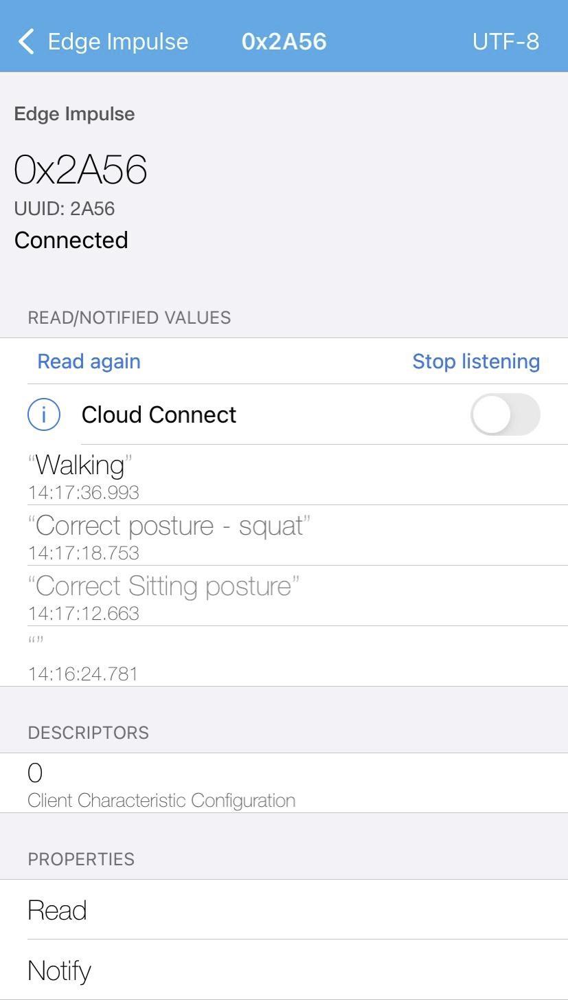

Then open up a Terminal and run the below command to see the model inference in realtime:

`edge-impulse-run-impulse`

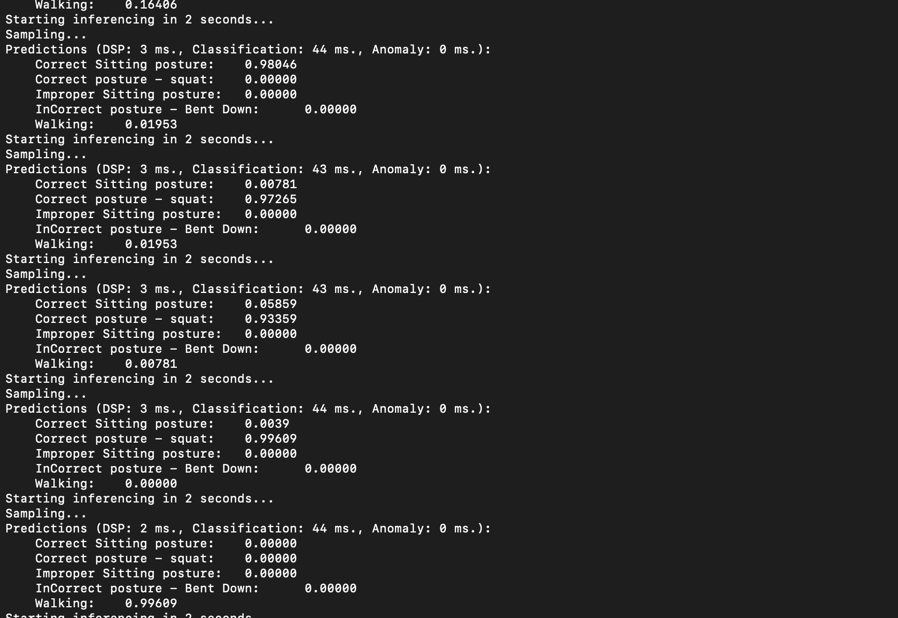

## Summary

This TinyML-based wearable can be used in manufacturing warehouses, shipping, or other situations where employees lift objects on a regular basis.  While this is a proof-of-concept, this type of approach could help them to correct their posture via local notifications from the mobile application.

