# Workplace Organizer with NVIDIA Jetson Nano 2GB

Created By:
Zalmotek 

Public Project Link:
[Coming Soon]()

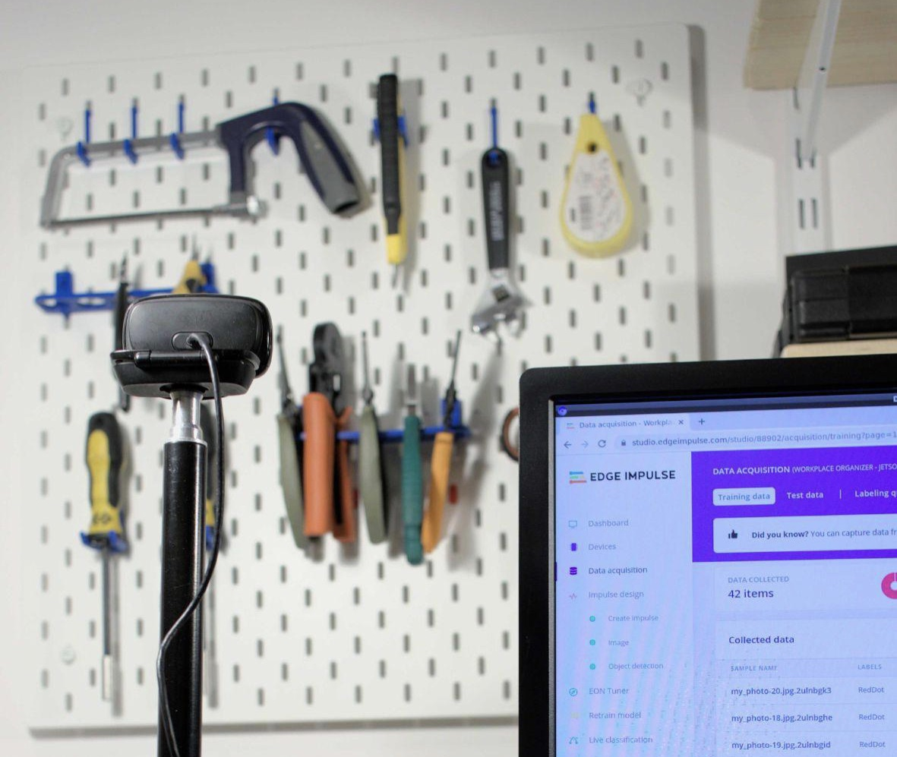

## Intro

Having an organized workplace allows the workers to have greater efficiency in their activities, directly impacting their productivity. 

When you are in an environment where people work multiple shifts and must share the same set of tools, there are a number of challenges that arise. By interviewing a few facility managers, we have found out that the most prominent problem is that employees do not return the tools in their designated space at the end of a shift, causing increased anxiety and delays in the activity of the following shift, since they must find the missing tools or replacements for them.

## Our Solution

We believe the computer vision approach is the best in overcoming this obstacle and Edge Impulse offers the right tools for it.
 
There are a few possible routes in creating an algorithm for detecting missing tools in their placeholder:

1. Train a model to recognize the different tools, define the number of each tool it must recognize at all times, and run an alert if any is missing;
1. Run an anomaly detection algorithm to detect if something is “missing” from the photo. - Non-specific (the algorithm won’t be able to exactly tell how many tools are missing);
1. Place stickers/tokens of a strident color under tools and run an object classification/detection algorithm to detect the number of tokens present in the image -  Resource effective, Increased Specificity, Repeatable, Implies 3D printing (but small stickers can be used as well if you do not have access to a 3D printer).

The winner in our opinion is number 3 so let’s get on with it and show you how it works.

### Hardware requirements

 - Jetson Nano 2GB Developer Kit
 - microSD card (64GB UHS-1 recommended)
 - Display
 - USB keyboard and mouse
 - USB camera (or a CSI camera like the Raspberry Pi Camera V2)
 - USB cable or CSI for rPi camera
 - Skadis pegboard or a toolbox
 - Stickers or 3D printed marker

### Software requirements
 - Edge Impulse account

## Hardware Setup

NVIDIA Jetson Nano 2GB DevKit has a quick get-started guide [here](https://developer.nvidia.com/embedded/learn/get-started-jetson-nano-2gb-devkit) that, based on your operating system, will help you write the OS on an SD card and start the system. We also recommend having an enclosure for the Jetson to protect it from all sorts of nefarious events. In this tutorial, we have found the [reComputer](https://www.seeedstudio.com/re-computer-case-p-4465.html) case to be a good fit.

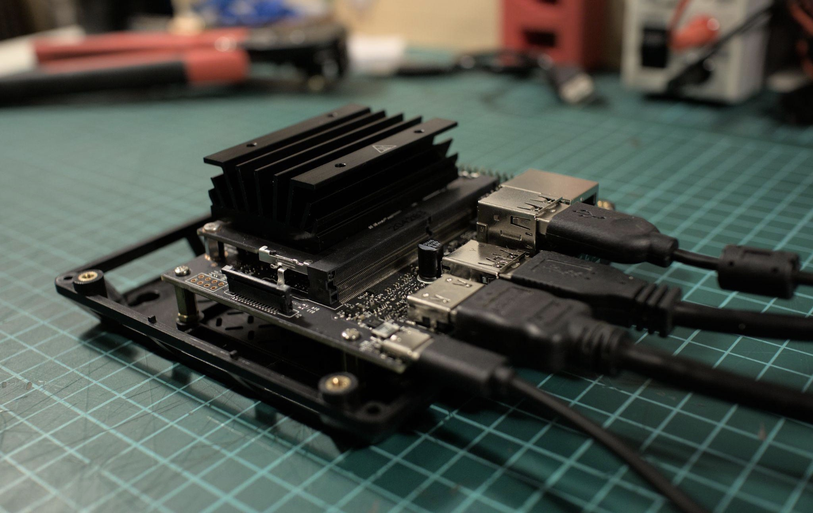

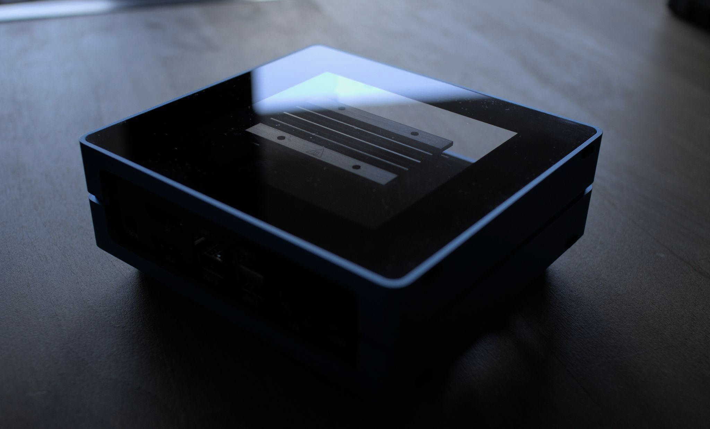

Usually, tools in the industrial environment are stored either horizontally, in drawers, or vertical, on panels, in designated spots. We will use the vertical panel setup from our workshop to develop the solution (IKEA Skadis pegboard and custom-made 3D printed supports - you can find the link [here](https://www.thingiverse.com/thing:2853261) if you like them), the difference, if you have a horizontal setup, would be the camera placement position.

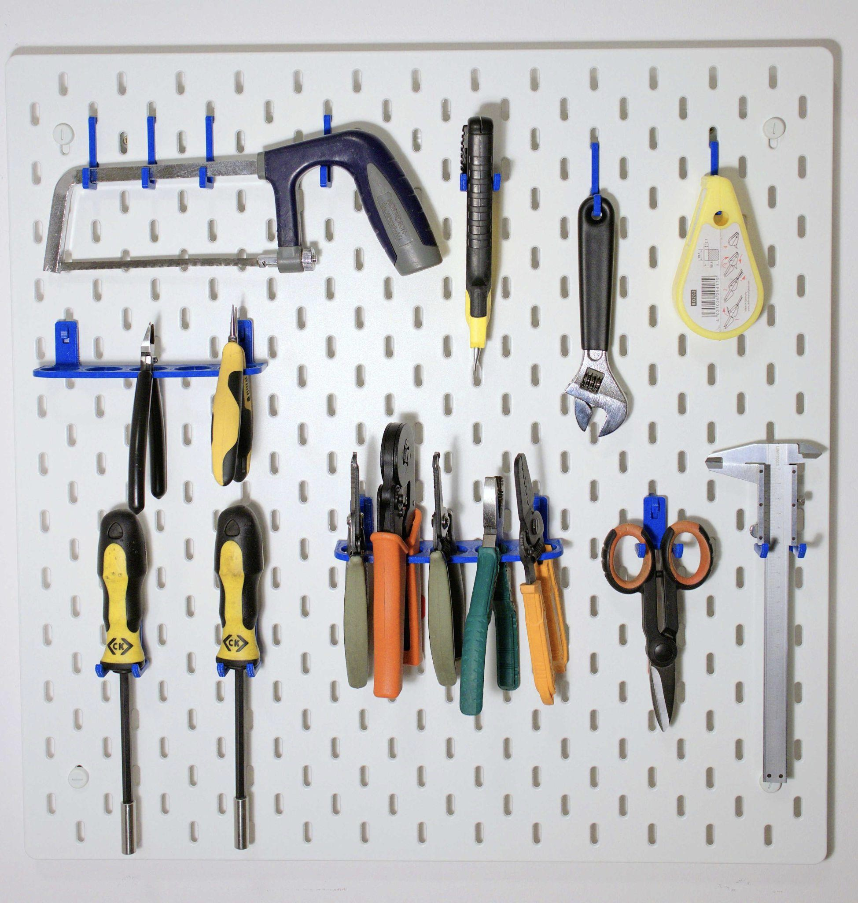

We initially designed and 3D printed some tokens that perfectly fit in the pegboard slots. They print very quickly and are reusable. We did quite a bit of experimentation to find out what shape and color yield the best results. Firstly, we have tried using red and blue oval pegs. Unsurprisingly, this yielded poor results because they blended too well with the patterned background. Next up, we have decided to use colored geometric shapes. The best results, by far, were obtained with blue triangles, and to top it all off, a great jump in the model’s accuracy was gained by slightly scaling and rotating the triangles (without modifying their aspect ratio). You can find the 3D files that were most successful [here](https://www.myminifactory.com/object/3d-print-edge-impulse-ikea-skadis-markers-216427). 

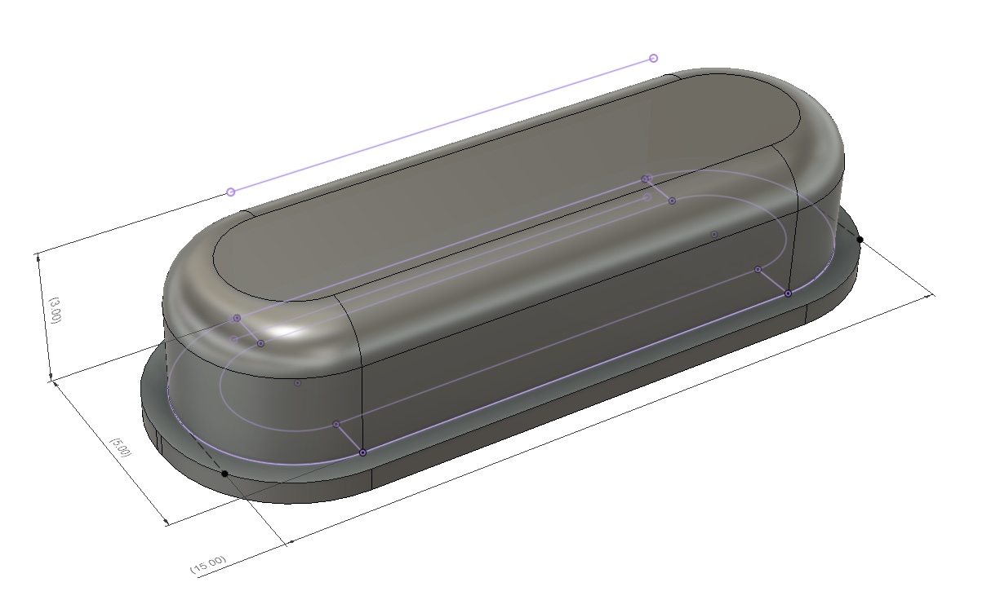


## Software Setup

Register for a free account on the Edge Impulse platform [here](https://studio.edgeimpulse.com/login), then power up the Jetson and either run a display with a keyboard setup or login via ssh to run the following commands to install the Linux runner. Start a terminal and run the setup script:

`wget -q -O - https://cdn.edgeimpulse.com/firmware/linux/jetson.sh | bash`

For more in-depth details about the Jetson setup, you can check [this](https://docs.edgeimpulse.com/docs/nvidia-jetson-nano) link, although the above command is enough for going to the next step.

### Creating an Edge Impulse Project

The first step towards building your TinyML Model is creating a new Edge Impulse Project.

Once logged in to your Edge Impulse account, you will be greeted by the Project Creation screen.

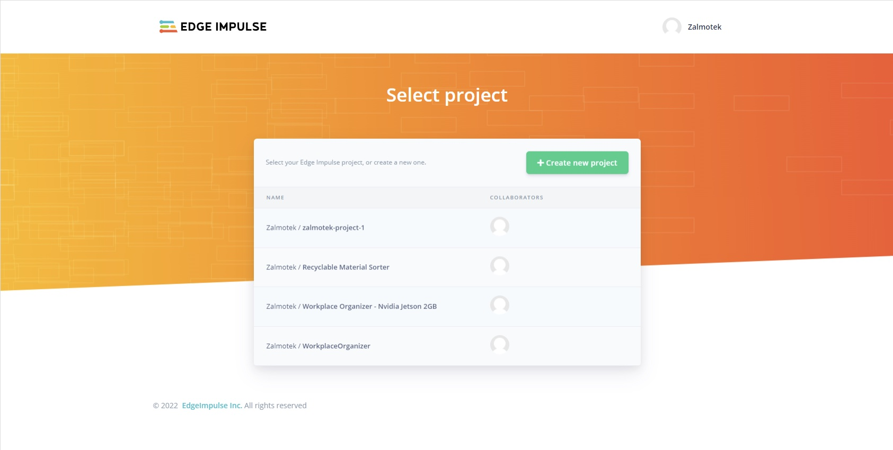

Click on **Create new project**, give it a meaningful name, select **Developer** as your desired project type and press **Create new project**.

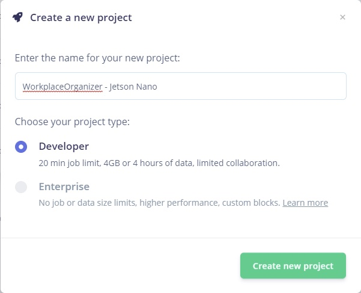

Afterward, select **Images** as the type of data you wish to use.

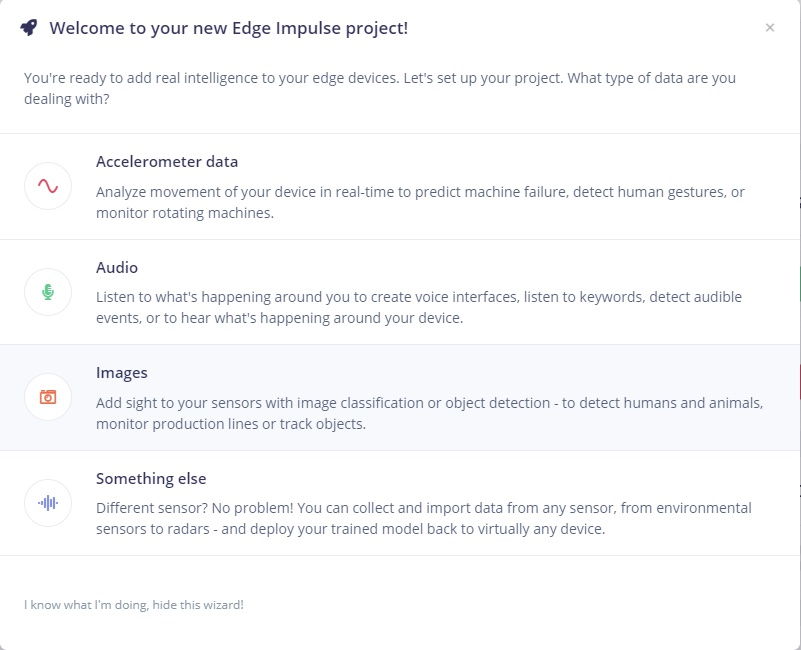

Due to the possibility of having to detect more than 1 marker in the image, we will pick **Classify multiple objects** when asked what you want to detect.

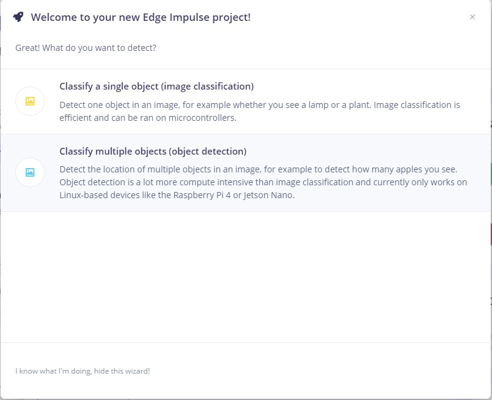

### Connecting the device

To connect the Jetson Nano to the Edge Impulse project, run the following command in the terminal:

`edge-impulse-linux -disable-microphone`

If you have previously used your device in the past for other edge impulse projects, run the following command to reassign the device to a new project:

`edge-impulse-linux -disable-microphone -clean`

If you have only one active project, the device will be automatically assigned to it. If you have multiple Edge Impulse projects, select in the terminal the one you wish to attach your device to.

Give a recognizable name to your board and press enter.

Your board is now connected to the Edge Impulse project and you can see it in the connected devices panel.

### Collecting and preparing the dataset

There are multiple ways to go about gathering your dataset:

1. Manually taking a bunch of photos, aka data points, using an application like “Cheese!” or “guvcview”.
1. Recording a Video and extracting the frames every 1 second, using a Python script.
1. Take photos using the Data Acquisition panel in Edge Impulse Studio.

For this tutorial, we will be using the first option. A thing to keep in mind when gathering photos is that they will be resized to fit in a 320x320px box, required by the MobileNetV2 SSD FPN-Lite 320x320 architecture so try your best to keep the subject in the middle of the frame. Moreover, to avoid overfitting your network, move the camera a little when gathering your dataset, change the light a bit, change the angles etc.

To install [guvcview](https://www.google.com/search?sxsrf=APq-WBuDl6H6DCIFBzm2mZVV2SmDD_Z8TA:1648217840969&q=guvcview&spell=1&sa=X&ved=2ahUKEwi4m7H3ueH2AhUhSfEDHYpUCHwQkeECKAB6BAgBEDI), run the following command in the terminal:

`sudo apt install guvcview`

And afterward run guvcview to launch the application and start gathering photos.

Once we have plenty of photos (we have collected around 115 pictures for our use case), it’s time to upload them to Edge Impulse and label them. Click on the **upload** button, select **choose files**, select all your photos and then begin uploading. 

After that, you will see them in the **Data acquisition** panel.

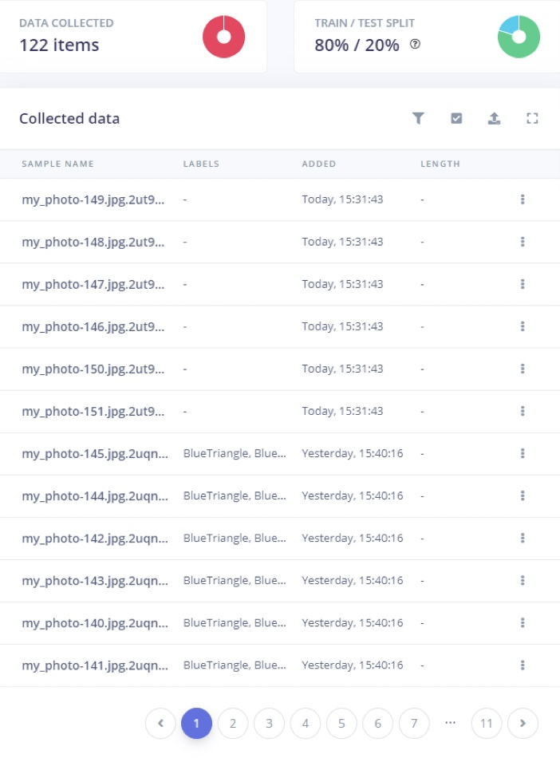

### Processing the data - Creating bounding boxes

Next, navigate to the **Labeling queue** and start drawing bounding boxes around the 3D printed markers. Even if it might feel cumbersome at first, Edge Impulse will start auto-labeling the object it recognizes, greatly speeding up the process.

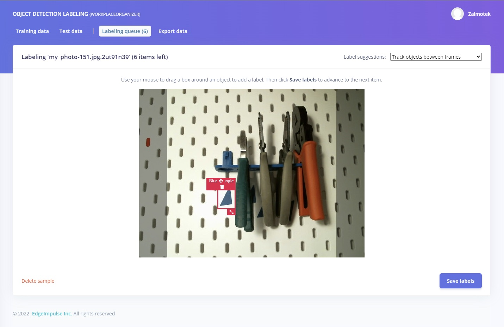

### Creating the impulse

After all the labeling is done, click on **Create Impulse**, under the **Impulse design** panel. For the input block, select **Images** as input, select **image** as processing block, and **Object detection** as learning block.

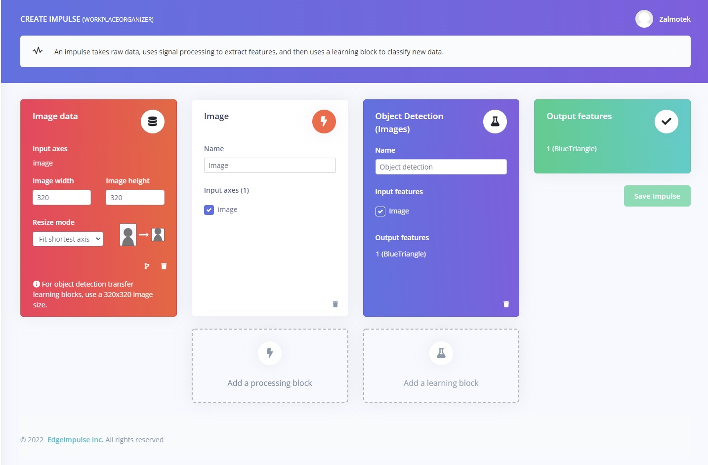

### Generate Features

Next step, click on **Save Impulse** and move over to the **Image** field under the **Impulse design** panel. Wait for the parameters to be generated and click on **Save parameters** to move on to the **Generate features** tab, where you will click on the **Generate features** button. After the job is done, you can visualize your dataset in 3D, in the feature explorer tab. This is one of the most useful tools to use from the Edge Impulse platform as it can let you quickly validate whether your data is well clustered.


### Training the model

Moving on to the model training, we recommend leaving the default settings on, and just beginning the training.

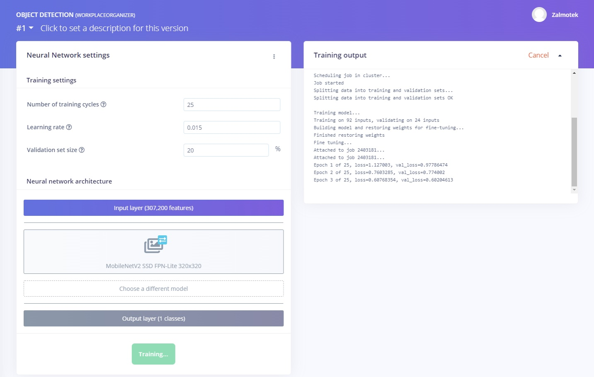

### Validating the model

This is another great feature that allows you to run the inference on the Test data pool of images, that were kept apart from the training data. After clicking on **Classify all**, you will be prompted with the model testing results, which represents the percentage of all samples with precision score over 80%.

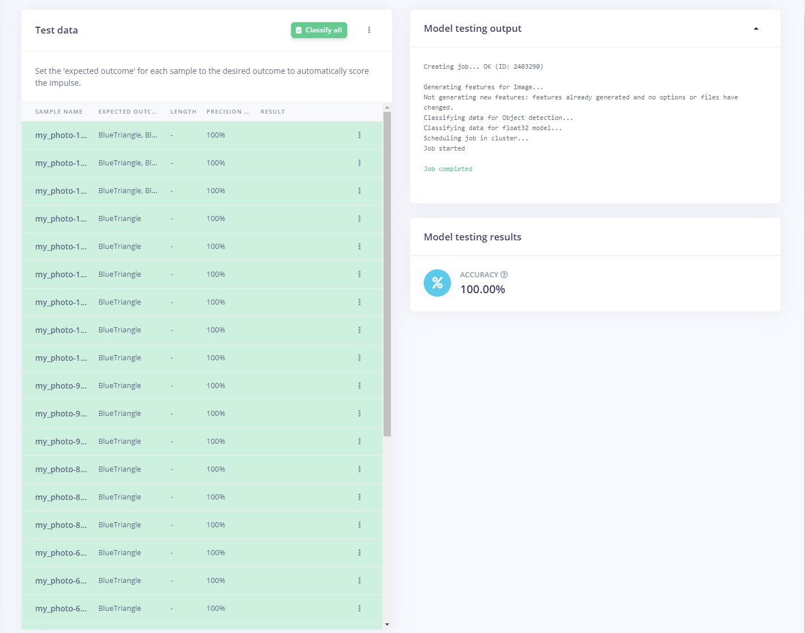

### Deploying the model on the edge

To run the inference on the target, issue the following command and select the project containing the model you wish to deploy:

`edge-impulse-linux-runner --clean`

Once the model downloads, access the URL provided in your serial monitor to watch the live video feed and see the model in action in a browser:

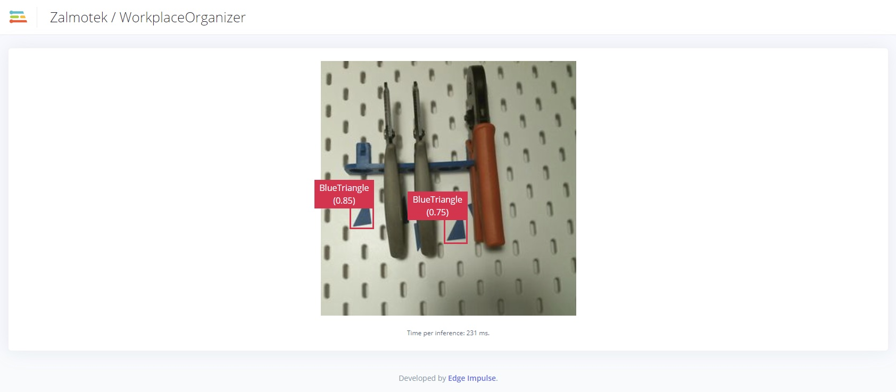

If you get to this point and the outcome is the desired one, good job! If not, you might want to revisit training the model and labeling more pictures to improve the detection rate.

Now for this system to run unattended in a real-world use case, we imagine the Jetson would run the inference on boot automatically at the end of each shift to check the presence/absence of tools and send a notification if something is not right. Now, this can be done in a number of ways depending on the current infrastructure and desired outcome. For this use case, we have decided to create a service to start the model on boot without a monitor or a keyboard and execute it after each working shift.

Now, to use the system we have just created in an unattended mode we have to employ the Edge Impulse Python SDK and a few other Linux tools. When we are using Python we like to work in a virtual environment. Yes, we like to keep our software workplace in the same tidy manner as our hardware workbench :)

Create a directory in which you will store all the components needed to run the model on the edge. We have created a folder in our home directory called EdgeImpulse.

```
mkdir EdgeImpulse
cd EdgeImpulse
sudo apt-get install python3-pip libatlas-base-dev libportaudio2 libportaudiocpp0 portaudio19-dev
sudo apt-get install python3 -m pip install --upgrade pip
pip3 install virtualenv six
python3 -m virtualenv -p python3 env
source env/bin/activate
python3 -m pip install edge_impulse_linux
```

Next up, we must download a local version of the model we have just created using the Edge Impulse platform.

`edge-impulse-linux-runner --download modelfile.eim`

Replace modelfile.eim with the name of your project, in our case, the command would look like this:

`edge-impulse-linux-runner --download WORKPLACEORGANIZER.eim`

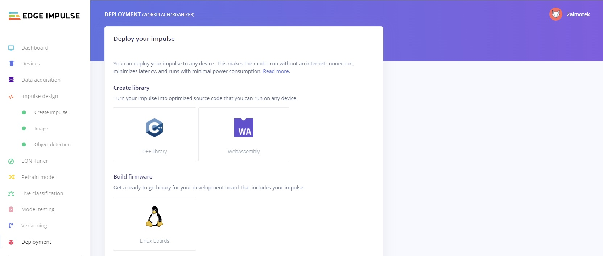

You can find the model name under the **Deployment** tab, written in parentheses at the top of the page.

Next up, navigate to [https://github.com/edgeimpulse/linux-sdk-python/tree/master/examples/image](https://github.com/edgeimpulse/linux-sdk-python/tree/master/examples/image) and download **classify.py** and **device_patches.py** and store them in the same folder with the other components.

Let’s run the inference using Python by issuing the following command:

`python3 classify-image.py path-to-modelfile.eim`

In our case, the command looks like this:

`python3 classify.py WORKPLACEORGANIZER.eim`

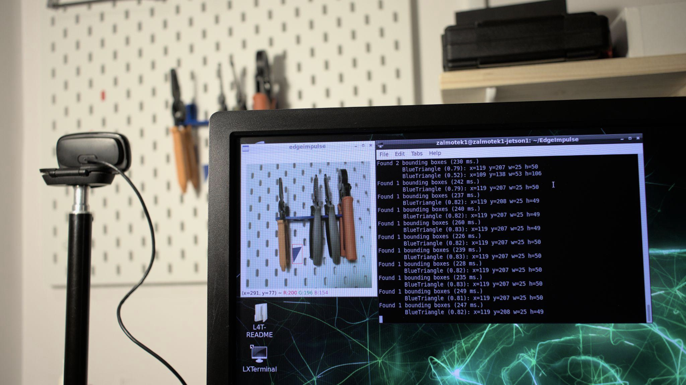

Things should be looking something like this.

All that remains would be a Linux service that starts on boot, calls this script at a predefined hour, when a shift ends. Let’s say, every weekday at 17:00 pm.

As you can see below the script file and the timer file and their location on disk (it’s important to use `sudo` and place it at the respective locations so it can be used as a systemd service).

Run this command to create the service file:

`sudo nano /etc/systemd/system/classify.service`

And here is the content:

```
[Unit]
Description=Classify Service
After=multi-user.target

[Service]
Type=simple
WorkingDirectory=/home/zalmotek1/EdgeImpulse
Environment=PYTHONPATH=/home/zalmotek1/EdgeImpulse
ExecStart=/home/zalmotek1/EdgeImpulse/env/bin/python3 /home/zalmotek1/EdgeImpulse/classify.py /home/zalmotek1/EdgeImpulse/WORKPLACEORGANIZER.eim

[Install]
WantedBy=multi-user.target
```

Run this command to create the timer file: 
`sudo nano /etc/systemd/system/classify_countdown.timer`

And here is content:
```
[Unit]
Description=Schedule running the classify on a time basis

[Timer]
OnCalendar=Mon,Tue,Wed,Thu,Fri *-*-* 17:00:00
Unit=classify.service

[Install]
WantedBy=timers.target
WantedBy=multi-user.target
```

To enable this services you must run the following commands:
```
sudo systemctl daemon-reload
sudo systemctl enable classify.service
sudo systemctl enable classify_countdown.service
sudo systemctl start classify_countdown.timer
sudo systemctl start classify.service
```

To check on the services you can run:
`sudo systemctl status classify.service` and `sudo systemctl status classify_countdown.timer`

## Conclusion

Computer vision technologies hold tremendous potential for both practical and theoretical applications. The simple fact that machines are now able to "see" in some capacity allows us to explore new frontiers in computer science, robotics, artificial intelligence, and more.

Using the above methodology you can quickly adapt to other tool setups or things you want to keep an eye on by training models on Edge Impulse and NVIDIA Jetson. Keep your workplace clean and your workflow lean!

If you need assistance in deploying your own solutions or more information about the tutorial above please [reach out to us](https://edgeimpulse.com/contact)!

